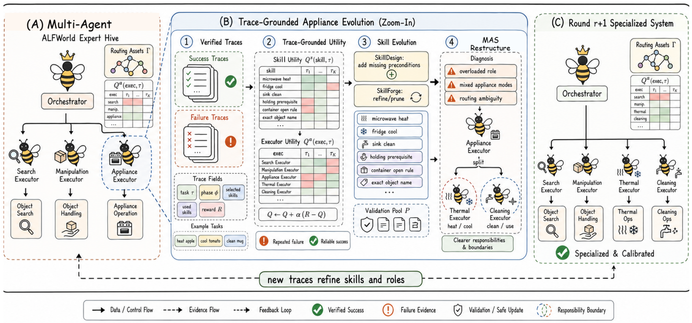

# SkillMAS

> **分类**: Skill 优化 | **成熟度**: 🟡 成长期 | **综合评分**: 0.47

---

## 一句话描述

**SkillMAS** 识别并解决了多 Agent 系统中 **技能进化与 Agent 组织结构之间的"适应解耦"** 问题——从同一条验证过的执行轨迹出发，同时更新技能和调整 Agent 职责边界，用 **效用学习 + 证据门控** 驱动双线协同进化，防止技能增长与组织惰性互相拖累。

**来源**:
- 上海交通大学、中南大学、OPPO 联合研究
- 发布年份：**2026**

**链接**:
- 论文：https://arxiv.org/pdf/2605.09341

---

## 核心实现

**1. 适应解耦现象的系统化诊断**

SkillMAS 通过移植应激测试量化了适应解耦的代价：将最终版本技能库塞回初始 Agent 组织，成功率从 94.0% 崩至 68.7%（低于种子基线的 76.1%）；反之将最终 Agent 组织配初始技能库则崩至 50.0%。**技能单独涨而组织不调，涨出来的技能不是在帮忙而是在添乱。**

**2. 效用学习：只给真正使用的技能记功劳**

维护 Skill Utility（技能在某种任务上的成功率）和 Executor Utility（Agent 在某种任务上的成功率）两张效用表，仅从验证过的执行轨迹更新。关键过滤规则：检索不等于使用——只有执行轨迹中实际出现了技能标识符或匹配模式，才算"被使用"。效用表用 Monte Carlo 规则更新，更新率随证据累积自动衰减。

**3. 有界技能进化 + 证据门控 MAS 重构**

技能修复限定为四类手术级操作：加前置守卫、重排步骤、收紧检索范围、拆分过载技能，非重新生成。MAS 重构由结构化诊断工件驱动——通过分析 Agent 效用趋势、技能重叠度和当前修复效果来判断瓶颈在技能还是组织，每次只做一项变更（新增/删除/合并 Agent 或调整职责边界）。

---

## 主要能力

- **技能-组织协同进化**：技能和 Agent 职责边界共享同一证据源、同步更新，消除适应解耦
- **精确信用分配**：区分"检索到"和"实际使用"，只给真正起作用的技能记功劳，防止效用表被噪声污染
- **精确手术而非全量重写**：技能修复限定四种有界操作，MAS 重构每次只做一项变更
- **结构自适应收敛**：ALFWorld 收敛到多 Agent 结构，τ-Bench Retail 收敛到单 Agent 结构，系统根据领域特征自动收敛到最优组织形态

---

## 局限性

- **未做控制变量消融**：没有策略冻结实验，无法精确量化每个组件（技能进化 vs MAS 重构 vs 效用学习）的因果贡献
- **诊断规则领域局部**：判定规则目前是领域局部的启发式，跨领域迁移需重新定义
- **实验规模有限**：每个领域一个基座模型、固定任务集，限制了泛化结论的范围

---

## 成熟度评分

| 维度 | 评分 (0.0-1.0) | 说明 |
|------|---------------|------|
| 技术成熟度 | 0.45 | 学术论文阶段，上海交大+中南+OPPO联合研究，无开源代码 |
| 创新性 | 0.70 | 首次识别多Agent系统中技能进化与组织结构的适应解耦问题，效用学习+证据门控驱动协进化 |
| 落地程度 | 0.30 | 纯学术研究，无代码/工具发布 |
| 生态活跃度 | 0.40 | 两学术机构+OPPO工业联合 |

**综合评分**: 0.47

---

## 参考资料

- [SkillMAS 论文](https://arxiv.org/pdf/2605.09341)
