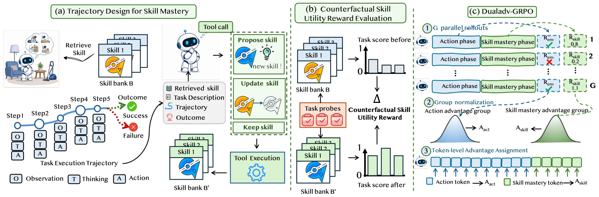

# SKILLMASTER

> **分类**: Skill 管理 | **成熟度**: 🟡 成长期 | **综合评分**: 0.56

---

## 一句话描述

**SKILLMASTER** 将技能管理（创建、修改、选择）**教给 Agent 自己**而非外部系统。通过两阶段轨迹设计、**反事实探针任务**评估技能修改效用、以及 **DualAdv-GRPO** 分离执行和技能管理的优势估计，让 7B 小模型学会自主管理技能库，在 ALFWorld 上达到 **98.7%**，超越所有闭源大模型。

**来源**:
- 山东大学、清华大学、中关村实验室、东南大学、中科大联合研究
- 发布年份：**2026**

**链接**:
- 论文：https://arxiv.org/pdf/2605.08693

---

## 核心实现

**1. 两阶段轨迹设计：执行 → 技能掌握**

每条训练 episode 分两阶段：**执行阶段**与标准 Agent 相同，检索技能、注入 Prompt、逐步执行并收到环境奖励；**技能掌握阶段**将任务描述、检索技能、完整轨迹和最终反馈汇总为技能回顾 Prompt，Agent 必须输出恰好一个工具调用——propose_skill（新建）、update_skill（修改）或 keep_skill（保留）。技能管理被建模为可优化的 RL 动作，而非固定规则。

**2. 反事实技能效用奖励**

当 Agent 调用 propose_skill 或 update_skill 时，系统选取 K 个语义相关的探针任务，每个跑两遍（原库 vs 临时修改库），比较表现。评分考虑失败变成功和成功变更快两种效果，只有多探针任务上效果一致正向的修改才拿高分。**技能质量不再是主观判断，而是可量化的下游效果。**

**3. DualAdv-GRPO：双流优势估计**

执行阶段和技能掌握阶段的奖励尺度和语义完全不同。DualAdv-GRPO 将两个阶段的奖励分别归一化，执行 Token 走执行优势流、技能管理 Token 走技能优势流，用可调权重控制比例。二者同时训练，互不干扰。

---

## 主要能力

- **Agent 自主技能管理**：技能创建、修改、选择全部由 Agent 自己决策，而非外部辅助系统
- **反事实效用评估**：用探针任务的下游效果变化评估技能质量，区分"靠技能成功"和"靠自己成功"
- **技能内化**：训练结束关掉技能检索后 Agent 从 98.7% 仅掉至 93.9%，技能已内化为 Agent 的自主行为模式
- **高效修改**：整个训练过程仅约 20 次有效技能编辑，就把 7B 小模型送到 98.7%
- **跨模型碾压**：7B 模型学会技能管理后，超越 GPT-4o（48.0%）和 Gemini-2.5-Pro（60.3%）

---

## 局限性

- **依赖初始种子技能**：技能库需要初始种子（论文使用 SKILLRL 蒸馏的技能）
- **反事实评估额外开销**：探针任务评估需要额外 rollout 预算（默认 K=3）
- **探针任务选取依赖任务家族定义**：更通用的选取策略仍是开放问题

---

## 成熟度评分

| 维度 | 评分 (0.0-1.0) | 说明 |
|------|---------------|------|
| 技术成熟度 | 0.55 | 学术论文阶段，五机构联合研究，有开源代码，ALFWorld 98.7%超所有闭源大模型 |
| 创新性 | 0.75 | 将技能管理教给Agent自己，DualAdv-GRPO分离执行和管理优势，反事实探针评估效用 |
| 落地程度 | 0.40 | 代码已开源，7B小模型即可运行，实用性强 |
| 生态活跃度 | 0.50 | 山大+清华+中关村+东南+中科大五机构联合 |

**综合评分**: 0.56

---

## 参考资料

- [SKILLMASTER 论文](https://arxiv.org/pdf/2605.08693)
- [代码](https://github.com/sduyangmin/Skill-Master)
