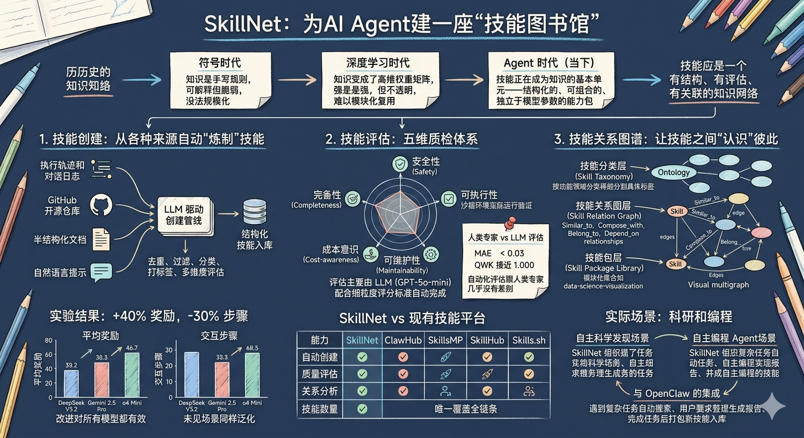
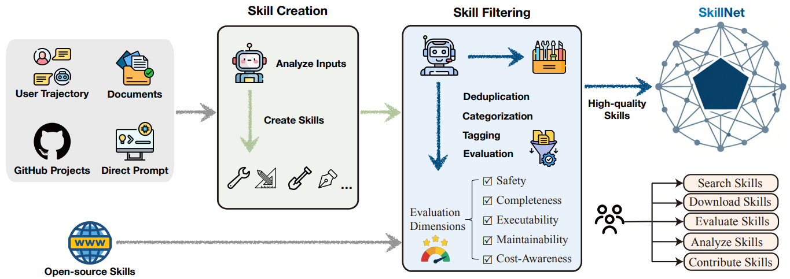

# SkillNet

> **分类**: Skill 召回 | **成熟度**: 🟡 成长期 | **综合评分**: 0.58

---

## 一句话描述

SkillNet 是目前唯一覆盖技能**"创建 → 评估 → 连接 → 分发"全链条**的开放基础设施，已收录 **60 万+候选技能**，用五维评估体系和三层技能本体论把散落的技能文件变成了有结构、有评估、有关联的知识网络，接入后 Agent 平均奖励提升 **40%**，交互步骤减少 **30%**。

---

## 核心实现

SkillNet 不只是一个技能仓库，更像一个技能操作系统——创建管线自动化、评估体系多维度、本体论三层组织、分发集成闭环。

**四源自动化创建**：从执行轨迹/对话日志、GitHub 开源仓库、半结构化文档（PDF/PPT/Word）、自然语言描述四种来源，用 LLM 驱动自动提取结构化技能。生成后经过去重、过滤、分类、打标签、多维评估，只有通过质检的才入库。

**五维质检体系**：每个技能从安全性（有无危险操作、抗注入能力）、完备性（流程步骤是否完整、前置条件是否写清）、可执行性（沙箱里能否实际跑通、有无幻觉工具调用）、可维护性（模块化程度、局部修改是否影响全局）、成本意识（延迟、算力、API 费用）五个维度量化打分。评估由 GPT-5o-mini 自动完成，可执行性维度还会在沙箱里实际跑。人类专家盲评验证：所有维度 MAE < 0.03，QWK 接近满分 1.000。

**三层技能本体论**：分类层按功能领域分类（开发/AIGC/科研/安全等），关系图层定义四种类型化关系（similar_to/compose_with/belong_to/depend_on），技能包层将相关技能打包成模块化集合（如 data-science-visualization、e2e-browser-testing）。关系图谱用语义嵌入做候选匹配再用 LLM 确认关系类型。

**闭环集成**：与 OpenClaw 集成后形成三种自动行为——遇到复杂任务自动搜索 SkillNet 下载匹配技能、定期分析本地技能库生成多维评估报告、完成任务后主动将成功经验打包入库。

---

## 主要能力

- 全链条覆盖：从创建到评估到连接到分发，其他平台更像技能市场，SkillNet 更像技能操作系统
- 四源自动炼制让技能库可以持续自我演化，不只是静态仓库
- 五维评估的自动化结果与人类专家几乎无差别，为大规模技能质量管理提供了可落地的方案
- 三层本体论把孤立技能变成有类型关系的知识网络，检索不再是纯语义匹配而是图结构上的导航

---

## 局限性

- 私有领域和低频、高度隐性的能力很难被收录——自动创建管线能抓到的知识有限
- 自动生成技能的恶意"投毒"虽然能检测一部分但无法彻底防御
- 从自然语言需求到全自动 Agent 部署的端到端管线还没打通
- 60万技能规模说小不小，但和真正的 Web 级别知识库比还有数量级的差距

---

## 成熟度评分

| 维度 | 评分 (0.0-1.0) | 说明 |
|------|---------------|------|
| 技术成熟度 | 0.65 | 有论文和代码开源，已收录60万+技能 |
| 创新性 | 0.50 | 三层本体论和五维评估的设计 |
| 落地程度 | 0.60 | 与OpenClaw集成，规模较大 |
| 生态活跃度 | 0.55 | 有开源代码和社区 |

**综合评分**: 0.58

---

## 参考资料

- [官网](http://skillnet.openkg.cn/)
- [论文](https://arxiv.org/pdf/2603.04448)
- [代码](https://github.com/zjunlp/SkillNet)
- [详解](https://zhuanlan.zhihu.com/p/2014393687812110022)