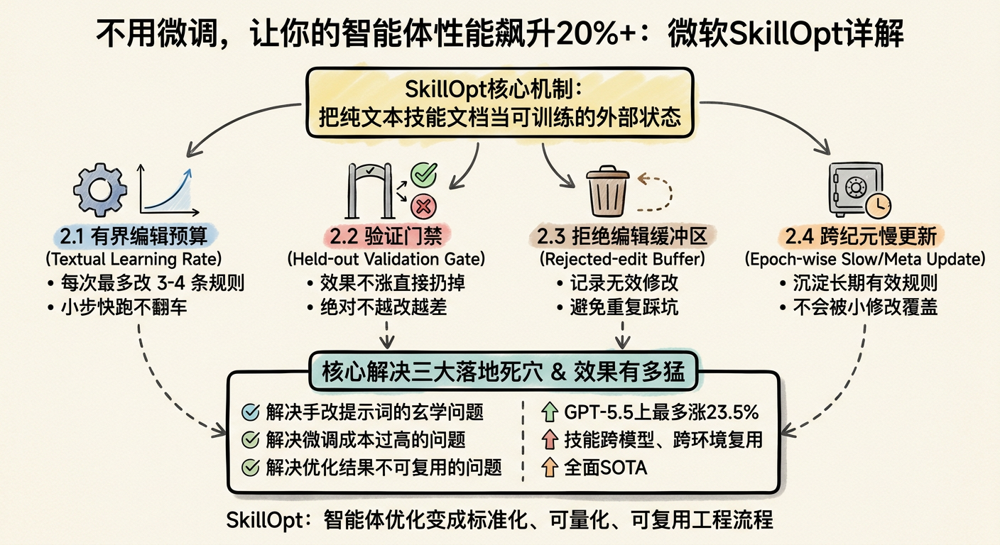
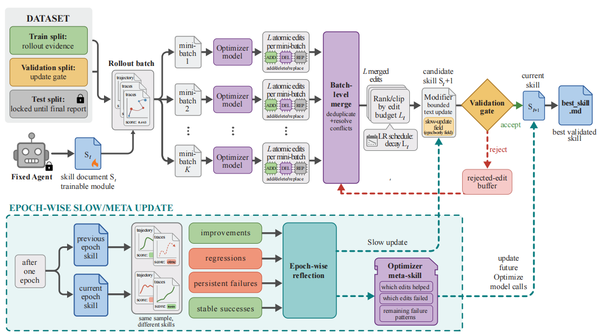

# SkillOpt

> **分类**: Skill 优化 | **成熟度**: 🟢 成熟期 | **综合评分**: 0.68

---

## 一句话描述

**SkillOpt** 将深度学习训练循环一比一翻译为文本编辑循环——把纯文本技能文档视为可训练的外部状态（不改模型权重），通过 **rollout → reflection → edit → validation gating** 四步闭环自动优化技能。在 **52 个测试组合中全部最优或并列最优**，GPT-5.5 上平均提升 23.5 分，优化后的技能**跨模型、跨执行环境可复用**，部署零额外推理成本。

**来源**:
- 学术论文：微软研究院（Microsoft Research）
- 发布年份：**2026**

**链接**:
- GitHub：https://github.com/microsoft/SkillOpt

---

## 核心实现

**1. 有界编辑预算（Textual Learning Rate）：每次最多改 3-4 条规则**

对应深度学习的"学习率"概念，每次迭代最多修改 L_t 条规则（默认 4 条），使用**余弦调度**（早期可多改、后期逐渐减量），防止一次性大幅修改导致的规则冲突和效果雪崩。消融实验证明：L_t=4 的限制编辑效果优于无限制重写 2-3 分——与神经网络学习率过大导致震荡同理。所有修改建议必须是**通用规则**，不能是针对具体 case 的硬编码。

**2. 验证门禁（Validation Gate）：效果不涨直接丢弃修改**

每次修改后的新版本技能必须在**完全独立的验证集**上跑一遍，只有得分**严格高于**上一版本才接受——持平也不更新，否则直接丢弃并将本次修改记录到拒绝编辑缓冲区。这条门禁机制保证了优化过程永远不会出现越改越差的情况，是 SkillOpt 效果稳定的核心法宝。

**3. 拒绝编辑缓冲区（Rejected-Edit Buffer）：踩过的坑不踩第二次**

所有被验证门禁打回的无效修改被记录到缓冲区，后续迭代时优化器会先检查哪些修改之前被证明无效，不再提出同样的建议。这加速了优化收敛速度，避免在同一个方向上反复尝试失败。

**4. 跨纪元慢更新（Epoch-wise Slow/Meta Update）：沉淀长期有效规则**

每迭代 2-3 轮后做一次慢更新：把多轮验证都持续有效的核心规则写到技能文档的**受保护区域**，这些规则不会被后续的 step 级小修改覆盖，保证核心能力不会因后续迭代退化。**这是 SkillOpt 最关键的组件**——消融实验中去掉 slow/meta update 后，SpreadsheetBench 从 77.5 暴跌至 55.0（-22.5 分）。

**5. 四步闭环流程**

**Rollout（前向传播）**：目标模型携带当前技能文档执行一批任务，收集成功/失败轨迹作为训练信号，模型参数冻结不动。**Reflection（梯度计算）**：优化器模型分析失败轨迹的共性问题，提炼改进方向，生成结构化编辑建议——两个模型分工（target model 执行，optimizer model 观察分析，同一级别的优化器也可恢复强优化器 56%-74% 的增益）。**Edit（权重更新）**：对技能文档做 add/delete/replace 三种结构化编辑。**Validation Gating（检查点保存）**：修改后在验证集评估，分数不涨则不接受。

---

## 主要能力

- **52 场景全 SOTA**：6 个基准测试 × 7 个模型 × 3 种执行环境共 52 个组合全部最优或并列最优，GPT-5.5 平均提升 23.5 分
- **跨模型迁移**：在 GPT-5.4 上优化的技能直接用于 GPT-5.4-mini 和 GPT-5.4-nano，仍保留 80% 以上的提升效果
- **跨执行环境迁移**：在 Codex 环境下优化的表格处理技能直接放到 Claude Code 环境下，直接提升 59.7 分
- **部署零额外成本**：训练成本一次性离线付出，最终输出的技能为纯文本 md 文件（中位数约 920 tokens），人类可读可审计可修改，插入系统提示词即用
- **低门槛落地**：不需要改模型权重，优化成本仅为微调的几十分之一，小团队手动跑都能跑通

---

## 局限性

- 依赖可自动评估的验证集，开放性任务暂不适用
- 训练需要两个模型（target + optimizer），同级别优化器效果打折扣
- 复杂轨迹类 benchmark 训练 token 消耗较高（37.9-46.4M），但仅需训练一次

---

## 成熟度评分

| 维度 | 评分 (0.0-1.0) | 说明 |
|------|---------------|------|
| 技术成熟度 | 0.75 | 论文+MIT开源代码，6基准×7模型×3环境52组合充分验证，跨模型跨环境迁移验证 |
| 创新性 | 0.85 | 首次将Skill文档视为可训练权重，深度学习训练循环到文本编辑的范式映射 |
| 落地程度 | 0.55 | 开源可用，Codex/ClaudeCode已验证，但实际企业部署案例少 |
| 生态活跃度 | 0.50 | 微软背书+MIT开源，2026年5月发布，社区关注度快速上升 |

**综合评分**: 0.64

---

## 参考资料

- [论文](https://arxiv.org/pdf/2605.23904)
- [GitHub](https://github.com/microsoft/SkillOpt)
- [详解](https://zhuanlan.zhihu.com/p/2044004553406863336)
