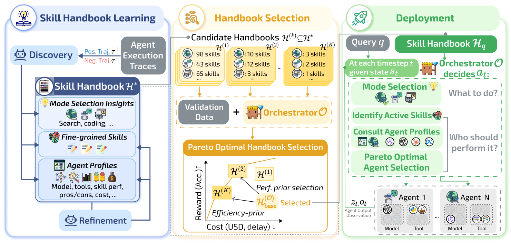

# SkillOrchestra

> **分类**: Agent 编排/模型路由 | **成熟度**: 🔴 研究阶段 | **综合评分**: 0.60

---

## 一句话描述

**SkillOrchestra** 是一种基于 **技能手册（Skill Handbook）** 的 Agent 编排框架，通过从执行轨迹中**自动挖掘细粒度技能**并为每个 Agent 建立**技能条件的能力画像**，用查表替代端到端 RL 训练，根治路由坍塌问题，同时实现 700 倍训练成本降低和跨 orchestrator 零成本迁移。

**来源**:
- Jiayu Wang, Yifei Ming, Zixuan Ke, Shafiq Joty, Aws Albarghouthi, Frederic Sala
- University of Wisconsin-Madison & Salesforce AI Research
- 发布年份：2026

**链接**:
- 论文：https://arxiv.org/abs/2602.19672
- 代码：https://github.com/jiayuww/SkillOrchestra

---

## 核心实现

**1. Skill Handbook 三层结构：模式洞察 + 技能注册表 + Agent 画像**

手册由三层可复用知识构成。
- **模式层**（Mode-level Insights）：从执行轨迹中蒸馏出的经验规则，指导何时搜索、编码或直接回答。
- **技能注册表**（Skill Registry）：自动挖掘的细粒度能力抽象，如"符号逻辑推理"、"Pell 方程求解"、"约束配对计数"——每个技能含自然语言描述、适用场景指示信号和典型样例，支持从粗到细的分层展开（如 data_processing → symbolic_logic）。
- **Agent 画像**（Agent Profiles）：每个 Agent 在每个技能上维护一个 **Beta 分布**估计的成功概率，附带成本统计、优劣势总结和使用注记，路由可直接查表决策。

**2. 技能发现与精炼：轨迹对比 + 统计合并拆分**

技能不是专家标注的，而是从执行轨迹中自动挖掘。
- **Skill Discovery** 阶段：对同一查询和模式，取一条成功轨迹和一条失败轨迹做对比，两者间的能力差距由 LLM 抽象为可复用技能定义并加入注册表。
- **Handbook Refinement** 阶段：定期依据 Agent 表现统计——高方差技能触发拆分（标识多个底层能力），统计不可区分的技能对触发合并（消除冗余）。

**3. Pareto 最优手册筛选 + 技能感知路由**

手册建完后不是全量使用。细粒度技能要求 orchestrator 具备足够的推理能力来准确识别当前激活的子技能，能力弱的 orchestrator 反而会因误判而选错 Agent。系统在验证集上评估候选手册子集，选出使目标 orchestrator 在性能和成本间达到 **Pareto 最优**的版本 —— 强者拿精细版，弱者拿粗粒度版。推理时，orchestrator 依次执行模式选择、技能识别，最后用 **Bayesian 后验均值**聚合 Agent 在所需技能上的能力得分，减去成本惩罚项，选分最高者执行。

---

## 主要能力

- **根治路由坍塌**：将 RL 路由器的单模型集中度从 98% 降至均衡分布，各模型按能力特长被合理调用
- **极致数据效率**：仅需几十条探索轨迹构建手册，训练样本比 Router-R1 少约 700 倍，比 ToolOrchestra 少约 300 倍
- **跨 orchestrator 零成本迁移**：手册与 orchestrator 模型解耦，一次构建可复用至不同 backbone，全部涨点无例外
- **白盒可解释路由**：每次路由决策有技能层面的明确理由，而非隐状态权重
- **Pareto 最优的性能-成本权衡**：在模型路由和 Agent 编排双场景中均位于 Pareto 前沿，准确率更高、成本更低

---

## 局限性

- **探索性数据集依赖**：手册构建需覆盖正负样本的探索性轨迹，新领域冷启动时如何高效获取尚未展开
- **持续更新机制缺失**：新任务和新模型加入后手册的自动增量更新策略论文未涉及
- **技能粒度选择未全自动**：当前通过验证集 Pareto 筛选，自适应粒度调整仍需进一步研究
- **Agent 编排场景验证有限**：仅 FRAMES 一个 benchmark，多工具多模式场景的泛化性有待扩大验证

---

## 成熟度评分

---

## 参考资料

- [论文](https://arxiv.org/abs/2602.19672)
- [代码](https://github.com/jiayuww/SkillOrchestra)
