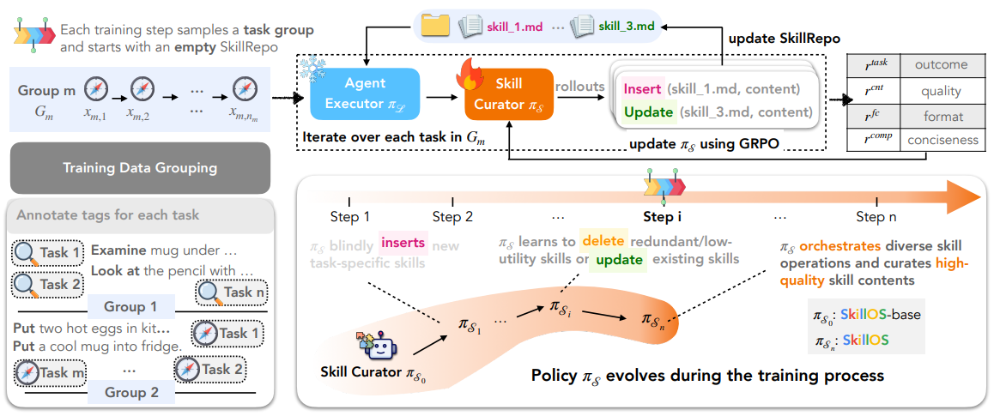

# SkillOS

> **分类**: Skill 管理 | **成熟度**: 🟡 成长期 | **综合评分**: 0.50

---

## 一句话描述

Google Cloud AI Research 联合 UIUC 和 MIT 提出 SkillOS——用一个**8B 参数的小模型当技能策展人**，通过 GRPO 强化学习学会什么时候新建、更新、删除技能，结果是**8B 策展人在管技能这件事上直接碾压了 Gemini-2.5-Pro**（61.2% vs 53.1%）。

---

## 核心实现

架构分两个角色：执行器（冻结）只管干活，策展人（可训练）只管管技能。每完成一个任务，策展人观察完整轨迹后决定 insert/update/delete 三种操作之一，形成"执行→观察→更新技能库→下次执行受影响"的闭环。

**分组任务流替代随机排列**：策展人在第 3 个任务改了一个技能，效果要等第 10 个相关任务才体现——延迟反馈是最大挑战。SkillOS 用软 Jaccard 相似度把相关任务聚成"任务组"，组内前面的决策在后面的任务上就见效，把延迟反馈转化成了即时可优化的信号。

**复合奖励函数**：四维奖励驱动——r_task（任务成功率，核心信号）、r_fc（操作有效性，不能产出格式错误或不存在的东西）、r_cnt（内容质量，用 Qwen3-32B 做外部评判器打分）、r_comp（压缩奖励，鼓励精炼惩罚照抄轨迹）。GRPO 优化，每组任务跑 8 条独立 rollout 算优势函数。

**技能库从"堆砌"到"精炼"的演化路径**：训练早期策展人只会不停 insert，后来 update_skill 占比持续上升——开始合并重复、提取共性、修正描述。技能内容从泛泛的"Tips"演化出失败处理逻辑、条件分支、状态验证、系统化搜索、回退规划等真正有操作性的结构。元策略技能（怎么思考问题）逐渐取代任务-物体专有技能（怎么处理水杯），形成可组合的元认知框架。

---

## 主要能力

- 分离式架构让策展能力可以独立升级，不碰执行器本身——冻结底层 Agent 模型，策展人单独训、单独部署
- 分组任务流把延迟反馈变成即时信号，解决了技能管理中最棘手的"改了才知道好不好、知道了已经过了好几个任务"的问题
- 复合奖励中的压缩奖励迫使策展人做减法而非照抄轨迹，产出的技能精炼、可复用
- 跨模型泛化：在 Qwen3-8B 执行器上训出来的策展人，换到 Qwen3-32B 甚至 Gemini-2.5-Pro 执行时性能照样往上走

---

## 局限性

- 训练成本不低——16 张 H100，ALFWorld 上 3 天，推理任务 2.5 天
- 技能库初始状态影响收敛速度和质量，冷启动到一个全新领域是未知数
- 复合奖励的四个权重是手工设的，不同领域可能需要重新调
- 目前只在两套任务（多轮交互 + 单轮推理）上验证，更长的演化周期（数万次交互）策展人能进化出什么尚未探索

---

## 成熟度评分

| 维度 | 评分 (0.0-1.0) | 说明 |
|------|---------------|------|
| 技术成熟度 | 0.50 | 有完整论文验证 |
| 创新性 | 0.55 | 分离式架构设计 |
| 落地程度 | 0.45 | 学术研究阶段 |
| 生态活跃度 | 0.50 | 有项目页面 |

**综合评分**: 0.50

---

## 参考资料

- [论文](https://arxiv.org/pdf/2605.06614)
- [详解](https://zhuanlan.zhihu.com/p/2036102058797946620)