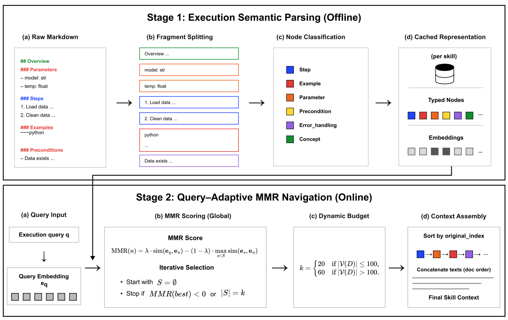

# SkillPager

> **分类**: Agent 技能召回 | **成熟度**: 🟡 成长期 | **综合评分**: 0.48

---

## 一句话描述

SkillPager 定义了**技能内检索（intra-skill retrieval）**：已知该用哪个技能，在技能文档内按当前查询挑出**最小但够用的上下文子集**，而非全文注入。通过离线六种语义类型解析 + 在线全局 MMR 选择，**充分性接近全文注入（78.89% vs 82.23%），同时节省 47% 的 prompt token**。

**来源**:
- 上海交通大学 & 上海创新研究院，论文 arXiv: 2606.00822
- 发布年份：2026

**链接**:
- 论文：https://arxiv.org/abs/2606.00822

---

## 核心实现

**1. 离线解析：六种语义类型节点 + 四类边**

一条自动流水线将原始 Markdown 技能文档拆分为六种语义类型节点：
- **step**：可执行操作或指令
- **example**：使用演示和代码片段
- **param**：可配置参数
- **precondition**：执行前约束
- **error_handling**：失败恢复步骤
- **concept**：定义性背景段落

前五种为可执行节点，concept 保留在候选池中但不可执行。同时自动推断**四种边（sequence、semantic、reference、condition）**构建节点图，但在线检索阶段**完全不依赖这张图**：离线管线对 395 个技能一次性解析后永久缓存，在线只需查询嵌入和 MMR 循环。

**2. 在线检索：全局 MMR 不打图遍历**

给定查询 q 和缓存的节点集合，MMR 从空已选集开始，每次迭代选一个节点最大化 $λ·sim(e_q, e_n) - (1-λ)·max sim(e_s, e_n)$，$λ=0.7$。第一项把与查询最相关的节点前推，第二项把已有高相似替代品的节点后压。当最佳剩余候选 MMR 转负时提前终止。选中节点按原文原始顺序重排后拼成上下文。预算分两档：节点 ≤100 取 20 个，更大取 60 个：来自 k 扫描分析。

**3. 放弃图遍历的关键决策**

实验中自动解析出的图**稀疏且不可靠**：执行关键节点之间经常未被连接。局部图遍历上下文充分性仅 66.73%，全局 MMR 达 78.89%，差 12.16 个百分点。在 MMR 结果上加一阶图扩张反而让充分性从 69.8% 降到 67.4%、节点膨胀、token 节省率缩水。结论是**图对这个场景是噪音源而非信号源**：一旦节点被正确按语义类型标注，扁平化全局 MMR 比任何局部图遍历方案都更准也更省 token。

---

## 主要能力

- **技能内检索**：在已知该用哪个技能的前提下按查询挑出最小够用上下文，填补生态空白
- 六种语义类型节点离线解析：step/example/param/precondition/error_handling/concept，一条流水线一次性缓存
- 全局 MMR 检索：仅依赖查询嵌入和数值计算，在线阶段**不调用 LLM**，中位数查询嵌入约 498 token
- concept 节点动态保留在候选池中，让 MMR 在查询级别自适应判断是否需要，**优于静态一刀切删除**

---

## 局限性

- 离线解析对 395 个技能耗时 **9.83 小时**（4 并行 worker），大规模技能库的解析成本不可忽略
- 仅覆盖 Markdown 格式的技能文档，其他格式（YAML、JSON schema）的解析未验证
- 离线解析和节点类型标注依赖 LLM 调用，标注质量直接影响检索效果
- 概念节点动态保留虽优于静态删除，但**概念内容何时有用的精确边界**仍未解决

---

## 成熟度评分

| 维度 | 评分 (0.0-1.0) | 说明 |
|------|---------------|------|
| 技术成熟度 | 0.50 | 六种语义类型+MMR选择方案设计合理 |
| 创新性 | 0.55 | 技能内检索是一个全新子方向的首次定义 |
| 落地程度 | 0.40 | 论文阶段，Token节省47%的数据来自受控实验 |
| 生态活跃度 | 0.45 | 上海交大+上海创新研究院出品，有开源代码 |

**综合评分**: **0.48**

---

## 参考资料

- [论文](https://arxiv.org/abs/2606.00822)
