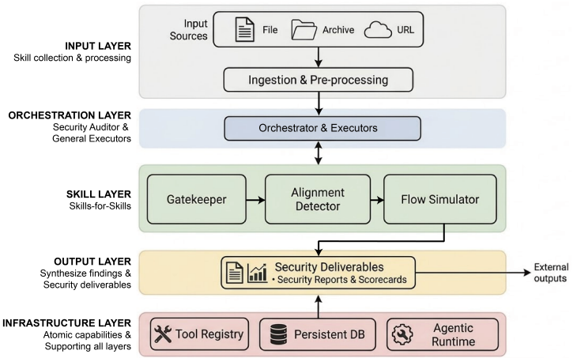

# SkillProbe

> **分类**: Skill 评测 / 安全审计 | **成熟度**: 🟡 成长期 | **综合评分**: 0.61

---

## 一句话描述

SkillProbe 是多阶段、模块化的**多 Agent 安全审计框架**，采用 **"Skills-for-Skills"** 范式，将审计环节封装为标准技能模块，Agent 加载即可完成全流程安全校验，覆盖**语义-行为不一致**与**跨技能组合风险**两大威胁。

**来源**:
- 学术论文
- 发布年份：2026年

**链接**:
- 论文链接：https://arxiv.org/pdf/2603.21019

---

## 核心实现

SkillProbe 框架分为五层架构（输入层、编排层、技能层、输出层、基础设施层），核心是三阶段审计流水线：

**阶段 1：Gatekeeper（准入过滤）**：采用"解耦检查+集中聚合"架构，将现有安全工具封装为独立执行器并行检测，覆盖合规性、恶意代码模式、风险依赖、权限声明合理性等维度。遵循保守原则，任一检查项不通过即全局拦截。

**阶段 2：Alignment Detector（语义-行为一致性检测）**：将一致性问题形式化为文档声明能力集 D(s) 与代码实现能力集 C(s) 的匹配问题。通过文档提取器与代码提取器并行解析、语义归一化后，构建四类对齐矩阵实现风险分类——完全对齐（Match）、过度声明（Over-declaration）、影子功能（Under-declaration，高风险）、复杂偏差（Mixed）。

**阶段 3：Flow Simulator（组合风险模拟）**：通过风险指纹标签化——为每个技能打上输出风险标签和输入敏感标签——将组合风险检测复杂度从指数级 O(2^N) 降至线性级 O(N×Rules)。基于 9 类核心风险链路策略（命令注入、间接提示词注入、数据泄露、意图劫持等）批量执行攻击路径模拟。引入证据强制机制，每个漏洞必须引用原始代码或文档片段作为证据。

**裁决机制**：基于恶意模式、语义一致性、组合安全性三大维度构建安全评分卡，采用一票否决原则，将技能分为 REJECTED（存在关键漏洞）、CONDITIONAL（低风险偏差需人工复核）、APPROVED（全维度符合安全基线）三个等级。

---

## 主要能力

- 语义-行为一致性检测：识别"文档合规、代码恶意"的语义欺骗攻击
- 跨技能组合风险识别：通过风险指纹标签化，将组合爆炸从指数级降至线性级
- 结构化安全评分卡生成（REJECTED / CONDITIONAL / APPROVED 三级裁决）

---

## 局限性

- 严格度、细粒度、低延迟三者难以同时实现（审计的不可能三角）
- 误报率仍需进一步降低
- 当前组合风险模拟依赖预定义风险链路策略，对新型零日攻击模式存在检测盲区
- 面对大规模技能瞬时涌入（如 >10,000）时，审计严格度与延迟之间仍难以平衡

---

## 成熟度评分

| 维度 | 评分 (0.0-1.0) | 说明 |
|------|---------------|------|
| 技术成熟度 | 0.65 | 有完整论文和大规模评估 |
| 创新性 | 0.70 | Skills-for-Skills 审计范式创新 |
| 落地程度 | 0.55 | 基于真实数据集的审计能力 |
| 生态活跃度 | 0.50 | 学术研究阶段 |

**综合评分**: 0.61

---

## 参考资料

- [论文](https://arxiv.org/pdf/2603.21019)
- [详解](https://zhuanlan.zhihu.com/p/2020165820400054775)
