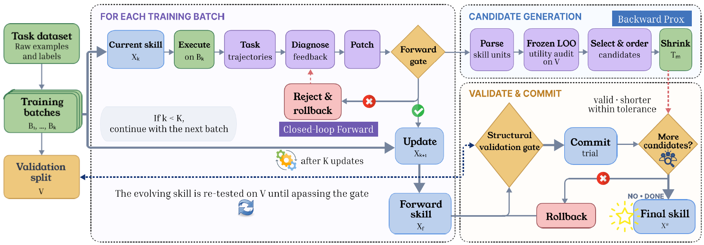

# SkillProx

> **分类**: Skill优化 | **成熟度**: 🟡 成长期 | **综合评分**: 0.56

---

## 一句话描述

SkillProx 是**技能自进化框架**，借近端梯度的前向-后向分工：前向**同批重跑实测门控**诊断更新、后向**冻结 leave-one-out 效用审计+验证门控收缩**，让技能的任务能力与结构复杂度协同进化。

**来源**:
- SkillProx: Self-Evolving Agent Skills via Proximal Textual Gradient Descent（Mingxuan Zheng 等，香港科技大学 / 澳门大学）
- 发布年份：2026

**链接**:
- https://arxiv.org/abs/2608.07449
- https://github.com/Steven011018/SkillProx（论文标注 will be available）

---

## 核心实现

SkillProx 把技能进化绑成前向-后向两阶段，借近端梯度下降的前向（降任务损失）/后向（控结构复杂度）分工——不真算梯度、不真解近端算子，只保留"前向决定进什么、后向决定留什么"的责任分工。

**1. 前向闭环诊断更新：同批重跑实测门控**

- 每轮迭代在训练批执行当前技能，诊断器拿失败迹+对照成功迹+历史+上轮拒绝理由提编辑方向，Patcher 产候选。
- 候选**同批重跑**，门控两项——硬准确率和 cell 准确率都不退才接受。
- 首个严格提升提前终止；否则最多 3 试按字典序选优但仍须过门。被拒尝试的硬/cell 变化与方向喂下轮诊断——诊断按实测后果演化。

**2. 后向冻结效用审计：leave-one-out 测单元边际贡献**

- 前向完得的技能解析成 L2 章节+L3 引用组单元。
- 每单元用**冻结 leave-one-out** 算边际效用：移除该单元后验证集准确率掉多少，掉为正即有用、涨为负即有害。
- 全程只测一次且冻结，只定候选资格与顺序，按 cell 效用、硬效用字典序排候选。

**3. 验证门控收缩：结构有效+性能不退+压缩范围内才提交**

- Shrinker 产收缩试验，先过结构有效+严格复杂度缩减。
- 再在验证集验：硬准确率不退、cell 准确率容忍小退（0.02）、压缩比例不超阈值（0.10）。全过才提交。
- 压缩比例是软停止阈值，候选有限每最多一次，收缩有限步终止。

控制要点：诊断质量不能从语义判须实测判；技能只增不减会累积冗余/冲突/实例特定内容害有用知识；前向决定进什么、后向决定留什么。

---

## 主要能力

- **IID 全最优**：三骨干 SpreadsheetBench 全第一（21.0/51.3/54.5），27B 上 +13.0/+17.8 个点
- **OOD 不退化反迁移**：技能只在 IID 优化，WikiTQ/HiTab 上多骨干最优，后向收缩压掉过拟合
- **方差最低**：±0.5 vs SkillOpt ±7.6，增益跨 seed 稳非初始化运气
- **压缩提精度**：τ=−0.001 压 25.7% 同时 OJ 50.3%→52.3%，τ=0.050 压 74.9% 仍 51.0%
- **两阶段互补**：去 Prox 掉 2.5、去闭环掉 1.5，全方法方差最低

---

## 局限性

- **前向门控只约束当前批**：各轮批不同，不保证跨迭代/验证/测试单调
- **后向依赖前向质量**：Prox 需优化过的前向技能收缩，原始基线不行（去闭环掉 1.5）
- **审计做完整移除但实际可合并/降级**：每个尝试须在当前状态重验，计算开销
- **压缩超 80% 性能降**：τ 过激进时收缩过头，需 Pareto 选阈值

---

## 成熟度评分

| 维度 | 评分 (0.0-1.0) | 说明 |
|------|---------------|------|
| 技术成熟度 | 0.58 | 前向同批重跑门控 + 后向 leave-one-out 效用审计，代码标注将开源 |
| 创新性 | 0.72 | 近端梯度前向-后向分工，不真算梯度保留责任分工 |
| 落地程度 | 0.48 | 三骨干 IID 全最优方差 ±0.5，后向收缩压过拟合 |
| 生态活跃度 | 0.45 | 单篇论文，代码标注 will be available |

**综合评分**: 0.56

---

## 参考资料

- [SkillProx: Self-Evolving Agent Skills via Proximal Textual Gradient Descent](https://arxiv.org/abs/2608.07449)
- [开源代码（论文标注 will be available）](https://github.com/Steven011018/SkillProx)
