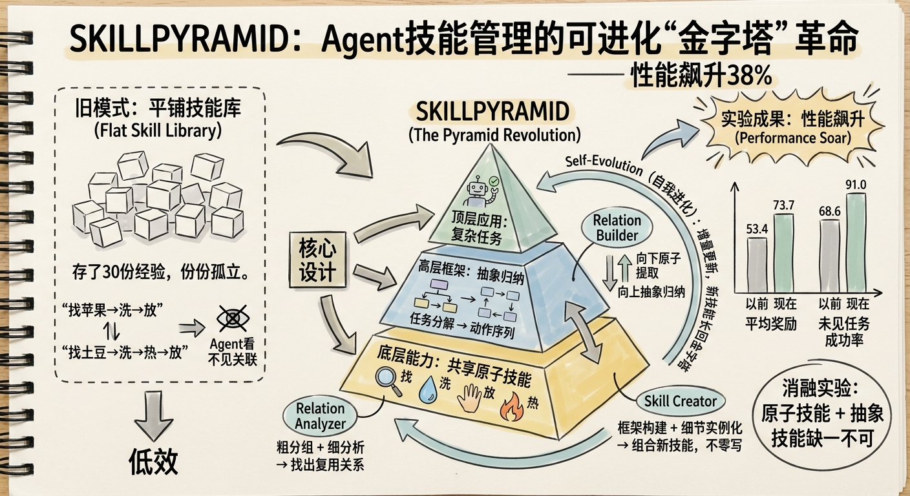
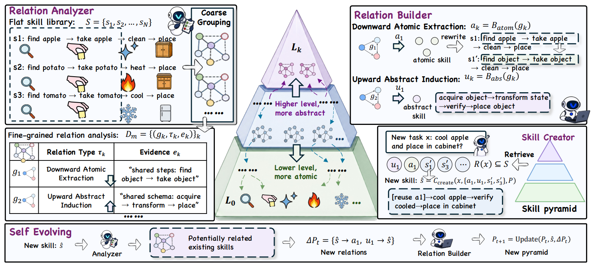

# SKILLPYRAMID

> **分类**: Skill 召回 | **成熟度**: 🟡 成长期 | **综合评分**: 0.37

---

## 一句话描述

**SKILLPYRAMID** 将平铺的技能库重构为 **可自演化的层级金字塔**，通过 **向下原子提取** 和 **向上抽象归纳** 两种操作，把孤立技能拆解为底层可复用原子、中层组合模式和高层任务框架，让 Agent 遇到新任务时不再从零探索，而是 **从现有能力中组合生成新技能**。

**来源**:
- 中科院自动化所、上海 AI 实验室联合研究
- 发布年份：**2026**

**链接**:
- 论文：https://arxiv.org/pdf/2606.03692

---

## 核心实现

**1. Relation Analyzer：从粗到细的两阶段关系分析**

Analyzer 采用 **粗分组 → 细分析** 策略，避免全库逐对扫描的噪音和成本。粗分组阶段仅看技能名称和简短描述，将功能相近、有潜在复用可能的技能归入同组；细分析阶段打开每组内技能的完整内容，深入识别具体关系类型，输出结构化的 **关系构建任务**，指定哪些技能之间存在什么关系及其证据。两阶段设计让分析成本随技能库增长的曲线显著平缓于全对扫描。

**2. Relation Builder：向下原子提取 + 向上抽象归纳**

Builder 执行两种互补的结构化操作。**向下原子提取**：从一组技能中提取共享的最小可复用能力（如"定位并获取目标物体"），作为原子技能放入金字塔更低层，同时重写原始技能，在关键步骤显式引用原子技能。**向上抽象归纳**：从一组技能中提取共享的高层解题模式（如"获取→处理→验证→放置"），作为抽象技能放入金字塔更高层，提供可泛化的任务框架而非僵化步骤。两种操作共同将平铺技能库重建为有层级、有引用、有方向的图结构。

**3. Skill Creator：框架构建 → 细节实例化的两步组合**

遇到新任务时，Skill Creator 不检索匹配技能，而是两步组合：先用抽象技能勾勒高层解题结构、子目标、决策点和成功标准（**框架构建**）；再用原子技能填充每一步的具体操作、输入检查和输出验证（**细节实例化**）。新技能每层都显式引用金字塔中的已有技能，只有真正新增的部分才从零生成。

**4. Self-Evolution：增量更新，技能长回金字塔**

每次任务执行结束后，新生成的技能作为新节点 **增量长回金字塔**。Analyzer 仅检索与新技能相关的已有技能，Builder 仅构建新技能与它们的关联，无需重建整个结构。Builder 还会检查新技能是否能被已有原子或抽象技能覆盖，若能则不重复构建，天然防止冗余膨胀。

---

## 主要能力

- **层级化技能重构**：向下提取共享原子能力、向上归纳抽象任务框架，将平铺技能库重建为可复用的金字塔结构
- **组合式新技能生成**：遇到新任务时从抽象框架 + 原子操作中组合出新技能，无需从零探索或生成
- **跨任务经验迁移**：原子技能被多个上层技能共享引用，"找苹果"和"找土豆"共享同一个"获取目标物体"原子
- **增量自演化**：每次任务执行后将新技能增量长回金字塔，系统随使用次数增长持续扩展且防止冗余
- **结构抗退化**：金字塔层级结构天然区分稳定底层和灵活高层，模型升级或环境变化时仅需更新受影响层

---

## 局限性

- **首次建塔需全库扫描**：Analyzer-Builder 管道遍历整个技能库，论文未探索更轻量的冷启动构建策略
- **依赖强主干模型**：Analyzer 和 Builder 都需要能理解技能语义、识别复用关系的大模型，弱模型下金字塔质量退化情况未被研究
- **评测局限文本交互环境**：ALFWorld、ScienceWorld、WebShop 均为文本场景，多模态和具身环境未验证
- **关系类型有限**：金字塔目前仅有向下原子提取和向上抽象归纳两种复用关系，时序依赖、因果关联等复杂组合推理未被建模

---

## 成熟度评分

| 维度 | 评分 (0.0-1.0) | 说明 |
|------|---------------|------|
| 技术成熟度 | 0.35 | 学术论文阶段，验证环境限于文本交互任务（ALFWorld/ScienceWorld/WebShop） |
| 创新性 | 0.60 | 层级化技能重构+组合式新技能生成，向下原子提取+向上抽象归纳双操作结构新颖 |
| 落地程度 | 0.25 | 纯学术研究，未见开源代码或生产部署案例 |
| 生态活跃度 | 0.25 | 中科院自动化所+上海AI Lab联合研究，单篇论文 |

**综合评分**: 0.37

## 参考资料

- [SKILLPYRAMID 论文](https://arxiv.org/pdf/2606.03692)
- [详细解析](https://zhuanlan.zhihu.com/p/2045818007985845760)
