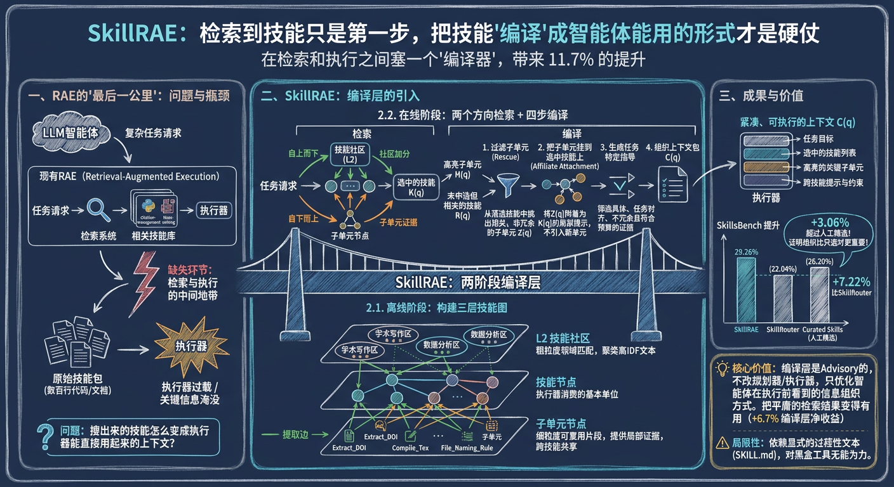
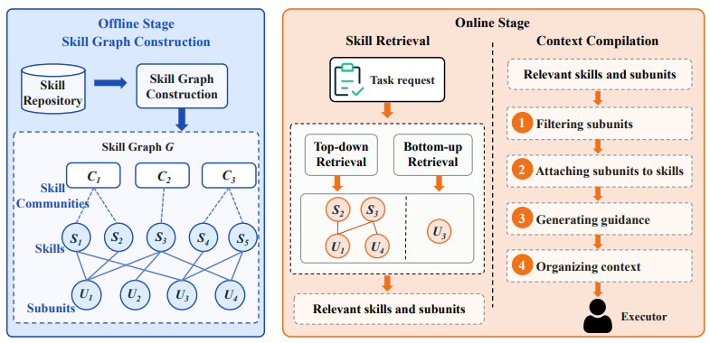

# SkillRAE：检索到技能只是第一步，把技能"编译"成能用的形式才是硬仗

**一句话描述**：SkillRAE 在检索和执行之间塞了一个**编译器**——把搜出来的技能和子单元重新组织成紧凑、可执行的上下文包，不改下游任何东西，只优化 Agent 看到的信息组织方式，在 SkillsBench 上带来了 **11.7%** 的提升，甚至**超过了人工指定的 curated skills（+3.06pp）**。

---

## 核心实现

离线建一张三层技能图（社区-技能-子单元），在线双方向检索后用四步编译器把结果组织成可执行上下文。编译器是 advisory 的——只改 Agent 看到什么，不改执行逻辑，可叠加在任何现有检索器或执行器上。

**离线三层图**：L2 技能社区（KMeans 聚类，一个社区的技能解决同一类问题）、L1 技能节点（保留为执行器兼容单位，不拆碎）、L0 子单元节点（过程性代码行/文件模式/约束说明，标准化去重后通过提取边连回源技能）。子单元跨技能共享，同一子单元可以属于多个技能。

**双方向检索**：自上而下——任务请求和技能社区做 embedding 匹配，得分最高社区里的技能获得社区加分，保证领域一致性。自下而上——任务请求和子单元做匹配，将子单元证据反向投射到源技能上，投射得分考虑子单元区分度（被越少技能共享，区分度越高）。最终技能得分 = 技能相似度 + 子单元证据 + 名称匹配 + 社区加分。

**四步编译**：Rescue（打捞落选技能中高相关但被淹没的子单元，预算 384 tokens）→ Affiliate Attachment（把救援子单元挂到已选技能上，不独立暴露，避免引入新执行单元）→ 任务特定指导生成（再筛一次，要求具体、对齐、不冗余）→ 组织上下文（按任务优先格式打包——先明确要干什么，然后列出用哪些技能、每个技能里的关键子单元是什么、跨技能补充提示）。

---

## 主要能力

编译层不改源技能、不改规划器、不改执行器，只改变 Agent 在执行前看到的信息组织形式，可叠加到任何现有系统上。

三层图同时支持粗粒度社区路由和细粒度子单元证据聚合，两个方向的信号在检索时交叉验证。

救援子单元机制打捞了因整技能落选而被埋没的关键局部信息——在技能选对的前提下靠更好的上下文编译又提了 3 个点。

编译器是 advisory 而非 planner——不改变执行过程本身，只优化输入信息的组织结构，风险可控。

---

## 局限性

强依赖 SKILL.md 中显式的过程性文本——步骤、文件约定、约束声明必须写清楚，黑盒工具或无文档代码中的知识编译器提取不到。

作为 advisory 编译器，不保证 Agent 一定会正确使用编译后的上下文，也不负责运行时失败。

目前只在 117 个任务（SkillsBench 87 + AgentSkillOS 30）上验证，技能社区的 KMeans 聚类对技能数量和质量敏感。

---

## 参考资料

1. [论文](https://arxiv.org/pdf/2605.10114)
2. [详解](https://zhuanlan.zhihu.com/p/2041215811801571918)
