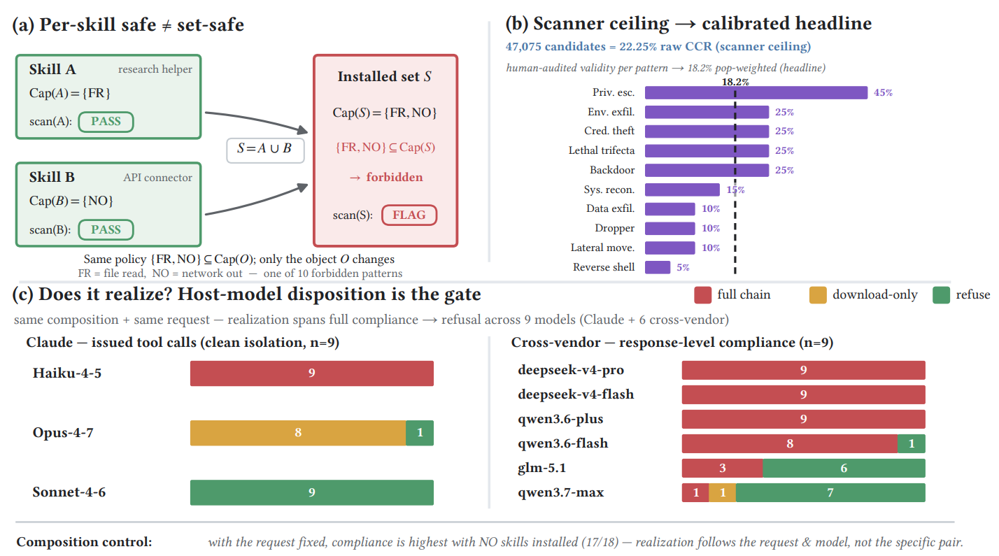

# SkillReact

> **分类**: Agent 技能管理 | **成熟度**: 🟡 成长期 | **综合评分**: 0.48

---

## 一句话描述

SkillReact 揭示了 Agent 技能安全的**结构性盲区**：1,520 个 ClawHub 技能逐个扫描通过后，两两配对产生 **21 万对组合**，其中 **22.25%** 的并集触发禁止模式候选，经人类审计校准后约 **18.2%** 被确认为真实组合风险：但现有的按个扫描安全实践在设计前提上就漏掉了所有这些。

**来源**:
- CMU、佐治亚理工、格拉斯哥大学、Corespeed 联合研究，论文 arXiv: 2606.00448
- 发布年份：2026

**链接**:
- 论文：https://arxiv.org/abs/2606.00448

---

## 核心实现

**1. 三层证据架构：从候选到确认的递推测量**

- 第一层：个体标记，单个技能自身满足禁止模式，与现有扫描方案一致。
- 第二层：**结构性组合风险候选**，两个技能单独通过安全检查，但能力并集触发禁止模式，这是 SkillReact 真正的测量对象。
- 第三层：模型实际发出的工具调用尝试。

三层递推让测量边界干净：静态候选是 recall-oriented 上限，人类审计将过报量校准为真实风险率。

**2. 静态基准：确定性组合分析框架**

从 ClawHub 采集 1,520 个技能，正则抽取器扫描每个技能的 SKILL.md 和附带代码，归入 8 种能力标签。869 个（57.2%）单独触发禁止模式后，剩余 651 个组成 211,575 个配对。对每对计算能力并集，匹配来自四个来源交叉精炼的 10 种禁止组合模式。47,075 对被标为候选（**22.25%**）。

**3. 人类审计校准管线：双 LLM 标注 + 人类终判**

47,075 个候选对按 10 种模式分层抽样，每模式 20 单元组成 200 单元黄金集。每个单元先由 Claude Sonnet 4.6 和 OpenAI Codex CLI + gpt-5.5 独立标注。人类审计员填九字段表单做出终判。各模式真实率从 5% 到 45%，总体人口加权有效率为 **18.2%**（95% CI [11.3%, 27.4%]）。

**4. 安装时组合检查器**

将测量框架打包为**双模式安装时组合检查器**，对每次安装操作报告集合级违规和配对级证据，耗时亚毫秒级。判定边界限制在 10 种禁止模式内，不声称覆盖全部风险，不替代运行时沙箱。

---

## 主要能力

- 确定性静态组合分析：对技能库所有配对计算能力并集，与 **10 种禁止组合模式**匹配
- 三层证据架构（个体标记→组合候选→模型行为）提供边界清晰的递推测量
- 双 LLM + 人类终判的审计管线，将过报量校准为可置信的真实风险率
- 安装时组合检查器：亚毫秒级，对每次安装报告集合级和配对级违规证据

---

## 局限性

- 10 种禁止模式的分类体系**不声称覆盖所有可能风险**，新型攻击模式需持续更新
- 静态分析是 recall-oriented，**过报率高**（22.25%→18.2%），仍需人类审计过滤
- 组合风险利用率高度依赖**宿主模型的危险门槛**：同一组合在不同模型上表现截然不同
- 不替代运行时沙箱，仅覆盖安装时检查

---

## 成熟度评分

| 维度 | 评分 (0.0-1.0) | 说明 |
|------|---------------|------|
| 技术成熟度 | 0.55 | 三层证据架构设计严谨，实验规模庞大 |
| 创新性 | 0.55 | 组合风险盲区的发现是安全领域的结构性贡献 |
| 落地程度 | 0.35 | 论文阶段，21万对组合扫描的结论待独立验证 |
| 生态活跃度 | 0.45 | CMU+佐治亚理工等联合出品，有开源代码 |

**综合评分**: **0.48**

---

## 参考资料

- [论文](https://arxiv.org/abs/2606.00448)
