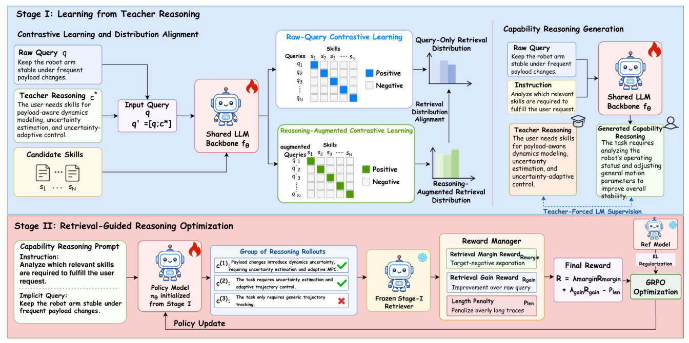

# SkillReason

> **分类**: Skill召回 | **成熟度**: 🟡 成长期 | **综合评分**: 0.57

---

## 一句话描述

SkillReason 是面向**隐式用户请求**的技能检索框架，用两阶段训练把 CoT 推理蒸馏进查询向量——Stage I 教师推理监督（对比学习+分布对齐+语言建模），Stage II 检索引导 GRPO 探索自身最优推理轨迹，**推理时只编码原始查询不生成 CoT**，0.6B 打过 8B。

**来源**:
- SkillReason: Reasoning-Enhanced Agent Skill Retrieval for Implicit User Requests（Donghong Jiang 等，北京邮电大学 / 北京大学 / 北京易华录 / 北京佐恩科技）
- 发布年份：2026

**链接**:
- https://arxiv.org/abs/2608.08640

---

## 核心实现

立论：真实用户请求只说目标不说怎么做，检索器需**推断底层能力需求**。现有基准（SkillRet/SRA-Bench）查询长且显式，测不出隐式语义鸿沟。SkillReason 训练时蒸馏推理进查询向量，推理时零额外开销。

**1. 基准层：SkillReason-Bench 暴露隐式鸿沟**

- 3,729 条隐式查询、**61,228 个技能**跨九域，查询均长 33.2 词。从 GitHub 采 69,138 技能清洗至 61,228。
- 用 DeepSeek-R1 筛锚点技能、LLM 生成只说目标的简洁请求（禁提技能名/库名/执行流程），多阶段质量控制（规则+BM25+密集去重、标签稳定性验证、域分层采样、双 LLM 独立审查+人工裁决）。
- 独立审计通过率 **99.3%**。

**2. Stage I 蒸馏层：把教师推理写进查询向量**

- 教师模型生成能力推理轨迹 $c^*$，构造增强查询 $\tilde{q}=[q;c^*]$，四个目标联合优化：
  - 原始查询对比学习（直接优化推理路径）；
  - 增强查询对比学习（用 $c^*$ 改善匹配）；
  - 检索分布对齐——蒸馏特权视图排序偏好，stop-gradient 防退化；
  - CoT 语言建模（teacher forcing 内化推理+初始化 Stage II）。
- 分布对齐单独用会崩（R@1 从 35 到 19.76），**须建立在 CoT 表示之后**。

**3. Stage II 强化层：探索自身最优推理轨迹**

- 从 Stage I 初始化，每查询采样 $G=8$ 条推理轨迹，冻结 Stage I 检索器算奖励。
- 奖励 = margin reward（正负分离度 $\tanh$）+ gain reward（推理增强相对原始查询的改善 clip）− length penalty（过长惩罚）。
- **生成策略与查询编码器共享骨干**，策略梯度更新的参数同时产生查询嵌入，推理经生成内化进表示。增益与请求隐式程度正相关。

**4. 推理层：训练完零开销**

- 训练完成后直接编码原始查询，技能表示离线预计算。
- 检索延迟与骨干同级（0.6B **32.27 ms**），自生成 CoT 增强涨到 3151 ms（2 个数量级）且不涨分。0.6B 查询-only 恢复 235B 教师 CoT 大部分收益。

---

## 主要能力

- **隐式请求检索 SOTA**：SkillReason-4B 三基准最优，0.6B 在 SkillReason-Bench R@10=**69.00**（骨干 53.69）
- **小模型打过大模型**：0.6B 一致超 Qwen3-Emb-**8B** 全指标，均涨 **17.56** 点 R@10
- **推理内化无推理时开销**：自生成 CoT 不涨分（45.16 vs 44.73），235B 教师 CoT 也只平齐，延迟省 2 个数量级
- **端到端增益验证**：4B 流水线任务成功率提 **14.66–25.03** 点，逼近 gold 技能
- **跨基准鲁棒**：隐式/长查询/能力密集三设置均强，不依赖显式词面线索

---

## 局限性

- **Stage II 增益局限隐式场景**：SkillRet（长显式查询）上 GRPO 不涨反微降，推理增强空间小
- **训练数据依赖强教师**：Stage I 需 Claude Sonnet 4.6 生成推理轨迹，Stage II 需 Claude Haiku 4.5 改写隐式查询
- **单标注脆弱性**：每查询只一个标注目标，替代技能分析虽验证排序不变但绝对分涨 2–4 点
- **Stage II 计算开销**：GRPO 每查询 8 rollouts + 冻结检索器算奖励，训练成本高于纯 SFT

---

## 成熟度评分

| 维度 | 评分 (0.0-1.0) | 说明 |
|------|---------------|------|
| 技术成熟度 | 0.58 | 两阶段训练蒸馏推理进查询向量 + 零推理开销，代码数据集开源 |
| 创新性 | 0.76 | 推理内化进查询向量推理时零开销，0.6B 超 8B |
| 落地程度 | 0.48 | SkillReason-Bench 三基准 SOTA + 端到端 +14.66-25.03 点 |
| 生态活跃度 | 0.45 | 单篇论文，GitHub + HuggingFace 开源 |

**综合评分**: 0.57

---

## 参考资料

- [SkillReason: Reasoning-Enhanced Agent Skill Retrieval for Implicit User Requests](https://arxiv.org/abs/2608.08640)
- [SkillReason 代码](https://github.com/donghong1/SkillReason)
- [SkillReason-Bench 数据集](https://huggingface.co/datasets/donghongjiang/skillreason-bench)
