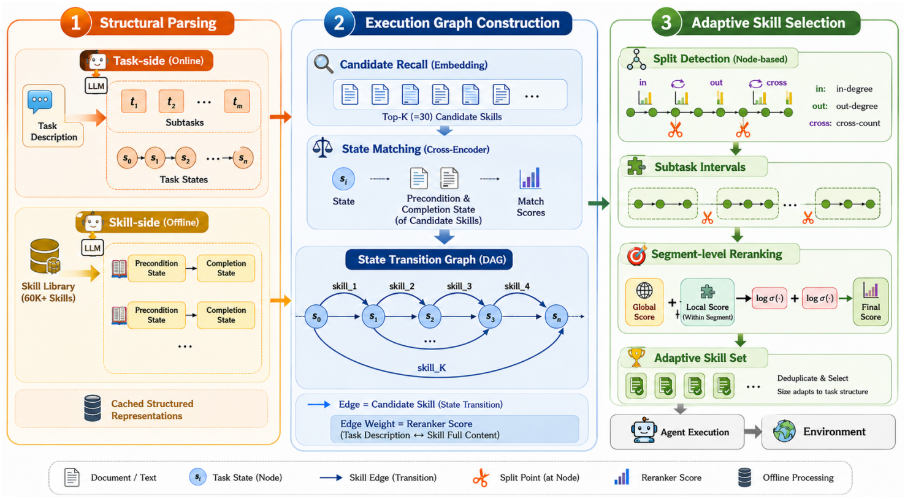

# SkillReranker：自适应技能重排序

> **分类**: 技能召回 | **成熟度**: 🟡 研究验证阶段 | **综合评分**: 0.57

---

## 一句话描述

**SkillReranker** 将技能选择从"**排序截断**"变为"**图匹配**"——先将任务和技能分别拆解为结构化执行状态，构建有向无环图（任务中间状态为节点、技能为边），再按任务的天然阶段边界自动分段，每段选最适配的技能。技能数量由任务本身的结构决定而非预设 Top-K，在 **ALFWorld Seen** 上平均奖励 **84.65**、步数 **15.48**，均优于固定 Top-K 基线。

**来源**:
- Task Decomposition-Guided Reranking for Adaptive Agent Skill Retrieval
- 发布年份：2026 年 7 月

**链接**:
- https://arxiv.org/abs/2607.06283v1

---

## 核心实现

**1. 任务与技能统一状态拆解**

对每个任务指令，LLM 将其拆为三个部分：有序子任务序列、关键子状态（每步完成后的状态描述）、状态间过渡关系。自由格式任务变成一个有清晰语义角色的状态序列。

对每条技能，离线解析为**前提状态（precondition）**和**完成状态（completion）**。前者描述技能启动前需满足的条件（如"Agent 正拿着目标物体且身处可用的冷却容器前"），后者描述技能完成后的状态。67,884 条技能全部预解析并缓存，推理时无需重复处理。

**2. 交叉编码器建图**

embedding 相似度粗召回 Top-30 候选技能后，用**交叉编码器 reranker**逐条挂边：
- **源节点 src**：技能前提状态与每个任务子状态逐一比对，取匹配度最高的。前提为 None 的从起始状态出发
- **目标节点 tgt**：在源节点之后的子状态里，完成状态与每个后续子状态比对取最高匹配。匹配不上则丢弃该技能
- 每条边保留与整个任务指令的**全局相关性分数 $ρ$**

**3. 自适应阶段分割**

给每条边赋权重 $w = σ(ρ)$，对每个中间节点 i 计算三个量：$In(i)$是在节点 $i$ 或之前完成的所有边权重之和，$Out(i)$ 是在节点 $i$ 或之后开始的所有边权重之和，$Cross(i)$ 是直接跨过节点 i 的边权重之和（距离越远权重衰减越大）。

当 $In(i) > Cross(i)$ 且 $Out(i) > Cross(i)$，节点 i 即为分割点。这是数据驱动的——分割点由候选技能的实际覆盖分布决定，不是人工规则。简单任务可能只有一个阶段，复杂任务三个或更多。

**4. 每段精排 + 去重输出**

每段将子任务拼接成段描述，对每条候选技能算阶段适配分：**任务级相关性 + 阶段级子任务匹配度**，两个 log-summation 等价几何平均——要求选中的技能既要整体跟任务相关，又要精确覆盖当前阶段子任务。每个阶段选得分最高的技能，相邻阶段选到同一技能则去重。最终技能数量不由 K 预设，由任务被切成了几个阶段决定。

---

## 主要能力

- **自适应技能数量**：技能数量由任务结构自动决定，简单任务 1-2 个、复杂任务 3-4 个，无需人工调 Top-K
- **前置条件-完成条件显式对齐**：将匹配从模糊语义相似变为精确的状态级对齐，precondition 和 effect 独立解析后各做各的角色
- **数据驱动阶段分割**：In/Out/Cross 三元计算自动发现任务瓶颈节点，作为技能组合的自然换挡点
- **Token 消耗优化**：每个任务只加载真正需要的技能描述，不固定灌 Top-K 条，上下文噪声和决策负担同步降低

---

## 局限性

- **依赖 LLM 任务拆解质量**：子任务和子状态提取的质量直接影响图构建和分割准确性，初始拆解偏差会向下游传播
- **交叉编码器推理成本**：Top-30 候选每条需要多次语义比对（前提/完成状态 vs 各子状态），候选增多时计算成本线性增长
- **技能前提/完成状态离线解析的维护**：技能库更新时需要同步更新预解析缓存
- 仅在 ALFWorld 和 ScienceWorld 两个 benchmark 上验证，在更大规模通用技能库上的图构建效率待验证

---

## 成熟度评分

| 维度 | 评分 (0.0-1.0) | 说明 |
|------|---------------|------|
| 技术成熟度 | 0.55 | 交叉编码器+图匹配+自适应分割，方法完整但在ALFWorld/ScienceWorld上验证 |
| 创新性 | 0.70 | 将技能选择从排序截断变为图匹配，precondition-completion显式对齐，技能数量自适应 |
| 落地程度 | 0.45 | 学术验证阶段，6.7万条技能预解析缓存，尚未在实际系统中部署 |
| 生态活跃度 | 0.45 | arXiv论文，尚未开源代码，社区关注度待观察 |

**综合评分**: 0.54

---

## 参考资料

- [Task Decomposition-Guided Reranking for Adaptive Agent Skill Retrieval](https://arxiv.org/abs/2607.06283v1)
