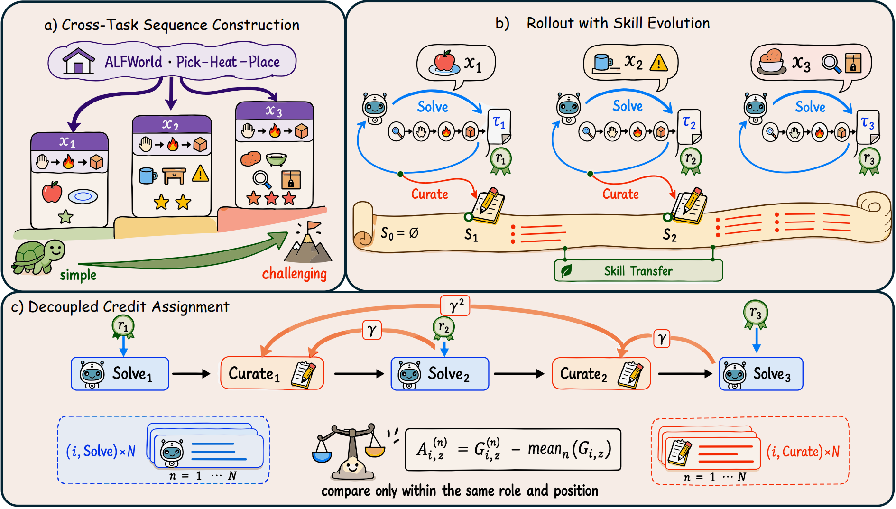

# SkillRise

> **分类**: Skill优化 | **成熟度**: 🟡 成长期 | **综合评分**: 0.49

---

## 一句话描述

SkillRise 是一个**端到端强化学习框架**，将相关但不同的任务组织为渐进序列，用**单一 policy 交替执行任务求解和技能文档策展**，通过**解耦跨任务信用分配**（当前 reward 监督解题、后续折扣回报监督策展），让 agent 在推理时持续累积可迁移技能。

**来源**:
- SkillRise: Agentic Reinforcement Learning for Cross-Task Skill Evolution
- 浙江大学 / NUS / 上海交大 / 美团
- 发布年份：2026

**链接**:
- https://github.com/Within-yao/SkillRise

---

## 核心实现

SkillRise 的核心链路围绕**序列构建 → 双角色 rollout → 解耦信用分配 → role-aware 优化**四个环节展开，不需要外部技能库或教师模型。

**1. 跨任务序列构建**

按任务族元数据将 K=3 个相关但不同的实例按难度从简单到复杂排列。早期简单任务的解法支撑后期复杂场景，后续任务的表现直接衡量技能可迁移性。

**2. 双角色 Rollout**

单一 policy 在序列上交替扮演两个角色：
- **Solve**：用当前技能文档和任务指令生成解题轨迹，拿到 reward
- **Curate**：审视刚完成的轨迹，提炼通用规则、记录失败点、删除实例细节，更新技能文档

技能文档是序列内**唯一的跨任务信息通道**——前面的轨迹不传给后面，只传策展后的文档。

**3. 解耦信用分配**

- Solve 行为用**当前任务 reward** 监督
- Curate 行为用**后续任务的折扣回报**（γ=0.6）监督
- 两个角色在同一序列位置内做 group-relative 比较，advantage 永不交叉

**4. Role-Aware Group-Relative 优化**

同一批 N=8 个独立 trial 的 solve 只跟 solve 比，curate 只跟 curate 比，使用 clipped objective 联合优化。跨任务折扣因子从 0.3 到 0.7，学习曲线几乎重叠，设计稳健。

---

## 主要能力

- **端到端跨任务技能学习**：无外部技能库、无检索模块、无教师模型，单一 policy + 序列内文档
- **跨任务 test-time scaling**：序列越长 Pass@1 越高（K=6 时 87.5%），增长来自技能积累而非重复采样
- **跨任务训练泛化到同任务重试**：Pass@3 全超 LaMer（专门为同任务反复尝试设计）
- **高效训练**：RetroAgent 和 SkillRL 的跑时分别为 SkillRise 的 6.0 倍和 4.3 倍

---

## 局限性

- 依赖任务族元数据构建序列，开放任务流中自动发现相关性未解决
- 实验上限在 4B 参数，更大规模的考察待完成
- 三个 benchmark 均为文本交互 + 确定性验证 reward，在更嘈杂或无法自动验证的场景下有效性待检验
- K=3 的固定序列长度，更长的序列训练是否带来持续增益未评估

---

## 成熟度评分

| 维度 | 评分 (0.0-1.0) | 说明 |
|------|---------------|------|
| 技术成熟度 | 0.50 | 跨任务序列+双角色 rollout+解耦信用分配闭环设计完整 |
| 创新性 | 0.70 | 单一 policy 交替解题与策展、解耦跨任务信用分配机制原创 |
| 落地程度 | 0.35 | 学术原型，实验限于 4B 参数与文本交互 benchmark |
| 生态活跃度 | 0.40 | GitHub 开源仓库 Within-yao/SkillRise，社区规模尚小 |

**综合评分**: **0.49**

---

## 参考资料

- [SkillRise论文](https://arxiv.org/abs/2607.26784)
- [SkillRise代码](https://github.com/Within-yao/SkillRise)
