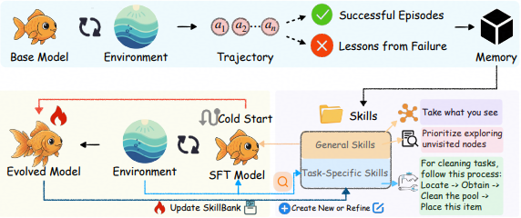

# SKILLRL

> **分类**: Skill 生成 | **成熟度**: 🟡 成长期 | **综合评分**: 0.45

---

## 一句话描述

SKILLRL 通过**自动技能发现与递归进化**桥接原始经验与策略改进。对**成功/失败轨迹差异化蒸馏**构建层次化技能库 **SKILLBANK**，通过递归进化使技能库与 Agent 策略在 RL 中协同进化，在 **ALFWorld** 和 **WebShop** 上以 **10-20× Token 压缩**实现 **15.3%** 提升。

**来源**:
- 学术论文：UNC-Chapel Hill, University of Chicago, UC San Diego, NEC Labs America, UC Berkeley, UC Santa Cruz
- 发布年份：2026年

**链接**:
- 论文链接：https://arxiv.org/pdf/2602.08234
- GitHub：https://github.com/aiming-lab/SkillRL

---

## 核心实现

SKILLRL 由三个核心组件构成：

**1. 基于经验的技能蒸馏（Experience-based Skill Distillation）**

不同于先前方法仅保留成功轨迹，SKILLRL 刻意保留成功和失败两类轨迹，并进行差异化处理：
- **成功轨迹**：由教师模型识别关键决策点、正确行动背后的推理逻辑以及可泛化的行为模式，提取为策略性技能。
- **失败轨迹**：由教师模型分析失败点、错误推理/行动、应做之事以及预防类似失败的通用原则，合成为简洁的失败教训。

**2. 层次化技能库（SKILLBANK）**

将蒸馏出的知识组织为两层结构，推理时，通用技能始终包含在上下文中，任务特定技能通过语义相似度动态检索：
- **通用技能**：跨任务类型的通用策略原则，如系统化探索（优先未访问位置）、状态管理（执行前验证前置条件）、目标跟踪启发式等，适用于所有任务。
- **任务特定技能**：针对特定任务类别的领域知识，包含领域特定行动序列、任务特定前置条件与约束、该任务类型特有的常见失败模式等。

**3. 递归技能进化（Recursive Skill Evolution）**

技能库并非静态 —— 通过冷启动监督微调和 RL 期间的动态进化实现协同进化：
- **冷启动监督微调**：基础 Agent 未学会如何有效利用技能，通过教师模型生成技能增强推理轨迹，演示如何检索、理解和应用技能，对基础模型进行初始化。
- **动态技能进化**：每个验证轮次后监控各任务类别的成功率，对低于阈值的类别触发进化。采用多样性感知的分层采样策略收集失败轨迹，由教师模型识别当前技能未覆盖的失败模式，提出新技能或优化现有技能，更新技能库。

---

## 主要能力

- 基于经验的差异化技能蒸馏：从成功轨迹提取策略模式，从失败轨迹合成教训，10-20× Token 压缩
- 层次化技能库与自适应检索：通用技能始终生效，任务特定技能按语义相似度动态检索
- 递归技能进化：技能库随 RL 训练动态扩展，与 Agent 策略协同进化

---

---

## 成熟度评分

| 维度 | 评分 (0.0-1.0) | 说明 |
|------|---------------|------|
| 技术成熟度 | 0.45 | 有开源代码 |
| 创新性 | 0.80 | 强化学习+技能库的创新结合 |
| 落地程度 | 0.30 | 学术研究阶段 |
| 生态活跃度 | 0.40 | 有开源社区 |

**综合评分**: 0.45

---

## 参考资料

- [论文](https://arxiv.org/pdf/2602.08234)
- [代码](https://github.com/aiming-lab/SkillRL)
- [详解](https://zhuanlan.zhihu.com/p/2015436383439847936)
