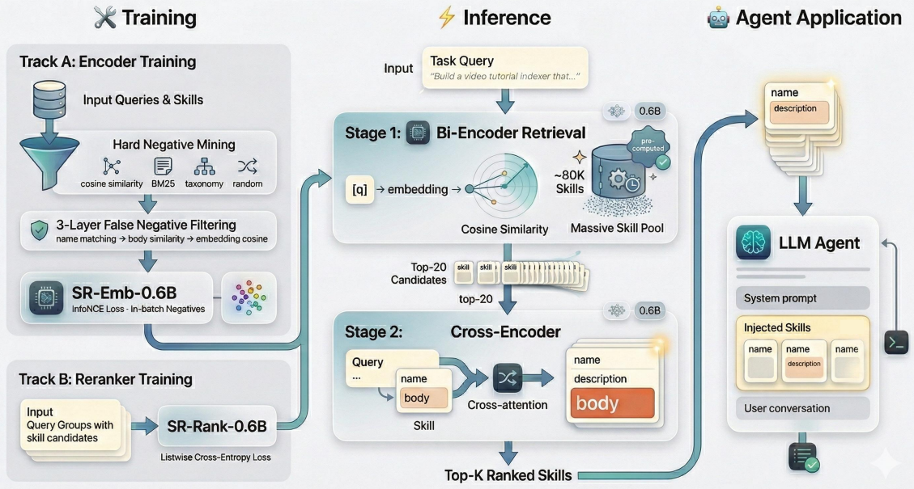

# SkillRouter

> **分类**: Skill 召回 | **成熟度**: 🟢 成熟期 | **综合评分**: 0.66

---

## 一句话描述

SkillRouter 是**两阶段检索-重排**流水线，通过实证纠正了**"元数据优先"误区**，发现技能实现文本才是匹配精度的核心支撑（**91.7%** 注意力集中于此），仅 **1.2B 参数**即实现顶尖匹配精度。

**来源**:
- 学术论文
- 发布年份：2026年

**链接**:
- 论文链接：https://arxiv.org/pdf/2603.22455

---

## 核心实现

SkillRouter 采用两阶段检索-重排架构，两个阶段均以完整技能文本作为输入：

**阶段 1：双编码器检索（粗排）**：微调 Qwen3-Emb-0.6B 作为嵌入模型，将用户查询与全量技能库进行向量嵌入，通过余弦相似度检索 Top-20 候选，将候选集从 8 万缩减至 20。训练数据包含 37,979 条（查询，技能）训练对，采用困难负例挖掘（语义负例 4 个 + 词汇负例 3 个 + 分类负例 2 个 + 随机负例 1 个），并通过三层假阴性过滤（名称去重、代码重叠、嵌入相似度）过滤约 10% 的负例。使用批内 InfoNCE 损失通过对比学习优化。

**阶段 2：交叉编码器重排（细排）**：微调 Qwen3-Reranker-0.6B，将每个候选技能的"名称+描述+代码"平铺拼接后输入，通过交叉注意力机制对每个（候选技能，用户查询）对联合处理，生成精细化相关性得分后重排。采用列表式交叉熵损失对整个候选列表联合排序（比逐点方式 Hit@1 提升 30.7 个百分点）。

**推理流程**：技能通过离线方式预编码，推理阶段仅需查询编码、近似最近邻搜索及对 20 个候选重排，实现高效在线服务。

---

## 主要能力

- 大规模技能库精准匹配：8 万技能库场景下端到端 Hit@1 达 74.0%
- 重排序修复：交叉编码器可修复 12.7% 的检索失败案例，仅造成 4.0% 性能下降
- 跨模型迁移：架构可针对不同垂直领域进行端到端微调，适配不同技能库特性

---

## 局限性

- 基准测试仅来自有限数量的技能源，结论适用于大规模、存在大量重叠的注册表；在小型目录中，纯元数据路由可能更具竞争力
- 仅在四种编程 Agent 和单一执行预算下完成评估

---

## 成熟度评分

| 维度 | 评分 (0.0-1.0) | 说明 |
|------|---------------|------|
| 技术成熟度 | 0.80 | 有完整论文和实验验证 |
| 创新性 | 0.55 | 基于实证纠正"元数据优先"的设计误区 |
| 落地程度 | 0.75 | 架构轻量化，适合落地 |
| 生态活跃度 | 0.60 | 学术研究，生态建设进行中 |

**综合评分**: 0.66

---

## 参考资料

- [论文](https://arxiv.org/pdf/2603.22455)
- [详解](https://zhuanlan.zhihu.com/p/2020593144639562073)
