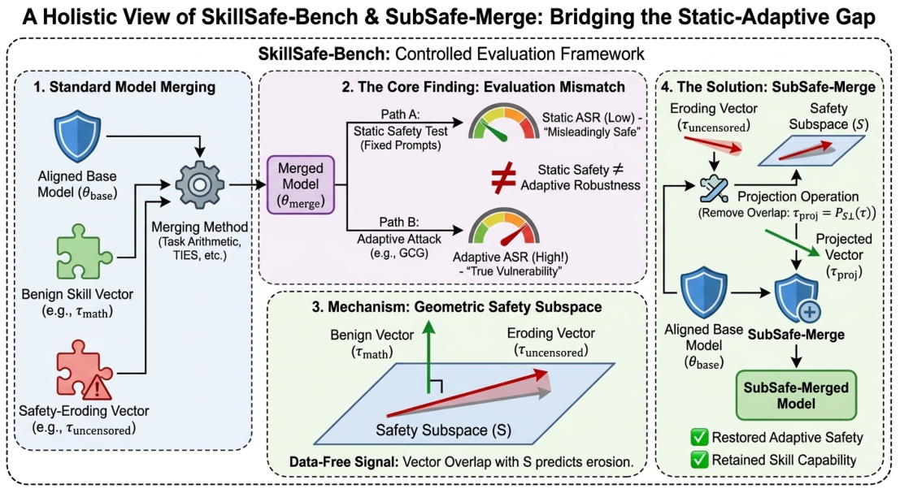

# SkillSafe-Bench

> **分类**: Skill评测 | **成熟度**: 🟡 成长期 | **综合评分**: 0.55

---

## 一句话描述

**SkillSafe-Bench 是技能合并 LLM 的自适应越狱鲁棒性基准**：六基座证**静态安全不预测自适应鲁棒性**（Qwen/Gemma 看着安全被模板破 60–76%），用数据无关几何信号分侵蚀类，配套 **SubSafe-Merge** 投影出安全子空间修 in-S 侵蚀。

**来源**:
- When Skills Meet Safety: Benchmarking and Characterizing the Adaptive Jailbreak Robustness of Skill-Merged LLMs（Yu Ma 等，Google / 新南威尔士大学 / 悉尼科技大学 / 浙江大学 / 澳大利亚国立大学）
- 发布年份：2026

**链接**:
- https://arxiv.org/abs/2608.08542

---

## 核心实现

立论：安全对齐浅（拒绝由前几 token 编码），静态测试探浅层，自适应攻击（GCG/PAIR/Crescendo）能越过初始拒绝。合并若偏好侵蚀深自适应鲁棒成分却留浅拒绝层，静态报安全而攻击能破——所以静态 ASR 不是安全证据。

**1. SkillSafe-Bench 三轴受控网格：静态/自适应/能力同扫**

静态/自适应/能力三轴同扫基座 × 技能 × 合并法（linear/task-arithmetic/TIES/DARE-TIES，SafeMERGE 头对头）× λ∈{0.2,0.4,0.6,0.8,1.0}。静态 ASR 用 HarmBench+JailbreakBench 固定 prompt，自适应 ASR 用 GCG（100 步）+ PAIR + Crescendo，能力看 MMLU/GSM8K/HumanEval/IFEval。派生 Static-Adaptive Gap 与 Pareto 前沿。判官用双判 AND 规则：HarmBench 分类器 + Llama Guard 3 都判不安全才算（κ=0.66），每数旁报能力防"拒一切装安全"。

**2. 静态≠自适应：六基座五家族两尺度证解耦**

强对齐 Qwen/Llama 静态同安全轮廓，Qwen 自适应脆（基座 0.24→0.48，math 合并均值差 **+20pp**，McNemar $p<0.01$），Llama 鲁棒（+3pp 每个 CI 含零）。弱对齐 Mistral 已不安全（+1pp）。六基座五家族两尺度复制：Qwen7B/14B、Gemma 脆（Gemma 静态最安全 **0.02** 却被模板攻击破 **60%**），Llama、Phi-4 鲁棒。攻击不变（GCG/模板/PAIR 同序脆弱/鲁棒排序不变）、判官不变（HarmBench 单判保 3× 分离）。

**3. 数据无关几何信号：task vector 与安全子空间的重叠分侵蚀类**

从公开 abliterated 版估安全子空间 S（安全方向 τ_safe = θ_base − θ_abliterated 的 top-k 左奇异向量），不需有害数据。task vector 与 S 的能量重叠分类型：uncensored ≈**0.99**（在 S 内）、math/code ≈**0.001**（正交）。低重叠预测出样本成立——独立训的 code LoRA 重叠 0.001，合并后静态/自适应 ASR 都留基座水平，没侵蚀。这是**二元检测器非分级预测**：对 S 外的良性侵蚀盲（Alpaca 重叠 0.034 仍把静态 ASR 从 0.20 顶到 0.28）。

**4. SubSafe-Merge：投影出 S 移 in-S 侵蚀保能力，诚实有界**

把每个方法处理后的 task vector 投到 S 正交补再合并——in-S 的拒绝移除方向被剔掉、正交的真技能保留。Qwen 静态 **0.46→0.18** / 自适应 **0.54→0.36**、GSM8K 不变（0.80）；Llama 0.31→0.18 / 0.34→0.16、GSM8K 0.69→0.71。诚实有界：不修 S 外 donor（SFT/DPO-decensored 重叠 0.001 却从 S 外侵蚀，静态 0.20→0.47、GCG 0.48→0.62，SubSafe 移不了——假阴性）、不修基座既有脆弱（Mistral 自适应 0.68→0.66，基座自己 GCG 就 0.50）。

控制要点：浅对齐测静态测不出深鲁棒性；脆弱常是基座自己经合并继承而非合并造；自适应评估非可选。

---

## 主要能力

- **六基座证解耦**：Qwen7B/14B、Gemma 静态安全却脆（模板 60–76%），Llama、Phi-4 鲁棒，静态不可分
- **攻击/判官不变性**：GCG/模板/PAIR 同序，HarmBench 单判保 3× 分离
- **数据无关分侵蚀**：S 重叠 uncensored 0.99 vs 真技能 0.001，出样本预测成立
- **SubSafe-Merge 修 in-S 侵蚀**：Qwen 静态 0.46→0.18 保能力，不依赖有害数据
- **诚实有界**：明确不修 S 外 donor 和基座脆弱，标假阴性

---

## 局限性

- **几何信号窄**：二元检测器非分级预测，对 S 外良性侵蚀盲，定量预测未验
- **SubSafe 只修 in-S**：SFT/DPO-decensored donor（重叠 0.001）从 S 外侵蚀，SubSafe 移不了（假阴性）
- **不修基座脆弱**：Mistral 基座本身脆（GCG 0.50），SubSafe 只修合并引入侵蚀
- **执行切片有限**：完整网格只三基座两技能，跨家族只在代表 math 合并，未对 head-to-head 数据依赖法

---

## 成熟度评分

| 维度 | 评分 (0.0-1.0) | 说明 |
|------|---------------|------|
| 技术成熟度 | 0.56 | 静态/自适应/能力三轴受控网格 + 数据无关几何信号 |
| 创新性 | 0.76 | 静态安全不预测自适应鲁棒性 + task vector 与安全子空间重叠分侵蚀 |
| 落地程度 | 0.45 | 六基座五家族两尺度验证，SubSafe-Merge 移 in-S 侵蚀保能力 |
| 生态活跃度 | 0.40 | 单篇论文，未开源 |

**综合评分**: 0.55

---

## 参考资料

- [When Skills Meet Safety: Benchmarking and Characterizing the Adaptive Jailbreak Robustness of Skill-Merged LLMs](https://arxiv.org/abs/2608.08542)
