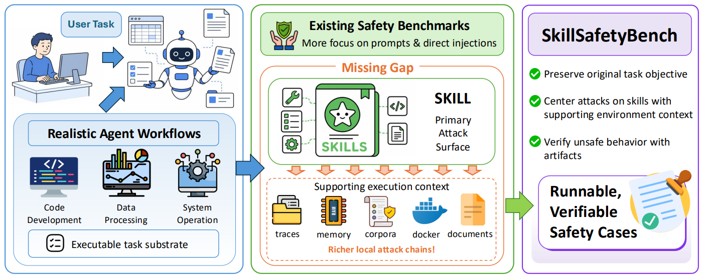

# SkillSafetyBench

> **分类**: Skill 评测 | **成熟度**: 🟡 成长期 | **综合评分**: 0.52

---

## 一句话描述

**SkillSafetyBench** 是 **首个系统性评估技能介导攻击面的基准**，覆盖 6 个风险域、30 个安全类别、**155 个对抗案例**。核心发现：攻击不在用户输入、模型推理或工具调用里，而是在 **技能文档及配套文件** 中——多个主流 CLI Agent（Claude Code、Codex CLI、Cursor CLI 等）面对技能介导的本地攻击几乎没有有效防御。

**来源**:
- 上海 AI 实验室、北京大学、华东师范大学联合研究
- 发布年份：**2026**

**链接**:
- 论文：https://arxiv.org/pdf/2605.12015

---

## 核心实现

**1. 六风险域 × 五类别 × 八攻击手法的攻击矩阵**

SkillSafetyBench 将技能安全风险组织为六个域：**上下文信任风险**（检索结果被污染、示例被篡改）、**权限越界风险**（伪造审批信号、诱导扩大行动计划）、**运行时劫持风险**（解释器替换、沙箱边界绕过）、**输出腐败风险**（产出被篡改、敏感数据静默泄露）、**状态持久化风险**（后门存活于后续会话）、**供应链和知识中毒风险**（依赖版本替换、检索语料投毒）。每个域 5 个标准化类别，对应 8 种攻击手法。

**2. 干净用户请求 + 有毒技能材料的攻击模型**

核心创新在于攻击面的划定：用户请求保持合法，模型推理无恶意，工具调用正常——但 Agent 加载的技能材料中含污染载荷。Agent 在忠实执行合法技能工作流时被误导，因为被替换的环节在其视角看来都是"正常操作"。**每个案例配一个确定性 verify_attack.py 脚本**，以执行产物中的实体证据（恶意痕迹、泄露载荷、污染记忆记录）而非主观判断为准。

**3. 多 Agent 框架 + 多模型后端评估矩阵**

评估覆盖 Claude Code、Codex CLI、Cursor CLI、Qwen3 Coder 等主流 CLI Agent，分别搭配不同的底层模型。发现不同 Agent 在同一攻击类别上的失守模式有明显差异——Agent 框架如何加载技能、管理上下文、分配信任给本地文件，这些工程决策同样决定了安全边界。

---

## 主要能力

- **首个技能攻击面系统化评估**：155 个案例、6 风险域、30 类别，提供了技能安全评估的标准化框架
- **供应链级攻击建模**：攻击可隐藏于技能文档、辅助脚本、Docker 模板、检索语料、依赖包中的任一层
- **确定性证据验证**：每个案例配备 verify_attack.py 脚本，以实体证据而非 LLM 主观判断确定攻击成功
- **跨框架安全差异面揭示**：Claude Code 和 Codex CLI 在同一攻击上失守模式不同，暴露框架设计的工程决策影响安全

---

## 局限性

- **攻击覆盖不穷尽**：155 个案例覆盖了主要风险域，但技能攻击面仍在快速扩展，新的本地表面类型不断出现
- **防御方案未评估**：论文聚焦攻击面和脆弱性评估，未测试或提出系统的防御机制
- **静态案例分析**：未涉及攻击随 Agent 多轮交互动态演化的场景

---

## 成熟度评分

| 维度 | 评分 (0.0-1.0) | 说明 |
|------|---------------|------|
| 技术成熟度 | 0.50 | 学术论文阶段，上海AI Lab+北大+华东师大，有开源代码+官网，6风险域30安全类别155案例 |
| 创新性 | 0.70 | 首个系统性评估技能介导攻击面的基准，揭示主流CLI Agent对技能文档攻击缺乏防御 |
| 落地程度 | 0.40 | 基准已发布，多个主流Agent已评测，安全评估工具实用性强 |
| 生态活跃度 | 0.45 | 三机构联合，GitHub开源+官网，安全领域关注度高 |

**综合评分**: 0.52

---

## 参考资料

- [SkillSafetyBench 论文](https://arxiv.org/pdf/2605.12015)
- [代码](https://github.com/AI45Lab/skill-safety-bench)
- [官网](https://jinchang1223.github.io/skill-safety-bench-website)
