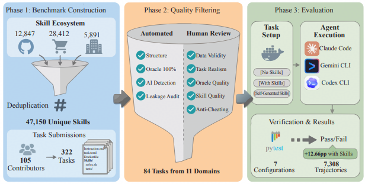

# SkillsBench

> **分类**: Skill 评测 | **成熟度**: 🟡 成长期 | **综合评分**: 0.70

---

## 一句话描述

SkillsBench 是**首个**将 Agent Skills 作为**一等评估工件**的基准，对 **11 领域 84 任务**在无/精选/自生成三种条件下配对评估。核心发现：精选 Skills **+16.2pp**，自生成 **–1.3pp**，**2-3 个最优**，小模型 + Skills 可匹敌大模型。

**来源**:
- 学术论文：BenchFlow, Ohio State University, Amazon, Dartmouth College, Stanford University, UC Davis, Carnegie Mellon University 等
- 发布年份：2026年

**链接**:
- 论文链接：https://arxiv.org/pdf/2602.12670
- 官网：https://skillsbench.ai

---

## 核心实现

SkillsBench 通过三阶段管线构建基准并评估 Skills 效能：

**1. 基准构建**

从三个来源聚合去重得到 47,150 个独立 Skills（开源仓库 12,847 + Claude Code 生态 28,412 + 企业 5,891）。并行地，105 位贡献者提交 322 个候选任务，每个任务包含指令、Docker 容器化环境、参考解法和确定性验证器。

**2. 质量过滤**

自动化检查（结构验证、Oracle 100% 通过、GPTZero 人类撰写检测、Skill 泄漏审计）与人工审核（数据真实性、任务现实性、Oracle 质量、Skill 质量、反作弊）结合，精选 84 个任务横跨 11 个领域。

**3. 评估协议**

每个任务在三种条件下运行：无 Skills、精选 Skills、自生成 Skills。在 Claude Code、Gemini CLI、Codex CLI 三个商业平台上使用七个前沿模型，pytest 确定性验证器产生二元 pass/fail，共生成 7,308 条有效轨迹。

---

## 主要能力

- 配对评估 Skills 效力：同一任务在三种条件下对比，直接测量 Skill 的边际贡献，而非评估 Agent 的绝对能力
- 跨领域跨模型分析：11 个领域 × 7 种 agent-model 配置的系统性实证证据，揭示 Skills 效力的领域异质性和 harness 差异
- Skills 设计因素分析：量化 Skills 数量（2-3 个最优）、复杂度（Detailed/Compact 优于 Comprehensive）和模型规模（Skills 可部分替代模型容量）对性能的影响

---

## 局限性

- **覆盖与泛化**：仅评估终端型容器化任务，结果可能不适用于 GUI Agent、多 Agent 协调或超长周期工作流；模型和 harness 集合有限，商业平台行为可能随时间变化
- **因果归因与控制**：Skills 注入增加了上下文长度，观察到的增益可能部分反映"更多上下文"而非过程性结构；需要更强的长度匹配基线（如随机/无关文本、仅检索文档对照）
- **确定性与生态效度**：容器化提供状态隔离但非完美确定性；应评估生态代表性设置，包括低质量 Skills 和自动选择 Skills 的场景

---

## 成熟度评分

| 维度 | 评分 (0.0-1.0) | 说明 |
|------|---------------|------|
| 技术成熟度 | 0.70 | 完整基准测试框架 |
| 创新性 | 0.65 | 系统性评估方法 |
| 落地程度 | 0.60 | 被广泛引用 |
| 生态活跃度 | 0.55 | 社区使用中 |

**综合评分**: 0.70

---

## 参考资料

- [论文](https://arxiv.org/pdf/2602.12670)
- [详解](https://zhuanlan.zhihu.com/p/2014393687812110022)
