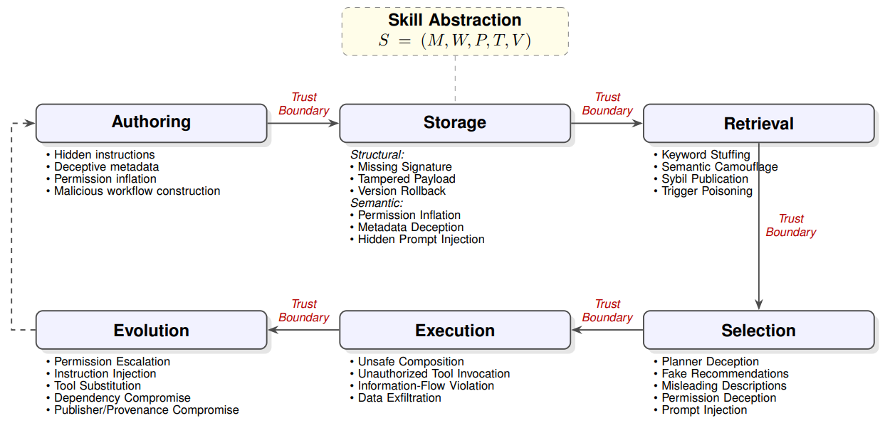

# SkillSec-Eval

> **分类**: Skill评测 | **成熟度**: 🟡 成长期 | **综合评分**: 0.53

---

## 一句话描述

**SkillSec-Eval** 是 Google 提出的 **Agent 技能全生命周期安全评估框架**，将技能从创建到退役拆为 **创作→存储→检索→规划→执行→进化** 六阶段，每阶段定义信任假设和攻击面，在 327 个真实技能上逐道门做攻防评测，量化衡量各层防线有效性。

**来源**:
- Agent Skill Security: Threat Models, Attacks, Defenses, and Evaluation
- 发布年份：2025

**链接**:
- https://arxiv.org/abs/2607.13987

---

## 核心实现

**1. 六阶段威胁分类法**

- **创作**：信任假设为"规约与行为一致"，攻击含权限膨胀和虚假能力描述
- **存储**：信任假设为"仓库原件未被篡改"，攻击分结构层（去签名、篡改 Payload、版本回滚）和语义层（权限不符、描述掩护恶意指令），传统供应链安全管得住结构层但对语义层完全瞎
- **检索**：信任假设为"返回的候选既相关又可信"，攻击含 Agentic SEO——关键词堆砌、语义伪装、Sybil 克隆、触发器下毒
- **规划**：信任假设为"元数据真实反映行为"，Planner 只看元数据不看代码
- **执行**：信任假设为"工作流只在授权范围内操作"，攻击含越权调用和信息流泄露
- **进化**：信任假设为"更新保留可信度"，技能每次更新需重新验签和验语义一致性

**2. 逐道门攻防评测**

仓库准入：纯规则防线恶意准入率 52.9%，纯语义防线 42.9%（误杀率 20%），**混合防线（规则先过+LLM 后验）压至 7.9%**。检索层：裸奔语义检索 Sybil 攻击成功率 93.2%，三层检索验证（语义去重+元数据行为一致性+权限申报合理性）将关键词堆砌从 46.59% 降到 7.83%。执行层：LifecycleGuard 运行时监控做动态污点追踪加策略校验。

---

## 主要能力

- 首个覆盖技能完整生命周期的安全威胁分类法和评估框架
- 每阶段定义独立信任假设+攻防对，可逐道门量化防线有效性
- 327 个真实技能上的完整攻防实验
- 规则+LLM 语义的混合防线在仓库准入上表现最佳
- 清晰指出传统供应链安全对技能语义层的盲区

---

## 局限性

- 实验依赖单一 LLM 裁判（Gemini 3.1 Pro），未交叉验证
- 攻击样本在生命周期边界独立生成，未评估跨阶段级联攻击
- 进化层仅模拟准入重验证，未覆盖长期信任衰减的动态过程
- 仓库准入混合防线的 20% 误杀率仍是实用化的障碍

---

## 成熟度评分

| 维度 | 评分 (0.0-1.0) | 说明 |
|------|---------------|------|
| 技术成熟度 | 0.55 | 六阶段威胁分类法+逐道门攻防评测完整，327个真实技能完成实验，属框架阶段 |
| 创新性 | 0.80 | 首个覆盖技能完整生命周期的安全威胁分类法与评估框架 |
| 落地程度 | 0.35 | Google 出品，混合防线将准入恶意率压至7.9%，但尚处研究无生产部署 |
| 生态活跃度 | 0.40 | 论文发布，无开源代码，框架待业界采纳 |

**综合评分**: **0.53**（0.55×0.30 + 0.80×0.25 + 0.35×0.25 + 0.40×0.20）

---

## 参考资料

- [论文](https://arxiv.org/abs/2607.13987)
