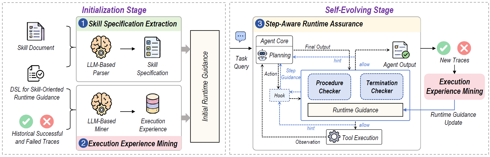

# SKILLSentry

> **分类**: Skill执行 | **成熟度**: 🟡 成长期 | **综合评分**: 0.56

---

## 一句话描述
SKILLSentry 是面向 **LLM agent 技能执行可靠性**的运行时保障框架，用面向技能的 DSL 把技能规范和历史轨迹经验结构化为运行时引导，通过过程/终止检查器在 hook 层包裹执行环监控偏离并按步提示，使四配置 15 技能平均成功率**+24.1%**、标准差**-41.1%**。

**来源**:
- SKILLSSENTRY: Reliable Skill Execution for LLM Agents via Runtime Assurance（You Lu、Xinyu Huang、Bihuan Chen、Xin Peng，中国某高校计算机科学与人工智能学院）
- 发布年份：2026

**链接**:
- https://arxiv.org/abs/2608.09253

---

## 核心实现
立论：技能给 LLM agent 可复用过程知识，但**具备能力≠稳定执行**——生成式执行的每次动作依赖动态上下文，小扰动导致跳步或参数错配。SKILLSentry 不教新能力，专攻"已能做却不稳定"的可靠性缺口。

**1. 表示层：DSL 承载规范与经验**

- 输入是技能文档+历史成败轨迹，输出是结构化运行时引导 $G$。
- DSL 把每个技能建模为 `skill` 节点下挂若干 `step`，每步含 `depends on`（前置）、`constraints`（工具/参数约束）、`logical_actions`（带正则匹配的可观察动作模式）、`on enter`（步级建议+警告）、`failure_patterns`（带 reason 的失败关联动作）；`termination` 字段列出必完成步骤。
- 这套语法同时承载文档抽取的规范与轨迹挖掘的经验。

**2. 初始化层：解析器+挖掘器两阶段填充 $G$**

- **LLM 解析器**（GPT-5.4）把自然语言技能文档转成 DSL 规范字段，做唯一性、依赖无环、约束类型轻量校验，失败回灌让解析器修订。
- **LLM 挖掘器**从 $T^+/T^-$ 轨迹经五步（动作模式抽取→轨迹摘要→经验字段诊断 FP/FN/MC/OK→字段编辑 ADD/UPDATE/REMOVE→校验）填充 `logical_actions`、`on enter`、`failure_patterns`，输出 $G^*$。

**3. 保障层：FSM+hook 步级监控**

- 从 $G^*$ 构造**有限状态机**，每个 skill step 对应一个状态，`depends on` 决定激活时机。
- pre-action hook 拦截每次计划动作：进入新步时注入步级建议/警告；匹配已激活步的逻辑动作放行；匹配依赖未满足步的动作**临时拒绝**并给重规划 hint；匹配失败关联模式**首次拒、二次放**（advisory 不永久阻塞）。
- 终止检查器核验 `termination` 步骤是否全完成，否则拒绝终止；fail-open 原则兜底异常。

**4. 演化层：新轨迹回灌与跨模型迁移**

- 新轨迹回灌经验挖掘器迭代更新 $G^*$。10 轮演化后跨模型直接迁移保 **94.2%** 原生效果、仍 +**17.2%** 基线增益；强模型→弱模型迁移增益更大。

控制要点：步级提示比系统提示全量前置**+5.8%**、SD -26.8%；运行时仅占 0.8% 总执行时间，推理轮 +7.8%、token +8.7%。

---

## 主要能力

- **跨四配置一致提可靠性**：Claude Code×Haiku/Opus、Codex×GPT-5.2/5.4 上 15 技能平均成功率 62.6%→77.7%，SD -41.1%
- **低基线技能大增益**：excitation-signal-design +210.8%、d3-visualization +199.2%、weighted-gdp-calc +131.6%
- **步级 hint 干预偏步**：FSM+hook 检测跳步并临时拒，给重规划机会后放行
- **失败模式 advisory 阻塞**：首次拒、二次放，不永久封杀可能有效的动作
- **自演化+跨模型迁移**：迭代收敛，跨模型保 94.2% 原生效果

---

## 局限性

- **依赖确定性验证器**：挖掘成败轨迹需可靠标签，实际部署需自建 verifier 或换 LLM 评估器
- **不处理技能选择与多技能协同**：假设 agent 已选对技能，跨技能反复切换的工作流不支持
- **强模型迁移弱模型不对称**：弱→强迁移增益小，反映模型特异动作模式残留
- **技能文档质量前置假设**：解析器要求文档过程正确，低质文档会污染规范

---

## 成熟度评分

| 维度 | 评分 (0.0-1.0) | 说明 |
|------|---------------|------|
| 技术成熟度 | 0.58 | DSL 承载规范与经验 + FSM+hook 步级监控 + 演化，匿名代码待发布 |
| 创新性 | 0.72 | 过程/终止检查器 hook 层包裹执行环 + advisory 不永久阻塞 |
| 落地程度 | 0.48 | 四配置 15 技能 +24.1% SD-41.1%，跨模型保 94.2% |
| 生态活跃度 | 0.42 | 单篇论文，匿名代码待发布 |

**综合评分**: 0.56

---

## 参考资料

- [SKILLSSENTRY: Reliable Skill Execution for LLM Agents via Runtime Assurance](https://arxiv.org/abs/2608.09253)
- [SKILLSentry 代码（匿名，待正式发布）](https://anonymous.4open.science/r/skillsentry-865C)
