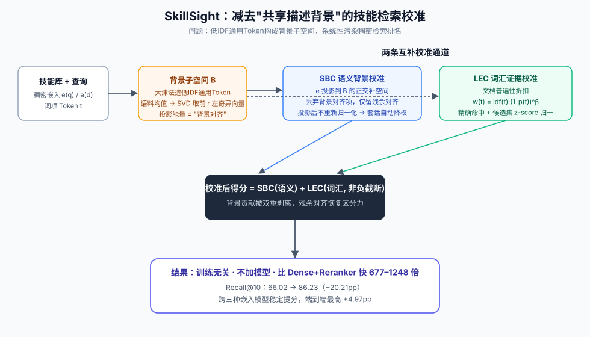

# SkillSight

> **分类**: Skill召回 | **成熟度**: 🟡 成长期 | **综合评分**: 0.54

---

## 一句话描述

**SkillSight** 是一个训练无关的技能检索校准框架，揭示了技能文档的**共享描述背景**（共享模板句构成的语义噪音）如何系统性污染稠密检索排名，并提出 **SBC（语义背景校准）** 和 **LEC（词汇证据校准）** 两条互补通道分别从语义和词汇层面减去共享背景的贡献，**Recall@10 提升 20.21pp**，比 Dense+Reranker 快 677-1248 倍。

**来源**:
- SkillSight: Seeing Through Shared Descriptions for Accurate Skill Retrieval
- 发布年份：2026

**链接**:
- https://arxiv.org/abs/2607.18785
- https://github.com/xiaojinying/SkillSight

---

## 核心实现

**1. 问题诊断：共享描述背景**

- **排序行为**：技能检索中排在金标准技能前面的无关文档比例显著高于传统文本检索
- **Token 统计**：低 IDF 通用 Token 的"金标准命中率"集中在零附近——出现频率极高但区分能力近乎零
- **能量缺口**：用低 IDF 通用 Token 构造语料级背景子空间（SVD 提取正交基），技能文档在此子空间上的投影能量系统性高于查询，稠密得分可正交分解为"背景对齐"+"残余对齐"，背景能量越高则污染越大

**2. SBC（语义背景校准）**

用大津法在 IDF 分布上自适应找通用 Token 集合，每个通用 Token 取所有包含它的文档嵌入均值作为其语义方向，所有方向加语料均值组成矩阵 $G$ 做 SVD。前 $r$ 个左奇异向量构成背景子空间正交基 $B$。将查询和文档嵌入投影到 $B$ 的正交补空间上再算内积，等价于从稠密得分中直接丢弃背景对齐项。**投影后不重新归一化**——套话越多的文档剥离背景后向量越短，得分自动降低。

**3. LEC（词汇证据校准）**

在标准 IDF 之上叠加**文档普遍性折扣**：$w_\beta(t) = idf(t) \times (1-p(t))^\beta$。$p(t)$ 是包含 Token $t$ 的文档比例，90% 文档都有则大幅压低权重。最终词汇得分为加权覆盖率（精确命中、不做软匹配），候选集内 z-score 归一化后与 SBC 语义得分加和，词汇通道仅取非负截断。

---

## 主要能力

- 首次揭示并量化"技能文档共享描述背景"对检索排名的系统性偏差
- SBC 不训练、不加模型、投影后不归一化——套话文档自动降权
- LEC 两层加权补回稠密匹配平滑掉的细粒度区分信号
- Recall@10 从 66.02 推至 **86.23**，端到端最高 +4.97pp
- 跨三种嵌入模型稳定提分，比 Reranker 快 677-1248 倍

---

## 局限性

- SBC 背景子空间的秩 $r$ 依赖谱有效秩，语料库极度异构时自动选择可能不最优
- LEC 的 $\beta$ 需按语料库规模手动调整，缺乏自适应机制
- 端到端增益在部分高基线 Benchmark 上不显著
- 未评估动态演化技能库（频繁新增/删除技能）对背景子空间的影响

---

## 成熟度评分

| 维度 | 评分 (0.0-1.0) | 说明 |
|------|---------------|------|
| 技术成熟度 | 0.55 | SBC+LEC 双通道已完整实现，跨三种嵌入模型稳定提分，属原型验证 |
| 创新性 | 0.80 | 首次揭示并量化"技能文档共享描述背景"对检索排名的系统性偏差 |
| 落地程度 | 0.35 | 训练无关免加模型，但无实际产品采用，端到端增益在部分高基线不显著 |
| 生态活跃度 | 0.45 | 论文与代码双开源，社区关注度有限 |

**综合评分**: **0.54**（0.55×0.30 + 0.80×0.25 + 0.35×0.25 + 0.45×0.20）

---

## 参考资料

- [论文](https://arxiv.org/abs/2607.18785)
- [代码](https://github.com/xiaojinying/SkillSight)
