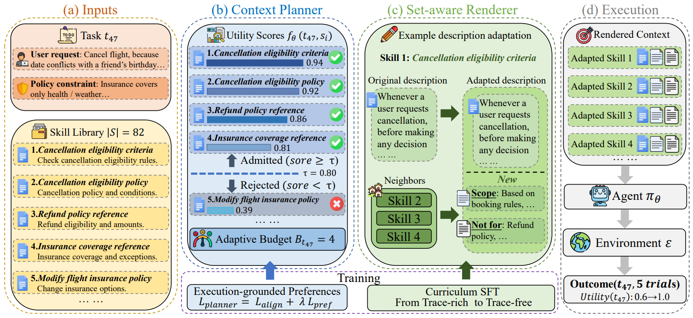

# SkillsInjector

> **分类**: Skill 召回 | **成熟度**: 🟡 成长期 | **综合评分**: 0.46

---

## 一句话描述

**SkillsInjector** 解决技能注入的"最后一公里"问题：用一个训练好的打分器替代语义匹配做技能选择，用 **自适应预算** 替代固定 Top-K，用 **Set-Aware Renderer** 在多技能同时注入时重写描述以区分边界和减少重叠。在三个基准上全面超过最强基线 **3.9 到 7.3 个百分点**。

**来源**:
- 南京大学 & 上海 AI 实验室
- 发布年份：**2026**

**链接**:
- 论文：https://arxiv.org/pdf/2605.29794

---

## 核心实现

**1. Context Planner：学习预测执行效用而非语义相似度**

训练一个打分器 $f_\theta(t, s)$，监督信号来自真实执行效用 $\Delta(t, s)$——在同一个任务上有技能和没技能的表现差异。训练数据从任务池中采样 Agent 的实际执行结果，用所有候选技能的 leave-one-out 评测标注执行效用的真实值。语义匹配和执行效用之间的相关性极弱（τ2-bench 上一份语义高度匹配的技能执行效用为 -0.20，而四份语义中等匹配的技能执行效用为 +0.40），学出来的打分器能区分"看着像"和"真有用"。

**2. 自适应预算：阈值截断而非固定 K**

每个任务的每份候选技能由打分器给出效用分，通过验证集上调出的阈值截断——超过阈值的全要、低于的全部不要。预算 $B_t$ 自然涌现不预设。简单任务可能只需要 1 条技能，复杂任务可能需要 6 条，每个任务拿到恰好它需要的数量。

**3. Set-Aware Renderer：技能描述互感知重写**

当选中的技能超过 1 条时，Renderer 读取每条技能的原始描述、当前任务和其他同时注入的技能描述，产出改写后的描述——在原描述基础上区分边界（"这条管这个，那条管那个"）和减少重叠（"两条都提到退款，但权限范围不同"）。Renderer 被蒸馏为小模型，每次 Agent 调用前仅推理一次。单条技能时直接跳过。

---

## 主要能力

- **执行效用驱动的技能选择**：学会预测"真的帮到 Agent"而非"文本看起来像"，打破语义匹配和执行效用之间的弱相关
- **任务自适应预算**：每个任务按实际需要自动决定注入几条技能，不需人工预设 K
- **技能互感知描述**：多条技能同时注入时改写描述区分边界、减少重叠，防止 Agent 被互相矛盾的描述搞混
- **轻量推理开销**：Renderer 被蒸馏为小模型，每次调用仅推理一次

---

## 局限性

- **打分器训练依赖执行效用标注**：需要为每份候选技能跑 leave-one-out 评测，初始训练成本较高
- **阈值敏感**：自适应预算的阈值在验证集上调出，不同领域可能需要重新调
- **Rewriter 的质量不恒定**：描述改写质量依赖蒸馏模型的原始能力，极端改写可能引入新的语义偏差

---

## 成熟度评分

| 维度 | 评分 (0.0-1.0) | 说明 |
|------|---------------|------|
| 技术成熟度 | 0.45 | 学术论文阶段，南京大学+上海AI Lab联合研究，无开源代码 |
| 创新性 | 0.70 | 训练打分器替代语义匹配+自适应预算+Set-Aware Renderer，解决技能注入最后一公里 |
| 落地程度 | 0.30 | 纯学术研究，无代码/工具发布 |
| 生态活跃度 | 0.35 | 两机构联合，单篇论文，社区生态待构建 |

**综合评分**: 0.46

---

## 参考资料

- [SkillsInjector 论文](https://arxiv.org/pdf/2605.29794)
