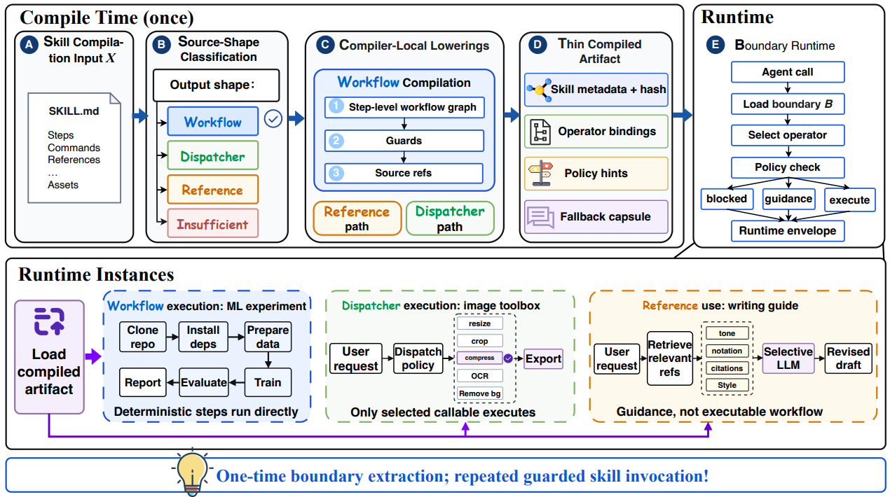

# SkillSmith

> **分类**: Skill 执行 | **成熟度**: 🟡 成长期 | **综合评分**: 0.54

---

## 一句话描述

**SkillSmith** 将编译原理思想引入 Agent 技能管理——**把技能的"理解"和"推理"从每次运行时剥离出来，编译成带边界合约的运行时接口**。技能不再是一本每次都要从头读的教科书，而是一套可以被"编译一次、执行无数次"的程序。**Token 减少 57%、解决时间缩短 50%，任务完成率无明显下降**。

**来源**:
- 以太之心、中国人民大学、UCSD 联合研究
- 发布年份：**2026**

**链接**:
- 论文：https://arxiv.org/pdf/2605.15215

---

## 核心实现

**1. 源码形态分类：四类技能分别降级**

编译前先判断技能的"源码形态"：**workflow 型**（有序步骤、明确控制流）编译为带依赖关系的步骤级工作流图；**dispatcher 型**（打包脚本和 API 描述）编译为类型化可调用算子；**reference 型**（表格和示例为主）索引化按需检索；**insufficient 型**（内容模糊）不编译、退回使用原始文档。分类基于结构性特征（标题层级、有序列表、代码块等）并由 LLM 最终判定，保守优先级：workflow > dispatcher > reference > insufficient。

**2. 边界合约：编译产物的声明式 ABI**

编译产物不是工作流 IR，而是一份声明式的**边界合约**，包含七个字段：边界类型 τ、可调用算子 O（含输入/输出 schema、底层绑定、源码引用）、输入/输出合约、风险标记 + 验证级别、动作策略 + 选择策略、以及**无损降级胶囊 F**——当编译产物无法处理当前请求时，完整保留原始技能内容，Agent 可回退到原始材料。

**3. 带护栏的运行时状态机**

Agent 使用编译技能时渐进式披露：先看到紧凑的 run_{skill} 操作柄和边界摘要，详细内容不占持久 Prompt。每次调用走三路径：执行路径（算子直接执行返回证据）、指引路径（返回参考指引让 Agent 自主推理）、阻塞路径（合约判断超出能力返回降级提示）。编译是非破坏性的——任何时候可从合约回到原始技能。

---

## 主要能力

- **Token 减半**：推理和 LLM 调用次数减少 43%，解决时间缩短 51%（约 2 倍加速），按 Token 计费的成本减少 57%
- **强模型编译、弱模型跑**：用强模型编译的产物给弱模型执行，某些任务上的准确率反优于弱模型直接解读原始技能
- **非破坏性编译**：降级胶囊完整保留原始技能，Agent 可在编译器产出不足时无损失回退
- **跨平台适用**：SkillsBench 七个任务、三个 Agent 平台、四个模型规模上验证

---

## 局限性

- **覆盖范围有限**：当前仅测试 7 份 SkillsBench 技能，扩展到全量基准仍需更大规模验证
- **分类边界模糊**：source-shape 分类器的四类划分在某些边界模糊技能上可能需要更细粒度
- **降级路径过度保守风险**：如果合约策略过于保守，可能导致过多回退到原始材料

---

## 成熟度评分

| 维度 | 评分 (0.0-1.0) | 说明 |
|------|---------------|------|
| 技术成熟度 | 0.55 | 学术论文阶段，以太之心+人大+UCSD联合研究，有开源代码，Token减57%时间减50% |
| 创新性 | 0.75 | 首次将编译原理引入技能管理，理解与推理从运行时剥离为带边界合约的运行时接口 |
| 落地程度 | 0.40 | 代码已开源，编译一次执行无数次，实用价值高但需更多场景验证 |
| 生态活跃度 | 0.40 | 三机构联合，有Aeloon开源项目 |

**综合评分**: 0.54

---

## 参考资料

- [SkillSmith 论文](https://arxiv.org/pdf/2605.15215)
- [代码](https://github.com/AetherHeart-AI/Aeloon)
