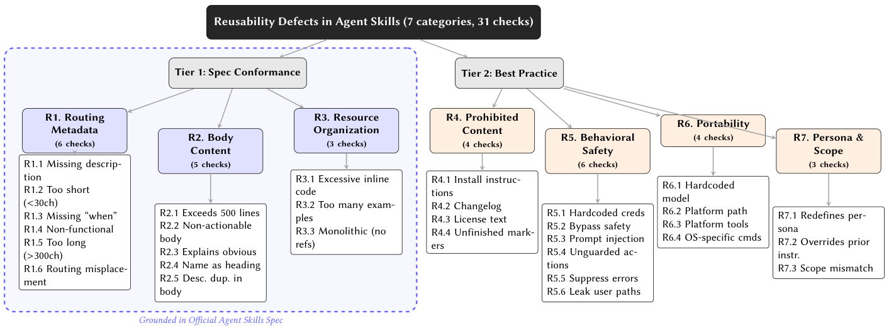

# SkillsReusable

> **分类**: Skill评测 | **成熟度**: 🟡 成长期 | **综合评分**: 0.55

---

## 一句话描述

对 **138,133 份公开 SKILL.md** 的两层缺陷分类普查：**91.8% 含缺陷**、89.3% 违规范，主导是路由元数据弱 / body 臃肿 / 资源组织差等**普通打包问题**（非恶意攻击），路由缺陷真降发现命中（hit@1 88.5% vs 82.6%），给到生成时质保工作流。

**来源**:
- What Keeps Agent Skills from Being Reusable? Evidence from 138K SKILL.md Files（Chi Zhang 等，CUNY 研究生中心 / 俄亥俄州立大学）
- 发布年份：2026

**链接**:
- https://arxiv.org/abs/2608.08453

---

## 核心实现

可复用是条生命周期：选（routing）→ 载（load）→ 支撑（resource）→ 执行（execute）→ 移植（port），缺哪个环节都垮。两层分类法 7 类 31 检查，三迭代建（逐句读规范 + 300 抽样编码 + 761 GitHub issue 交叉验证），两层分开让合规违规和最佳实践独立排序。

**1. Tier 1 规范符合性层（14 检查）：打在 reuse 主路径上**

直接从官方 Agent Skills 规范和 Claude Code 文档逐句抽 verifiable 结构要求：
- **R1 路由元数据**（6 检查）：缺 / 短 / 长 / 无功能 description、路由信息错放 body——直接卡 startup 选 skill 这一步；
- **R2 body 内容**（5 检查）：超 500 行、不可执行、解释显而易见、name 当标题、desc 重复——卡 context 成本；
- **R3 资源组织**（3 检查）：内联代码多、例子多、单体 skill 不用子目录——卡 progressive disclosure。

**2. Tier 2 最佳实践层（17 检查）：从实证文献抽常见坑**

从同行评审的安全和软件工程文献抽，Tier 1 抓不到的反复出现的坑：
- **R4 禁止内容**（4）：安装指令 / changelog / license / TODO；
- **R5 行为安全**（6）：硬编码凭据 / 绕安全（如 −−no−verify）/ prompt injection / 未防护 rm -rf / 错误抑制 / 路径泄露；
- **R6 可移植**（4）：硬编码模型名 / 平台路径 / 平台工具 / OS 命令（如 pbcopy）；
- **R7 persona 与范围**（3）：persona 重定义 / 指令覆盖 / 范围不匹配。

**3. 路由压力测试层：用最低限探测证明缺陷真有功能后果**

2 万技能建 BM25 索引（仅 description 字段），故意选最简单的词法检索而非 LLM selector——这是**下限探测**：最简单机制下路由缺陷能合理降发现。结果 R1-clean **hit@1 88.5% / MRR 0.906** vs R1-defective **82.6% / 0.855**——路由元数据缺陷真的降发现命中。更语义化的检索可能压缩差距，故作未来工作。

控制要点：缺陷打在生命周期某环节非通用风格问题；主导是普通打包非恶意（R1 67.0% / R2 51.4% / R3 36.9%）；spec-aware 技能 1.83 vs 无意识 3.00 缺陷；AI 标记安全 2.3× / 可移植 2.8×；零缺陷技能编码项目特定本地过程非教程内容。

---

## 主要能力

- **生态级普查**：138,133 份技能 91.8% 含缺陷（宽严阈值稳 88.8–94.6%），89.3% 违规范
- **主导是普通打包**：R1 路由 67.0%、R2 body 51.4%、R3 资源 36.9%，非花式攻击
- **功能后果实证**：R1-defective 路由 hit@1 82.6% vs clean 88.5%
- **平台/来源信号**：spec-aware 1.83 vs 无意识 3.00 缺陷，AI 标记安全 2.3×/可移植 2.8×
- **质保工作流**：spec-aware prompting+轻量 lint+自动修复+安全门控，12 条证据型指南

---

## 局限性

- **路由测试仅 BM25**：生产 harness 用 LLM 选择器，语义检索可能压缩差距，标未来工作
- **AI 标记关联非因果**：标记子集非随机样本，未做 propensity 匹配
- **对话优先来源是假说**：未测文本与聊天记录重叠，未找"saved from chat"标记
- **R2-R7 功能影响间接**：上下文成本/安全/移植需端到端基准，本文用 GitHub issue 佐证

---

## 成熟度评分

| 维度 | 评分 (0.0-1.0) | 说明 |
|------|---------------|------|
| 技术成熟度 | 0.60 | 两层缺陷分类 7 类 31 检查 + 路由压力测试 |
| 创新性 | 0.66 | 138K SKILL.md 生态级普查，缺陷打在生命周期环节 |
| 落地程度 | 0.48 | R1-defective 路由 hit@1 82.6% vs clean 88.5% 实证后果 |
| 生态活跃度 | 0.45 | 单篇论文，HuggingFace 数据集 |

**综合评分**: 0.55

---

## 参考资料

- [What Keeps Agent Skills from Being Reusable? Evidence from 138K SKILL.md Files](https://arxiv.org/abs/2608.08453)
- [SkillMD-138K 数据集与分析脚本](https://huggingface.co/datasets/FayeZC/SkillMD-138K)
