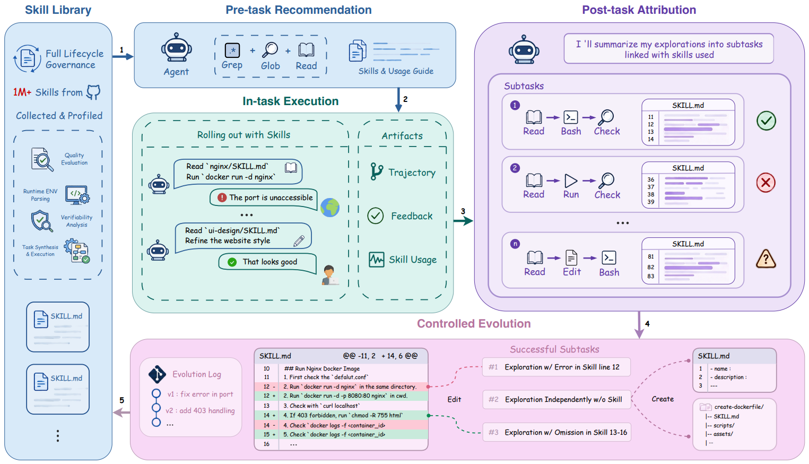

# SkillsVote

> **分类**: Skill 召回 | **成熟度**: 🟡 成长期 | **综合评分**: 0.59

---

## 一句话描述

**SkillsVote** 为 Agent 技能装上了完整的 **生命周期治理闭环**——收集（Collection）→ 画像（Profiling）→ 推荐（Recommendation）→ 归属（Attribution）→ 进化（Evolution）。不是"检索到就塞进 Prompt"，而是先画像判断能不能跑、再让 Agent 像程序员一样在库里搜索、执行后拆到子任务级归因功劳、只有证据门控下的可复用发现才能写回技能库。

**来源**:
- 产品/开源框架：Mental Tensor 团队
- 发布年份：**2026**

**链接**:
- 产品网站：https://skills.vote
- 开源仓库：https://github.com/MemTensor/skills-vote

---

## 核心实现

**1. 百万级技能画像：三个维度把静态文档变成有执行证据的行为档案**

对百万级技能逐一构建三维护画像：**运行时需求画像**（OS、写入权限、sudo、网络、API Key、MCP Server 依赖）、**质量画像**（描述与脚本一致性、引用完整性、任务是明确可执行还是开放式模糊描述）、**可验证性画像**（是否可客观判断"确实成功了"，环境可否在沙箱中复现）。通过验证的技能额外获取一组合成测试任务（含标准任务描述、可复现环境和可执行验证器），真实跑 Agent 记录成功率、Token 消耗和执行轨迹。偏好驱动或需特殊硬件的技能保留画像但不强行塞评测。

**2. Agentic Library Search：推荐不是检索，是搜索**

推荐阶段独立于任务执行。Agent 不解决任务，只做一件事：在结构化技能库里像程序员一样 **grep、glob、read**——浏览技能目录、按需打开 SKILL.md 和资源文件、判断哪些技能覆盖当前任务需求、哪些适配目标环境、哪些互补。输出不是 Top-K 排序列表，而是一套**紧凑的技能暴露集 + 简洁的使用指南**，告诉执行 Agent"这三份技能相关，它们这样配合，注意环境要求"。推荐记录同时作为后续归属的锚——执行后回溯检查推荐技能是否被实际使用、效果如何，下一次推荐的依据是上一轮真实的执行证据而非语义相似度。

**3. 子任务级归属：三道归因决定技能是帮了忙还是添了乱**

将整条执行轨迹拆解为最细的语义完整子任务（有独立目标、有主要评估信号、最多关联一份技能上下文），每个子任务过三道归因：**结果证据**（成败来自客观环境反馈还是主观判断还是无明确信号）、**责任归属**（成功归功于技能指导还是 Agent 自己探索还是 Agent 看了技能后自行纠正；失败归咎于技能写错还是环境故障还是评估信号问题）、**可复用增量**（提取技能中真正影响执行的那部分知识——缺失的前置条件、错误的步骤顺序、遗漏的恢复模式，丢弃随机试错和任务特定硬编码）。只有成功子任务、且归因为技能贡献、且提取出可复用增量——才允许提出进化建议。

**4. 证据门控的受控进化：离线 + 在线双模式**

Offline Evolution 在历史任务数据上离线优化技能库，在 Terminal-Bench 2.0 上帮 GPT-5.2 提升 7.9 个百分点。Online Evolution 在测试时任务流中边跑边进化，在 SWE-Bench Pro 上提升 2.6 个百分点。治理过的技能库比原始社区技能库、比不加归属直接进化、比仅靠语义检索——都要好。

---

## 主要能力

- **百万级技能画像**：168 万+ Skills 收录，三维画像（运行时/质量/可验证性）将静态文档转为执行证据档案
- **Agentic Library Search**：Agent 主动搜索而非被动排序，输出紧凑暴露集 + 使用指南 + 编排建议，推荐依据随执行证据迭代
- **子任务级归属**：三道归因（结果证据 → 责任归属 → 可复用增量），精确区分技能贡献和 Agent 自主探索，防止错误归因污染技能库
- **证据门控进化**：只有通过归属三道检验的可复用发现才写入技能库，离线 + 在线双模式验证（+7.9 / +2.6）
- **一行命令接入**：npx skills add，支持 Codex/Claude Code/OpenClaw 等主流客户端，Playground 可可视化推理轨迹

---

## 局限性

- 画像构建依赖 GPT-5.4 强模型，成本极高（20 万美元+），普通团队难以复现
- 子任务级归属的拆分和归因目前依赖 LLM 判断，跨模型迁移的归属一致性未验证
- 推荐仍以 LLM 驱动为主，缺乏可解释的规则层，推荐结果的稳定性受模型版本影响
- 反馈闭环中的在线进化在复杂多任务场景下的大规模量化验证尚不充分

---

## 成熟度评分

| 维度 | 评分 (0.0-1.0) | 说明 |
|------|---------------|------|
| 技术成熟度 | 0.65 | 产品上线可用，有论文+开源代码+真实任务对比数据 |
| 创新性 | 0.70 | recommend→feedback闭环+LLM多维画像+子任务级归因，工程创新显著 |
| 落地程度 | 0.60 | 一行命令接入，多平台支持，Playground可用，168万+Skills收录 |
| 生态活跃度 | 0.35 | MemTensor团队产品，社区生态尚在建设 |

**综合评分**: 0.57

---

## 参考资料

- [产品网站](https://skills.vote)
- [GitHub 仓库](https://github.com/MemTensor/skills-vote)
- [论文](https://arxiv.org/pdf/2605.18401)
- [SkillsVote 深度解析](https://blog.csdn.net/MemTensor/article/details/159996412)
