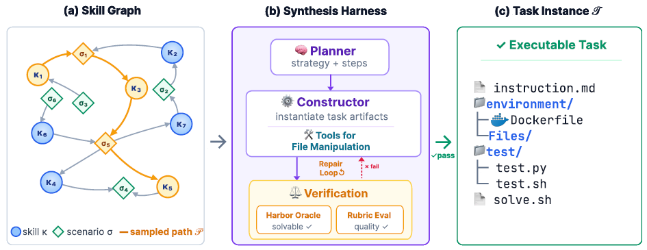

# SkillSynth

> **分类**: Skill 生成 | **成熟度**: 🟡 成长期 | **综合评分**: 0.54

---

## 一句话描述

SkillSynth 通过场景中介技能图将终端 Agent 训练从**"堆数量"转为"控多样性"**。从 ClawHub/GitHub 收集技能构建含 **82,073 节点、57,214 边**的有向图，**逆频率采样**保证工作流多样性，多 Agent 验证管线产出可执行任务。基于其训练的 **Qwen3-32B** 在 **Terminal-Bench 2.0** 上超越 **15 倍参数**的 Qwen3 Coder 480B。

**来源**:
- 学术论文：腾讯混元团队
- 发布年份：2026年

**链接**:
- 论文链接：https://arxiv.org/abs/2604.25727

---

## 核心实现

SkillSynth 通过三个阶段将技能图谱转化为多样化训练数据：

**1. 技能图谱构建（Skill Graph Construction）**

从 ClawHub 和 GitHub 收集并过滤技能，由 LLM 推断每个技能的前置场景（何时适用）和后置场景（执行后状态），经层次凝聚聚类去重、跨技能双向语义对齐、场景合并与过滤，构建以场景为节点、技能为有向边的统一图。最终图谱包含 82,073 个场景节点、57,214 条技能边、185,529 个 LLM 验证的桥接，85.6% 节点位于最大连通分量中，涵盖编码、文档处理、DevOps、安全及音频语音、3D 仿真等长尾领域。

**2. 逆频率路径采样（Inverse-Frequency Path Sampling）**

从图中采样有向路径作为任务工作流抽象。采用逆频率加权策略——场景和技能被访问越少、被选中概率越高——避免路径集中在热门节点；路径内排除已访问节点以保证单调推进，长度 1~7 步，仅接受技能集未曾出现过的路径。该机制将采样分布逐步推向场景与技能空间的均匀覆盖。

**3. 多 Agent 协作验证管线（Multi-Agent Harness）**

规划器将路径转化为子目标序列，构造器据此生成完整任务实例（指令、文件系统快照、Docker 环境、pytest 验证脚本、参考解法）。通过执行验证（确认可解）和评分验证（LLM 检查指令-测试对齐性）双重把关，失败则反馈重试（最多 3 轮），最终产出 3,560 个验证通过的任务实例，oracle 通过率 95.7%。

---

## 主要能力

- 图谱驱动的多样性控制：通过逆频率路径采样在"场景 × 技能"空间上实现均匀覆盖，合成轨迹的唯一场景-技能对比单技能基线高 31%，比随机多技能高 19%
- 全自动任务实例生成：单次运行产出 3,560 个验证通过的可执行任务，95.7% oracle 通过率，包含指令、环境、验证脚本和参考解法的完整任务包
- 小模型超越大模型的数据效率：Qwen3-32B + SkillSynth 在 Terminal-Bench 2.0 上（29.6%）超越 Qwen3 Coder 480B（23.9%），证明多样性优先于数量的数据策略

---

## 局限性

- 图谱质量依赖 ClawHub/GitHub 技能的质量和覆盖度
- 尚未开源，无法独立复现
- 仅验证了终端 Agent 场景，其他 Agent 范式的适用性待验证

---

## 成熟度评分

| 维度 | 评分 (0.0-1.0) | 说明 |
|------|---------------|------|
| 技术成熟度 | 0.55 | 有预印本论文和完整实验验证，已用于训练 Hy3 Preview 模型 |
| 创新性 | 0.80 | 首次将技能图谱引入 Agent 训练数据合成，多样性>数量范式转变 |
| 落地程度 | 0.40 | 腾讯混元内部应用，尚未公开开源 |
| 生态活跃度 | 0.40 | 论文 2026 年 4 月发布，图谱可随 ClawHub 自动扩展 |

**综合评分**: 0.54

---

## 参考资料

- [论文](https://arxiv.org/abs/2604.25727)
- [详解](https://blog.csdn.net/weixin_58753619/article/details/160746726)
