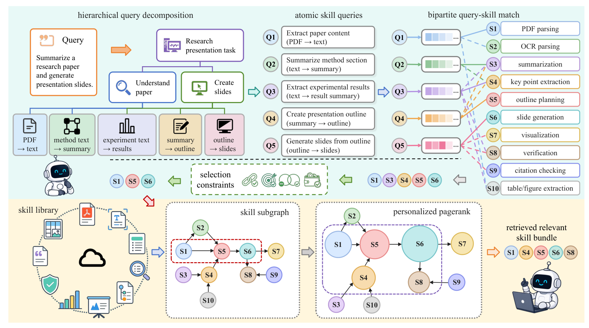

# SkillTrace

> **分类**: Skill召回 | **成熟度**: 🟡 成长期 | **综合评分**: 0.59

---

## 一句话描述

SkillTrace 是一个**可组合 skill 检索框架**，把复杂查询-skill 库关系建模成 **Query-Skill Graph** 三层结构（查询组合关系/查询-skill 语义匹配/skill 间执行依赖），用三阶段图遍历找回**既覆盖查询又含执行依赖**的完整可执行 skill 组合，SkillsBench 53.17%、ALFWorld 91.43% 双 SOTA。

**来源**:
- SkillTrace: Traversing a Query–Skill Graph for Composable LLM Agents（Yue Yao 等，山东大学/ANU/清华/Curtin，AAAI 2027）
- 发布年份：2026

**链接**:
- https://arxiv.org/abs/2608.02356

---

## 核心实现

SkillTrace 把"找回一坨能跑通的 skill"建模成 Query-Skill Graph 的三阶段遍历：查询树分解 → 二部匹配找主 skill → 依赖传播补 supporting skill。

**1. 查询分解层：把复杂查询拆成自包含原子查询（HQT）**

输入用户查询，提示语言模型把它组织成**层次化语义树**，叶节点是自包含的原子 skill 查询——每个描述恰好一个输入-输出变换，禁止再往 skill 级以下分解，也不允许引入原查询没有的需求。树叶集即原子查询集 $A_x$。这一步保证后续匹配有清晰的一对一目标，避免需求混叠。

**2. 匹配层：一对一最大权二部匹配找主 skill（QSBG）**

原子查询集 $A_x$ 和 skill 库 $S$ 作为二部图两 disjoint 节点集，边权为查询和 skill 在共享表示空间的余弦相似度。这里不取每个查询的 top-1，而是做**最大权二部匹配**：每个查询恰好配一个 skill、每 skill 至多配一查询。一对一约束防多个查询抢同一个 skill、也逼出覆盖度低冗余的主 skill 集 $P_{x,S}$，作为依赖传播的种子。

**3. 依赖层：reverse-aware PageRank 回补未明说的前置 skill（SDS）**

skill 库预先组织成有向依赖图，边权由输出/输入 schema 的重叠度决定（阈值 $\delta_D$ 之上才建边）。把主 skill 集 $P_{x,S}$ 当 personalized PageRank 的种子传播。关键点：依赖边从 supporting 指向消费 skill，标准 PPR 顺流扩散会找"下游"，而要找的是**前置 prerequisite**，于是加入反向转移矩阵 $T_D=\text{RowNorm}(A_D+A_D^\top)$，让相关性从主 skill **逆流回溯到前置依赖**。最终保留主 skill + TopK supporting skill：
$$S_x^* = P_{x,S} \cup \text{TopK}_{s_i\in S\setminus P_{x,S}}(r_i^*)$$

控制要点：光建图不够，要按查询需求遍历（SkillDAG 只建图反不如独立检索）；一对一匹配防冗余种子；反向传播找回未明说依赖（消融去掉 SDS 掉 **12.95pp** 最大降幅）；在线复杂度 $O(QN+Q^2N+K(N+E))$ 近似线性于库规模。

---

## 主要能力

- **可组合检索非单 skill 检索**：建模查询间组合+查询-skill 匹配+skill 间依赖三层，找回完整可执行组合而非相关 top-k
- **依赖感知传播**：reverse-aware PPR 补回查询没明说的前提 skill，消融去此层掉 12.95pp（最大）
- **一对一匹配防冗余**：最大权二部匹配逼每原子需求配不同主 skill，保覆盖度
- **跨模型泛化**：5 个 backbone 全超 GoS（+0.69~6.68pp），增益不挑模型
- **近似线性复杂度**：图离线建、Q/K 小、依赖图稀疏，在线检索 O(QN+Q²N+K(N+E)) 近似线性

---

## 局限性

- **依赖图质量受限**：依赖边靠输入输出 schema 重叠度（阈值 0.6）构造，schema 不规范或缺失时依赖建不准
- **HQT 依赖 LLM 分解**：原子查询分解靠语言模型，分解质量影响种子和最终组合
- **检索与执行割裂**：SkillTrace 只管给对 skill，模型弱时执行仍差（DeepSeek-V3.2 仅 16.00%）
- **图构建一次性摊销**：skill 库变动需重建依赖图，频繁变动场景需重建成本

---

## 成熟度评分

| 维度 | 评分 (0.0-1.0) | 说明 |
|------|---------------|------|
| 技术成熟度 | 0.58 | 三阶段图遍历 Hungarian + reverse PPR，NetworkX 实现未开源 |
| 创新性 | 0.78 | 首把可组合检索建模成三层图并按查询遍历，reverse-aware PPR |
| 落地程度 | 0.50 | SkillsBench/ALFWorld 双 SOTA 跨 5 模型，但依赖图质量 |
| 生态活跃度 | 0.46 | AAAI 2027 接收，单篇论文，未开源 |

**综合评分**: 0.59

---

## 参考资料

- [SkillTrace: Traversing a Query–Skill Graph for Composable LLM Agents](https://arxiv.org/abs/2608.02356)
