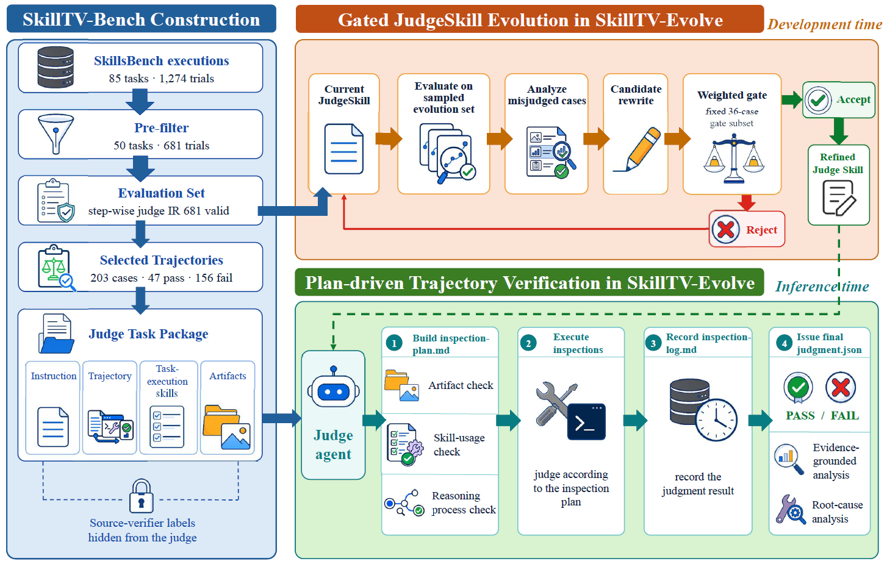

# SkillTV-Bench

> **分类**: Skill评测 | **成熟度**: 🟡 成长期 | **综合评分**: 0.57

---

## 一句话描述

SkillTV-Bench 是一个 **skill-aware 的轨迹验证基准**（681 案跨 11 域），把 task-time skill 当 judge 的验证上下文指示该查什么证据、哪些失败任务关键；配套 **SkillTV-Evolve** 把验证知识外化成 JudgeSkill 并用 gated 进化从误判里精炼，让同一 agent judge 准确率提 **14.8pp**、rollout 命中率 22.9%→45.5%。

**来源**:
- SkillTV-Bench: Benchmarking How Well Judges Perform on Skill-Augmented Agentic Execution（Zhi Han 等，上交/上海AI实验室/中山医/UCL）
- 发布年份：2026

**链接**:
- https://arxiv.org/abs/2608.05573
- https://github.com/HanZhi306/SkillTV-Bench

---

## 核心实现

分两半：SkillTV-Bench 提供带真实 skill 的验证基准，SkillTV-Evolve 在其上把验证知识外化成可进化的 JudgeSkill。

**1. 基准构建层：把 skill 当验证上下文打包成可检查的执行包**

从 SkillsBench 85 任务 1274 试验出发，五阶段过滤映射：提原始试验 → 去过长轨迹只留 pass+fail 都有的任务 → 规则转换器把乱序事件流映射成固定 schema 的 step-wise 表示 → 校验 schema/一致性 → 域均衡采样切成 478 进化集 + 203 评估集（任务不相交防过拟合）。每案是四元组 $(I,\tau,S,A)$：指令 + 规范化轨迹 + task-time skill 集 + 工件，源验证器标签对 judge 隐藏。skill 不是给 task agent 用完就丢，而是**告诉 judge 该查什么证据、哪些失败任务关键**。

**2. plan-driven 验证层：把 rubric 属性陈述操作化成证据寻求动作**

JudgeSkill 把 judge 推理结构化成三产物：**检查计划 P**（查什么 / 去哪查 / 证据何时算够）、**检查日志 L**（实际执行的检查和发现）、**证据落地判决 $(\hat{y},R)$**。普通 rubric 只陈述属性，这里把属性操作化成可执行的证据寻求动作。pass 的判据是日志里有充分正向证据且无任务关键失败（缺工件、未解 runtime 错、schema 违反、漏验证步、skill 使用错）。judge 还从三条失败参考（工件可见 / 推理过程可见 / skill 编排可见）里挑导航方向。

**3. gated 进化层：从误判里精炼 JudgeSkill 而不动模型**

478 案不相交进化池，每轮当前 judge 在采样开发集上推断，误判案分三束反思（**假 pass 加固** / **假 fail 放松** / **均衡校准**），压成改写简报喂给优化器提改写 JudgeSkill。关键控制点是**固定 36 案开发门评估**（保全部 14 任务族、27 fail / 9 pass），候选只在改进门控指标时才替换现任：
$$G = 0.5\cdot\text{BalAcc}+0.3\cdot\text{Recall}_{fail}+0.2\cdot\text{Precision}_{pass}$$

控制要点：judge 主病是"接受 plausible failure"（precision-recall 不平衡），$G$ 权重偏 $\text{Recall}_{fail}$ 针对主病；任务不相交切分逼泛化；门控让 JudgeSkill 只升不降，进化后同一 agent judge BalAcc 从 0.568 升到 0.634、准确率 +14.8pp。

---

## 主要能力

- **skill 当验证上下文**：task-time skill 不止给 task agent，给 judge 指明查什么证据/哪些失败任务关键
- **操作化检查**：JudgeSkill 把 rubric 属性陈述转成证据寻求动作，查什么/去哪查/何时够
- **gated 进化不改模型**：从误判案例精炼 JudgeSkill，同一 agent judge 涨 14.8pp
- **rollout 选择增益**：验证器准→选中轨迹成功率从单 rollout 22.9% 提到 10 rollout 45.5%
- **任务不相交防过拟合**：评估集题不参与进化，逼 JudgeSkill 在未见任务泛化

---

## 局限性

- **依赖源验证器标签**：benchmark 标签靠 SkillsBench 源验证器，标签质量决定评测可信度
- **进化集规模有限**：478 案进化、36 案门控，小规模下进化稳定性待验
- **三失败参考人工综合**：从实证分析综合，覆盖不全可能漏新型失败模式
- **单 backbone 评估**：agent judge 用 Claude Sonnet 4.6，跨更多 backbone 泛化未验

---

## 成熟度评分

| 维度 | 评分 (0.0-1.0) | 说明 |
|------|---------------|------|
| 技术成熟度 | 0.60 | 681 案验证基准 + JudgeSkill 三产物 + gated 进化，开源 |
| 创新性 | 0.74 | task-time skill 当验证上下文 + rubric 属性操作化成证据寻求动作 |
| 落地程度 | 0.47 | 同一 agent judge +14.8pp，rollout 命中 22.9%→45.5% |
| 生态活跃度 | 0.46 | 单篇论文，GitHub 开源 |

**综合评分**: 0.57

---

## 参考资料

- [SkillTV-Bench: Benchmarking How Well Judges Perform on Skill-Augmented Agentic Execution](https://arxiv.org/abs/2608.05573)
- [SkillTV-Bench 代码与数据](https://github.com/HanZhi306/SkillTV-Bench)
