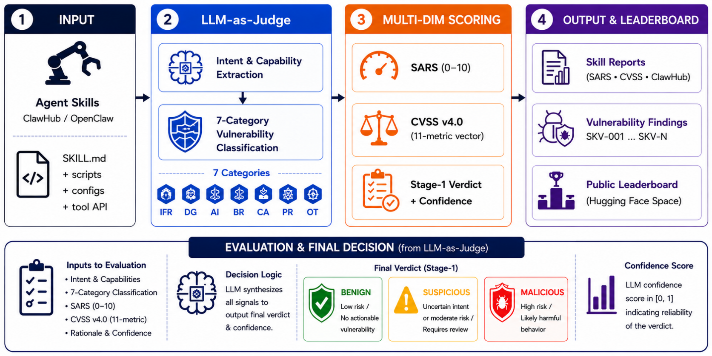

# SkillVetBench

> **分类**: Agent 技能评测 | **成熟度**: 🟢 成熟期 | **综合评分**: 0.61

---

## 一句话描述

SkillVetBench 是一个**活的公共 Hugging Face 排行榜**，使用 LLM-as-Judge 对开源 Agent 技能进行多维度安全审查。贡献是 **SARS（Skill Agentic Risk Score）**：一个 5 维度、带加权公式的 Agentic 风险评分，捕获了代码级扫描器**结构性遗漏**的指令层和多智能体风险。在 100 个技能的受控检测中实现**零假阴性、零假阳性**，而最佳静态基线 SkillSieve 仍漏检 15%；VirusTotal 漏检 67%，ClawScan 漏检 52%。

**来源**:
- SUPREME Lab，德州大学埃尔帕索分校，论文 arXiv: 2606.15899v1
- 发布年份：2026

**链接**:
- 论文：https://arxiv.org/abs/2606.15899

---

## 核心实现

**1. SARS 五维度 Agentic 风险评分**

SARS 定义五个独立维度，每维 0-3 分，由 LLM-as-Judge 评定。
- **IFR（指令保真风险，权重 2×）**：技能指令是否可能被 Agent 误执行或绕过；
- **DG（数据引力，1.5×）**：技能接触的敏感数据广度；
- **AI（动作不可逆性，1.5×）**：技能操作是否不可撤销；
- **BR（爆炸半径，2×）**：危害扩散范围；
- **CA（链式放大，2×）**：多智能体/多技能协作中风险的级联放大效应。

**2. LLM-as-Judge 审查流程 + 多框架集成**

默认 Judge 为 Qwen2.5-14B-Instruct（T=0.2）。审查覆盖七类漏洞：命令/Shell 注入、RCE、不安全文件操作、提示注入、记忆投毒、数据暴露、供应链攻击和权限滥用。排行榜同时展示 SARS 评分、完整 CVSS v4.0 向量分解、以及 ClawHub 双视图（市场官方裁决 vs LLM 审查对比）。评估器敏感度分析中检测率从 35%（Mixtral-8x7B）到 95%（Qwen2.5-32B）不等，说明 **Judge 选择是关键变量**。

**3. 指令层检测缺口量化**

对 Prompt Injection（19 个技能），VirusTotal 检出 0，ClawScan 检出 3，LLM-as-Judge 检出全部 19 个。对 Memory Poisoning（9 个技能），ClawScan 检出 1，VirusTotal 检出 3，CodeBERT 检出 0：传统工具漏检 **89-100%** 的指令层威胁。CA（链式放大）维度在所有恶意类别中均 ≥1.80，即使这些技能的 CVSS 基础分偏低（Data Exposure 1.84，Supply Chain 2.30）。

---

## 主要能力

- **SARS 五维度加权风险评分**填补代码扫描器对指令层和多智能体风险的盲区
- 受控 100 技能检测中**零假阴性、零假阳性**，超过最佳静态基线 15% 的漏检率
- **活的公共排行榜**（1,299 个技能，2026.05 快照）：39.2% 标记为存在漏洞，3 个 Critical，54 个 High
- 量化了代码扫描工具对**指令层威胁的 89-100% 漏检率**

---

## 局限性

- **LLM-as-Judge 评估器敏感度差异巨大**（Mixtral-8x7B 35% vs Qwen2.5-32B 95%），Judge 模型选择直接影响结果可信度
- SARS 权重公式是**专家定义的固定权重**，未经大规模经验校准
- 当前仅覆盖 **七类预定义漏洞**，对新型攻击向量的覆盖需人工扩展
- 排行榜技能来源于**公开 ClawHub 生态**，对私有技能库的代表性有限

---

## 成熟度评分

| 维度 | 评分 (0.0-1.0) | 说明 |
|------|---------------|------|
| 技术成熟度 | 0.65 | SARS五维风险评分+HF公共排行榜，零假阴性零假阳性 |
| 创新性 | 0.65 | LLM-as-Judge做技能安全审查，代码级扫描器结构性遗漏指令层风险 |
| 落地程度 | 0.55 | SUPREME Lab出品，VirusTotal漏检67%在横向对比中极具说服力 |
| 生态活跃度 | 0.60 | HF排行榜模式便于社区持续贡献和追踪 |

**综合评分**: **0.61**

---

## 参考资料

- [论文](https://arxiv.org/abs/2606.15899)
- [代码](https://huggingface.co/spaces/supreme-lab/AgentSkillBench)
