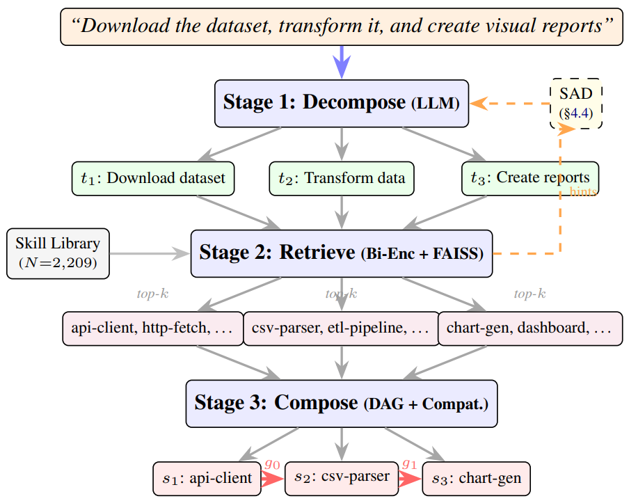

# SKILLWEAVER (SAD)：组合式技能路由与技能感知分解

> **分类**: Agent技能路由 / 组合式检索 | **成熟度**: 🟡 成长期 | **综合评分**: 0.55

---

## 一句话描述

将技能路由从单选升级为组合式路由（拆解-检索-编排），发现**分解而非检索是瓶颈**。提出SAD：用检索反馈回路让decomposer看到可选技能后重新分解，DA从51.0%提升至**67.7%**（+32.7%），**上下文消耗降低99.9%**。

**来源**:
- 论文：Gao, "Compositional Skill Routing for LLM Agents: Decompose, Retrieve, and Compose"
- 发布年份：2026
- 机构：Alibaba Cloud

**链接**:
- arXiv: 2606.18051v1
- COMPSKILLBENCH已公开

---

## 核心实现

**1. 三段式组合路由框架**

给定复杂查询和2209个真实技能库：
- 拆：decomposer（Qwen2.5-7B）拆成原子子任务序列，每个子任务恰好配一个技能
- 检：对每个子任务用双编码器+FAISS做语义检索，**仅用技能元数据**，CatR@10达69.0%
- 组：按技能间兼容性（I/O类型匹配、类别Jaccard、关键词共现）选最优组合形成DAG

**2. SAD：检索增强的分解反馈回路**

标准分解→检索top-15候选技能名→作为提示词喂回decomposer→重新分解。控制要点：
- SAD是**粒度修正器而非词汇对齐器**：修好了75个vanilla步数错误的查询，DA都正确的查询上CatR@1完全一致（$p = 0.97$）
- 直接告诉vanilla decomposer ground truth步数，DA飙到99.3%，CatR@1到39.8%，跟SAD的DA=1条件下几乎一样
- Qwen2.5-14B过度分解更严重（平均4.72步），SAD同样压回

**3. COMPSKILLBENCH基准与迁移验证**

从公开MCP生态构建，300个组合式查询、2209个真实技能、24个类别，分Easy/Medium/Hard三级。迁移实验验证SAD非模板记忆：
- 类别级留出：+35.6%相对DA提升
- 技能级留出：+23.2%
- 人类查询DA_±1：+66%

控制要点：上下文从88.4万token降到约1,160 token，**降低99.9%**。

---

## 主要能力

- 组合式技能路由：支持一个查询需要多个技能串行协同，不再局限于单选
- 瓶颈定位与精准攻击：DA条件分析揭示分解是瓶颈（DA=1时CatR@1从34.2%跳到41.2%），SAD集中解决
- 跨模型粒度修正：14B过度分解比7B更严重，SAD同样压回有效
- 上下文压缩：将2209技能暴露压到平均2.9个/子任务，token从88.4万降到约1,160
- 表征层可扩展：listwise reranker +10.3%、BGE-base +14.5%，gap在表征层不在架构层

---

## 局限性

- CatR@1徘徊在37-41%，@10到@1的gap靠reranker或更强encoder收窄
- 组合阶段缺ground-truth兼容性标注，仅在30条pilot上验证执行可行性
- 实验全用Qwen2.5系列作decomposer，跨家族模型的分解行为差异没测
- SAD增加一次LLM推理（Pass-2），7B上可控但更大模型的trade-off未量化

---

## 成熟度评分

| 维度 | 评分 | 说明 |
|------|------|------|
| 技术成熟度 | 0.55 | 三段式组合路由+SAD反馈回路完整实现，COMPSKILLBENCH基准已公开 |
| 创新性 | 0.75 | SAD检索增强分解反馈、瓶颈定位（分解而非检索是瓶颈）、上下文压缩99.9% |
| 落地程度 | 0.45 | 仅在自建基准上验证，跨家族模型分解行为差异未测，组合阶段验证有限 |
| 生态活跃度 | 0.40 | COMPSKILLBENCH已公开，但工具化程度低 |

**综合评分**: 0.55×0.3 + 0.75×0.25 + 0.45×0.25 + 0.40×0.2 = **0.55**（🟡 成长期）

---

## 参考资料

- [论文](https://arxiv.org/abs/2606.18051)
