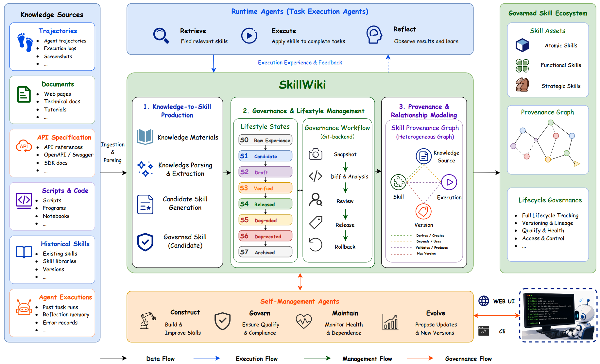

# SkillWiki

> **分类**: Agent技能基础设施 / 技能治理 | **成熟度**: 🟡 成长期 | **综合评分**: 0.48

---

## 一句话描述

将技能管理从算法优化问题重新定义为**基础设施问题**，模仿GitHub为Agent技能提供生产 - 组织 - 治理 - 演化的完整闭环。125件异构知识制品中99件成功转化为受治理技能，支持S0-S7完整生命周期和Git风格审计工作流。

**来源**:
- 论文：Huang et al., "SkillWiki: A Living Knowledge Infrastructure for Agent Skills"
- 发布年份：2026
- 机构：Harbin Institute of Technology, Tencent, Nanyang Technological University

**链接**:
- arXiv: 2606.16523v1
- 代码: https://github.com/Huangdingcheng/SkillWiki

---

## 核心实现

**1. 知识层与技能层解耦**

原始知识材料（执行轨迹、文档、API规范、脚本、历史技能）作为长期资产保存，技能在知识之上持续构建。从知识源抽取可复用的操作模式和工作流模式，**技能始终与知识来源保持可追溯链接**。控制要点：不是把文档直接转成prompt，而是提取结构化的能力表示。

**2. 技能溯源图谱**

系统维护一张异构图，将知识来源、技能、工具、验证记录、执行历史和版本沿革全连在一起。每条技能可追溯完整履历——从哪个文档/轨迹产生、经过哪些验证、被哪些Agent调用、每个版本改了什么。控制要点：图谱为大规模仓库的治理、维护和演化提供关系骨架。

**3. Git风格治理与闭环演化**

所有技能变更以候选变更形式提交，经过快照 → 差异分析 → 审查 → 发布四阶段。内置元技能和自管理Agent自动识别接口、实现、依赖和评估合约的变化，**检测破坏性变更并生成维护提案**。控制要点：执行反馈驱动闭环——运行时监控（成功率、故障模式聚类） → 自动修复提案 → 治理审查 → 版本发布。**人的决策永远覆盖自主行为**。

---

## 主要能力

- 完整生命周期管理：S0原始经验→S7归档八状态全覆盖，各状态间有明确转换条件和验证门禁
- Git风格可审计治理：所有变更可追溯、可审查、可回滚，人工可随时介入任何阶段
- 异构知识转化：125件制品中99件（79.2%）成功转化，覆盖轨迹、文档、API、脚本、历史技能五类
- 执行驱动闭环演化：监测成功率、聚类故障模式、自动生成修复方案和版本更新
- 三层技能分类：原子技能（基础操作）、功能技能（可复用任务）、战略技能（高层规划协作）

---

## 局限性

- 规模验证严重不足：仅百级技能仓库测试，数万级别下的依赖爆炸、图谱性能、并发治理冲突均未评估
- 下游任务影响未测：治理后的技能仓库是否真正提升Agent任务完成率未验证
- 长期演化稳定性未知：持续演化的技能生态会收敛还是漂移，版本滚动下的兼容性保证是开放问题
- 偏向治理框架本身，技能内容质量的自动评估和优化机制较弱

---

## 成熟度评分

| 维度 | 评分 | 说明 |
|------|------|------|
| 技术成熟度 | 0.50 | S0-S7八状态全覆盖，Git风格治理闭环，但仅百级技能仓库验证 |
| 创新性 | 0.65 | 知识层与技能层解耦、溯源图谱、Git风格治理是新颖的技能治理范式 |
| 落地程度 | 0.35 | 仅在125件制品上验证，数万级别下未评估 |
| 生态活跃度 | 0.40 | 代码已开源，但社区规模小，偏学术研究阶段 |

**综合评分**: 0.50×0.3 + 0.65×0.25 + 0.35×0.25 + 0.40×0.2 = **0.48**（🟡 成长期）

---

## 参考资料

- [论文](https://arxiv.org/abs/2606.16523)
- [GitHub仓库](https://github.com/Huangdingcheng/SkillWiki)
