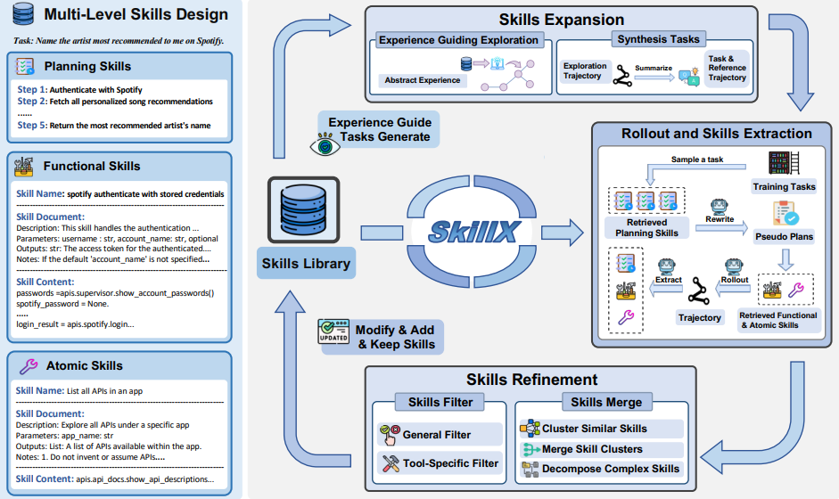

# SkillX

> **分类**: Skill 生成 | **成熟度**: 🟡 成长期 | **综合评分**: 0.45

---

## 一句话描述

SkillX 全自动构建**即插即用技能库**，将 Agent 执行轨迹转化为标准化**三层技能（规划→功能→原子）**，打破经验复用的技术与模型壁垒，**弱模型可直接复用强模型经验**，任务成功率平均提升约 **10%**。

**来源**:
- 学术论文：浙江大学联合蚂蚁集团
- 发布年份：2026年

**链接**:
- 论文链接：https://arxiv.org/pdf/2604.04804
- 代码链接：https://github.com/zjunlp/SkillX

---

## 核心实现

SkillX 的核心是将经验拆解为三层互补的技能体系，无需人工参与，通过三步闭环流程全自动构建并迭代技能库：

**三层技能架构**：

- **规划技能（Planning Skills）**：高层任务组织模块，将完整轨迹压缩为有序的核心执行步骤与依赖关系，过滤试错、回溯等无效操作，给出"做什么"的宏观方案。
- **功能技能（Functional Skills）**：工具化子任务模块，封装可复用的工具组合宏操作，每个技能包含名称、输入输出说明、工具调用模式，解决"怎么完成子任务"。
- **原子技能（Atomic Skills）**：单工具执行规范层，补充工具使用约束、参数配置、失败场景等信息，修正工具调用幻觉。

**三步闭环构建流程**：

1. **技能提取**：骨干智能体对训练任务多轮滚动执行，仅保留成功轨迹；对轨迹"降噪压缩"后按三层架构自动提取对应技能。
2. **技能迭代优化**：通过合并（语义相似度聚类、聚合优势、拆解复杂技能）与过滤（通用过滤 + 质量筛选）双操作迭代升级技能库，以"新增/修改/保留"三种操作完成更新，多轮执行直到性能不再提升。
3. **主动扩展**：采用经验引导的探索策略——优先探索低利用率、高失败率的工具，从探索轨迹中合成新任务样本，自动发现并补充缺失技能，扩充覆盖场景。

**即插即用赋能**

先检索规划技能并重写为伪计划，再以伪计划每步为查询检索功能与原子技能，去重后一次性注入系统提示词，无需多轮交互。

---

## 主要能力

- 三层技能自动提取：从成功轨迹中自动提取规划、功能、原子三层技能
- 技能合并与过滤迭代优化：语义聚类合并 + 两轮质量筛选，技能库越用越好
- 即插即用跨模型赋能：弱模型接入后任务成功率平均提升约 10%

---

## 局限性

- 依赖成功轨迹数据
- 复杂开放场景效果有限

---

## 成熟度评分

| 维度 | 评分 (0.0-1.0) | 说明 |
|------|---------------|------|
| 技术成熟度 | 0.45 | 有论文和代码开源 |
| 创新性 | 0.65 | 三层分架构的创新设计 |
| 落地程度 | 0.30 | 学术验证阶段 |
| 生态活跃度 | 0.35 | 有开源代码 |

**综合评分**: 0.45

---

## 参考资料

- [论文](https://arxiv.org/pdf/2604.04804)
- [代码](https://github.com/zjunlp/SkillX)
- [详解](https://zhuanlan.zhihu.com/p/2025670255108797209)
