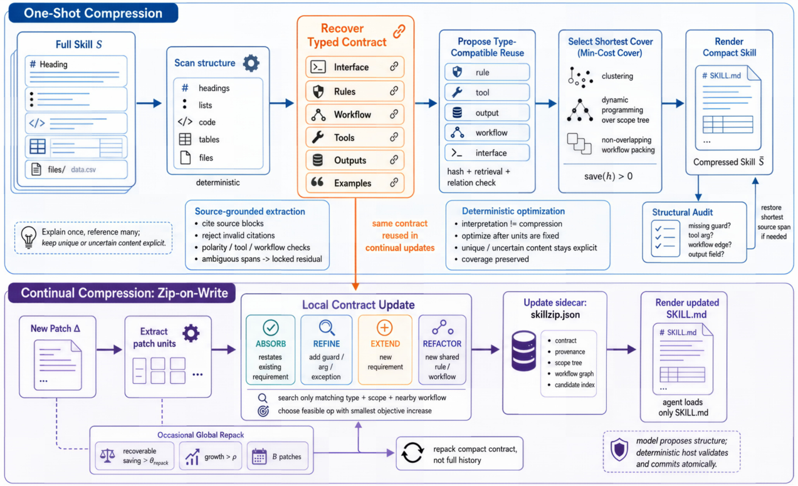

# SkillZip

> **分类**: Skill管理 | **成熟度**: 🟡 成长期 | **综合评分**: 0.57

---

## 一句话描述

SkillZip 把自演化智能体积累的技能形式化为**类型化合同**，用**最小描述长度目标**在硬覆盖约束下找最短忠实表示，**不跑任何下游任务、不看 rollout 不看奖励**就能压缩 31.2% 且保或微超性能。

**来源**:
- SkillZip: Evaluation-Free Skill Compression for Self-Evolving Agents by Discovering Reusable Structure（Xiaofan Bai、Hongqiang Lin、Chao Liu、Yantao Zhang、Xuan Jin、Xipeng Cao、Yuhong Li，阿里巴巴集团 / 浙江大学 / 杜克大学）
- 发布年份：2026

**链接**:
- https://arxiv.org/abs/2608.11079

---

## 核心实现

**1. 合同层：技能是类型化六元组而非平坦文本**

确定性扫描器把 Markdown 嵌套转作用域树并记源块 ID。schema 约束模型做**一次结构化抽取调**，输出合同 $C(S)=\langle I,G,T,C,O,E\rangle$——**接口/工作流/工具协议/作用域规则/输出合同/证据**。

无法以足够置信度解释的片段变**锁定残留**逐字保留。抽取器**故意不被要求压缩**，把解释与优化分开。

**2. 目标层：一个 MDL 目标管四种可复用结构**

选最短仍覆盖每个必需合同单元的表示：$(K^*,R^*)=\arg\min[L(K)+L(R|K)]$，受约束 $\forall a\in A_{req}(S), a\preceq(K,R)$。$K$ 是可复用元素库，$R$ 保留唯一/例外内容。

同一目标管四种结构：**等价需求**（改述只写一次当共享加残留差异更短）、**跨作用域重复规则**（移到最近共同祖先仅当适用每条路径）、**重复工作流**（反复动作序列变共享过程仅当 $L(\text{def}(q))+rL(\text{call}(q))<rL(q)$）、**守卫变体**（通用规则加守卫差仅当既忠实又更短）。

**Corollary IV.2**：稀有规则保护不依赖任务分布频率——保护因属于解析出的合同而非采样任务碰巧激活。

**3. 一次性压缩层：五步流水线**

- 扫描建作用域树；schema 约束模型一次抽取合同，宿主拒绝无支撑引用/极性不配/未知工具名，歧义片段入锁定残留。
- 只提类型兼容复用候选（同模态同谓词族同作用域祖系、工具同签名、工作流同进出行为），**冲突造例外候选不造合并候选**。
- 每候选算节省 $\text{save}(h)=L(\text{separate})-L(\text{form using }h)$，非正丢弃，规则放置用作用域树动态规划、工作流用不重叠加权 packing 贪心选加两两交换精化。
- 固定模板渲染加可选结构审计：独立重解析压缩后技能与合同比，缺项就恢复最短源片段并锁。

**4. 持续压缩层：Zip-on-Write 局部更新加周期重打包**

新补丁只与当前紧凑合同的兼容部分比，在四种操作下选目标增量最小的：**ABSORB**（重述已有需求）、**REFINE**（给现有单元加守卫/参数/验证/例外）、**EXTEND**（引入新需求）、**REFACTOR**（使共享规则或工作流新变得值得）。

宿主先冻结补丁再压缩：演化器决定学什么，SkillZip 只决定怎么表示。

候选搜索限匹配类型/当前与祖先作用域/相邻工作流节点，$d$ 个抽取单元比 $O(dk)$ 个候选而非完整历史。

局部更新可能漏掉跨补丁才变得有利的复用。sidecar 跟踪规则族和动作 n-gram 近似计数，当估计可恢复节省超 $\theta_{repack}$、合同增长超 $\rho$、或 $B$ 个补丁到达时触发**全局重打包**。

整个过程**模型只做 schema 约束抽取和关系裁决（贪心解码、温度 0），最小成本覆盖和渲染全确定**。

---

## 主要能力

- **评估免压缩**：全程不暴露给下游任务、rollout、奖励或行为验证器，从源头移除样本特异选择效应和评估集依赖。
- **硬覆盖保稀有规则**：Corollary IV.2 保证唯一需求的保护不依赖任务频率，删不掉稀有守卫/工具参数/例外/输出字段。
- **双模式适配**：One-shot 五步压缩既有技能 checkpoint，Zip-on-Write 在每轮自演化补丁上做局部作用域感知更新，预防冗余比移除冗余便宜。
- **结构合并而非内容过滤**：针对自演化技能知识密集冗余（重复约束/重叠作用域/复制工作流），用类型化合同做语义共享/作用域提升/工作流复用/例外编码。
- **确定性可审计**：抽取与优化分离，结构审计独立重解析压缩后技能比合同，缺项恢复最短源片段并锁，失败模式是欠压缩而非静默删。

---

## 局限性

- **保证限于解析器产出的合同**：Proposition IV.1 不证明任意自然语言被完美解释、也不证明两个渲染技能对每个语言模型诱导相同行为；不确定片段靠锁定残留保守保留，语义不确定性主要来自解析器而非优化器。
- **局部更新等价有条件**：Proposition A.2 仅在补丁不引入跨受影响与未受影响区域的 profitable 抽象时成立，几个补丁联合创造跨作用域复用时须靠周期重打包补回。
- **依赖 schema 约束模型质量**：一次性抽取用固定压缩器模型（实验用 Qwen3.7-Max），模型只做 schema 约束抽取和关系裁决，解析失败时只能欠压缩而非创造性重写。
- **非通用技能去冗**：定位自演化技能的结构性重复表示，对含背景/示例/无关内容的通用公开技能的初始去冗和质量控制，SkillReducer 的内容过滤更对路。

---

## 成熟度评分

| 维度 | 评分 (0.0-1.0) | 说明 |
|------|---------------|------|
| 技术成熟度 | 0.60 | 类型化合同六元组 + MDL 目标 + 五步流水线 + Zip-on-Write |
| 创新性 | 0.76 | 评估免压缩 + 最小描述长度目标发现可复用结构首创 |
| 落地程度 | 0.46 | 压缩 31.2% 保或微超性能，硬覆盖保稀有规则 |
| 生态活跃度 | 0.42 | 单篇论文，未开源 |

**综合评分**: 0.57

---

## 参考资料

- [SkillZip: Evaluation-Free Skill Compression for Self-Evolving Agents by Discovering Reusable Structure](https://arxiv.org/abs/2608.11079)
