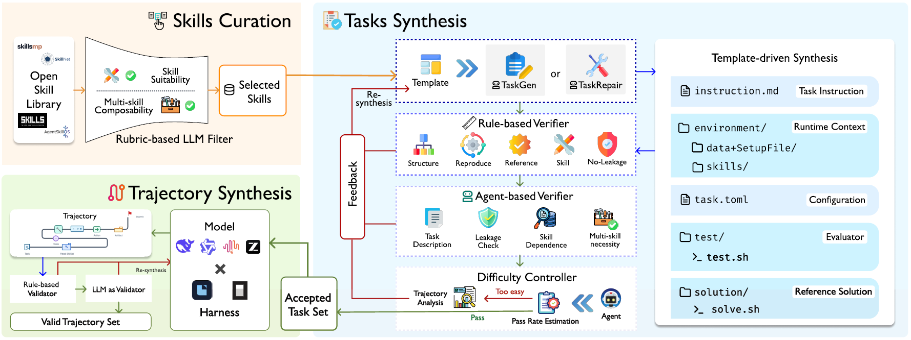

# SKT

> **分类**: Skill召回 | **成熟度**: 🟡 成长期 | **综合评分**: 0.59

---

## 一句话描述

SKT 是一个**三阶段验证数据合成管线**，从 Agent Skill 造出可执行任务和**忠实使用 skill 的轨迹**做 SFT，教模型**用 skill 而非内化 skill**；三阶段每道都验证，未验证数据反降 -1.9~-19.5 分，用 2000 skill 产出 27164 条轨迹，SkillEval 随规模 55.24→72.48。

**来源**:
- SKT: Skill-Use Training at Scale via Verified Synthetic Data Generation（Zelin Tan 等，上海 AI 实验室）
- 发布年份：2026

**链接**:
- https://arxiv.org/abs/2608.02287

---

## 核心实现

SKT 三阶段管线，每阶段都挂验证闸门，只留成功且忠实用 skill 的轨迹做 SFT。

**1. 策展层：从候选池挑可落地成可执行、可判分任务的 skill**

rubric-based LLM judge 过滤候选池，留**能落地成可执行、可客观判分任务**的 skill。采样 skill 集，配置 cardinality $k$（实验用 1/2/3）；当 $k>1$ 时，组合 judge 确认这些 skill 形成连贯工作流且各有不同角色，否则重采。这一步控制后续任务真能跑、能判分。

**2. 任务合成层：模板驱动造任务包 + 三道验证闸 + 反馈修复**

TaskGen 读 skill 填固定模板造任务包（指令 + 隔离运行时 + 评估器 + 参考解 + 配置）。过三道门：
- **规则验证器**查组件齐全、路径有效、参考解跑通、无 skill 规则照抄；
- **agent 验证器**查语义 well-posed、无答案泄露，并用**配对 rollout 验证 skill 依赖性**——提供 skill 和 withhold skill 两跑对比，withhold 应降分，否则任务不真依赖 skill；
- **难度控制**用固定 solver 跑 N 次估 $p_{pass}$，太易退回。

失败任务经反馈引导 TaskRepair 修复重验，不是直接丢。

**3. 轨迹合成层：只留既成功又忠实用 skill 的轨迹**

teacher-harness 对解题产出轨迹，过两道验证：
- **规则验证器**查全评估分、正常终止、良构工具 trace、显式 skill 访问；
- **LLM 验证器**查每个 skill 在被它应指引的动作**之前**被 consult 且影响了具体决策——防"轨迹跑通了但其实是模型假装用 skill"。

失败 rollout 不暴露失败原因、直接重采样（避免模型学会"失败也能蒙混过关"）。只留既成功又忠实的轨迹转 harness 原生训练例做掩码 SFT。

控制要点：教的是"用 skill"非"内化"（withhold/provide 配对铁证——withhold 仅涨 0.53~5.69、provide 涨 8.68~18.91）；验证是底线（未验证反降 -1.9~-19.5）；跨 harness 可迁移且有专属成分（mixed 训练一 checkpoint 兼顾多 harness，跨 harness 保留 49~58% matched 增益）；随规模单调升（SkillEval 100→2000 skill 单调 55.24→72.48）。

---

## 主要能力

- **验证数据合成**：三阶段每道都验证，只留成功且忠实用 skill 的轨迹，未验证数据消融反降 -1.9~-19.5 分
- **教用 skill 非内化**：withhold skill 仅涨 0.53~5.69，provide 涨 8.68~18.91，证明强化的是外部 skill 利用
- **跨 harness 迁移**：cross-harness SFT 保留 matched 增益 49~58%，mixed 训练一 checkpoint 兼顾多 harness
- **随规模单调提升**：SkillEval 随训练 skill 数 100→2000 单调升（55.24→72.48），边际递减但不回退
- **多 skill 协调**：K=2 涨最多（+16.77），强化多 skill 协调是强项，不只在单 skill 任务有效

---

## 局限性

- **验证管线成本高**：规则+agent+难度+双轨迹验证+反馈修复，每道闸门都耗 LLM 调用，大规模合成成本不低
- **依赖强 teacher**：轨迹质量受 teacher 模型能力上限约束，teacher 解不了的任务产不出轨迹
- **任务模板绑定**：模板驱动合成虽可控，但任务形态受模板约束，自由度不如开放式合成
- **SkillEval 与训练同管线**：评测基准和训练数据同源管线，虽有 skill 池无重叠，但任务分布可能同源偏置

---

## 成熟度评分

| 维度 | 评分 (0.0-1.0) | 说明 |
|------|---------------|------|
| 技术成熟度 | 0.62 | 三阶段验证合成管线每道挂验证闸门，数据集开源 |
| 创新性 | 0.70 | 验证数据合成 + 教用 skill 非内化，withhold/provide 配对铁证 |
| 落地程度 | 0.52 | 27164 轨迹 SkillEval 55.24→72.48 单调升，跨 harness 迁移 |
| 生态活跃度 | 0.50 | 单篇论文，HuggingFace 数据集开源 |

**综合评分**: 0.59

---

## 参考资料

- [SKT: Skill-Use Training at Scale via Verified Synthetic Data Generation](https://arxiv.org/abs/2608.02287)
- [SkillEval 数据集](https://huggingface.co/datasets/Artemis0430/skilleval-v1)
