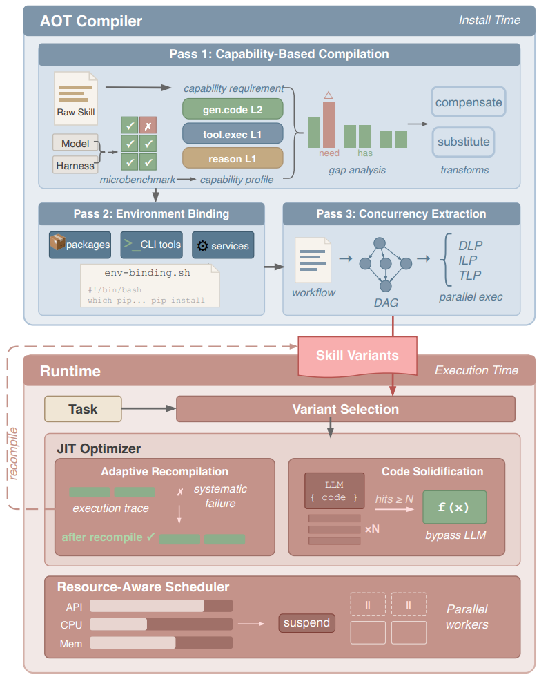

# SkVM

> **分类**: Skill 执行 | **成熟度**: 🔴 探索期 | **综合评分**: 0.50

---

## 一句话描述

SkVM 将**编译器思路**搬到 Skills 领域——**LLM 为"处理器"、Skills 为"程序"**，通过 **AOT（预编译）+ JIT（即时编译）** 两级优化解决模型、框架、依赖三大不匹配问题，实现**"一次编写，到处运行"**。

**来源**:
- 学术论文：上海交通大学
- 发布年份：2026年

**链接**:
- 论文链接：https://arxiv.org/pdf/2604.03088

---

## 核心实现

SkVM 架构分为两大模块：AOT 编译器（安装时运行）和运行时系统（执行时优化）。

**AOT编译——三个编译阶段解决三类不匹配**

1. **基于能力的编译**：从 1.5 万个高下载量 Skills 中提炼出 26 个基础能力（代码生成、工具执行、流程遵循等），分不同等级。先给目标模型和运行环境跑基准测试量化每项能力水平，再分析 Skills 需要哪些能力及等级，计算差距后执行适配变换——差距小的"补偿"（如把相对路径换成绝对路径），差距大的"替换"（如 pandas 换成 SQL 实现）。
2. **环境绑定**：将依赖检查从运行时提前到编译阶段。从 Skills 中提取所需的库、工具、服务，检查当前环境是否具备；缺失则生成安装脚本在 Skills 运行前自动执行，环境变化导致脚本失败时把错误信息作为上下文注入模型。
3. **并发提取**：将 Skills 拆解为步骤并构建依赖关系图，分三级挖掘并行性——数据级并行（多个同类文件并行处理）、指令级并行（独立工具调用合并批量执行）、线程级并行（独立子任务交由子 Agent 并行执行）。当前框架不支持某类并行时自动回退到串行，保证兼容性。

**运行时JIT优化**

- **自适应重编译**：记录执行情况，同一问题反复失败时自动将失败日志传给编译器重新优化，优化后效果更差则回退到先前版本。3 轮重编译后，14 类 Skills 中有 10 类达到满分。
- **代码固化**：识别 Skills 中重复出现的代码模板，将其转成可调用函数。编译时识别模板生成签名和参数 schema，运行时多次匹配后实例化为函数，后续执行直接提取参数调用，失败则回退到 LLM 生成。PDF 提取任务延迟从 10~15 秒降至 200 毫秒。

---

## 主要能力

- 能力补偿与适配变换：基于 26 个基础能力量化差距，自动补偿或替换不匹配的能力
- 依赖预检测与安装：编译阶段自动检查并生成安装脚本，避免运行时 Token 浪费
- 并发提取与代码固化：三级并行挖掘（最高 3.2 倍加速）+ 重复模板函数化（最高 50 倍加速）

---

## 局限性

- 目前仍在研究阶段
- 对框架的并行能力支持有要求

---

## 成熟度评分

| 维度 | 评分 (0.0-1.0) | 说明 |
|------|---------------|------|
| 技术成熟度 | 0.50 | 有完整论文和实验验证 |
| 创新性 | 0.80 | 编译思维解决可移植性问题 |
| 落地程度 | 0.35 | 概念验证阶段 |
| 生态活跃度 | 0.30 | 学术研究 |

**综合评分**: 0.50

---

## 参考资料

- [论文](https://arxiv.org/pdf/2604.03088)
- [详解](https://zhuanlan.zhihu.com/p/2025167123694002595)
