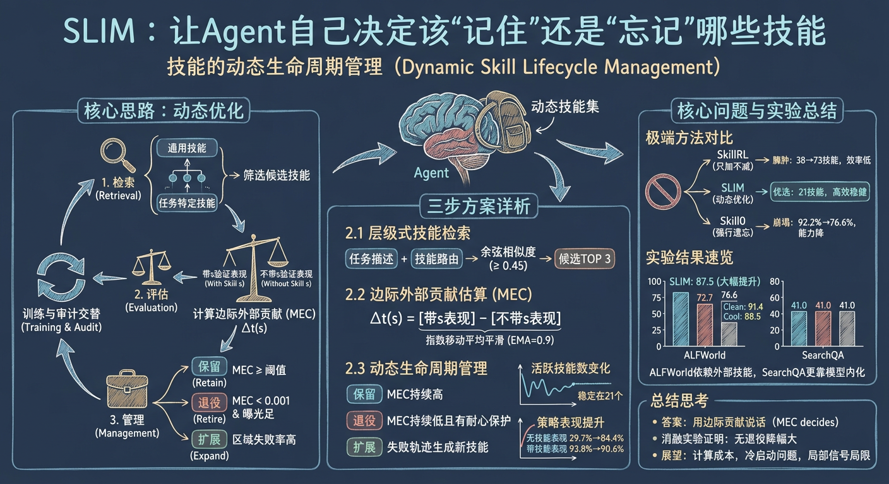
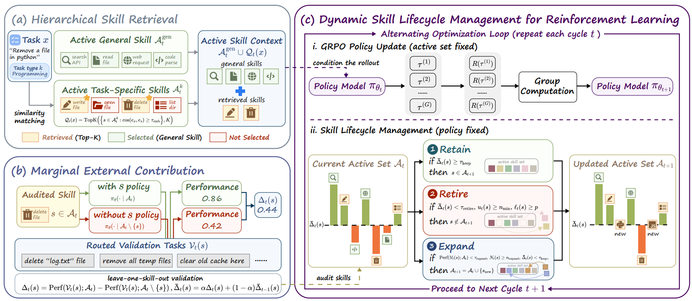

# SLIM

> **分类**: Skill 管理 | **成熟度**: 🔴 探索期 | **综合评分**: 0.45

---

## 一句话描述

SLIM 把活跃技能集当作一个**动态优化变量**——每个审计周期用 leave-one-skill-out 对照实验计算每个技能的**边际外部贡献（MEC）**，高的保留、低的退役、不够用就扩展，全程不让技能数膨胀，在 ALFWorld 上比 SkillRL 高出 **12.5 个百分点**。

---

## 核心实现

核心逻辑：活跃技能集不是训练前写死的配置，而是训练过程中持续优化的变量。每 10 步 GRPO 更新触发一次技能审计，三步交替——层级检索 → MEC 估算 → 生命周期管理。

**层级式技能检索**：通用技能全量注入所有任务，任务特定技能按类型分池存放，用嵌入余弦相似度匹配（阈值 0.45），最多取 3 个。检索只发生在任务特定层，把全库组合搜索压到任务范围内的候选筛选。

**MEC 边际贡献估算**：对活跃技能 s，在用到它的验证任务上跑带 s 和不带 s 的对照实验。∆t(s) = 带 s 的表现 − 不带 s 的表现。差值大说明策略还在依赖这个外部技能，差值为零或负说明已内化或开始制造噪音。用 EMA 平滑（系数 0.9）降噪。

**耐心退役机制**：不是一次低贡献就移除——技能得攒够 30 次曝光，且连续 3 轮审计低贡献，才真正退役。保护低频但关键的长尾技能不被误杀。论文的理论分析证明耐心能指数级降低"错杀"概率。

**动态生命周期三条规则**：保留（平滑 MEC ≥ 0.03）、退役（平滑 MEC < 0.001 且满足曝光和连续性条件）、扩展（覆盖区域持续翻车时，从失败轨迹中生成新任务特定技能，通用技能不在扩展范围）。训练过程中活跃技能数从 38 涨到 46 然后波动到 21——系统在同时做两件事：训练策略变强，保留仍有边际价值的外部技能。

---

## 主要能力

- 用 MEC 量化每个技能在当前策略下的真实贡献，退役决策跟着数据走而非拍脑袋
- 耐心退役保护长尾关键技能——低频不代表不重要，连续低贡献才是真该退的信号
- 动态生命周期形成闭环：有用留着、没用退掉、不够就造，技能库在质量而非数量上优化
- 消融显示去掉退役机制最伤（-14.1），随机审计最惨（-18.7）——证明贡献感知的决策不可替代，扰动技能集本身不带来收益

---

## 局限性

- 审计有额外计算成本，ALFWorld 完整训练约 20 小时，技能库更大时审计开销怎么控是真实问题
- 退役/保留阈值手工设的，不同场景需要调整
- MEC 是局部信号——当前"没用"的技能不等于以后也没用，训练早期被退役的永久丢失机会
- 扩展只覆盖任务特定技能，通用技能池空白时冷启动是硬伤

---

## 成熟度评分

| 维度 | 评分 (0.0-1.0) | 说明 |
|------|---------------|------|
| 技术成熟度 | 0.45 | 有论文和代码开源 |
| 创新性 | 0.60 | MEC边际贡献的创新设计 |
| 落地程度 | 0.30 | 学术验证阶段 |
| 生态活跃度 | 0.40 | 有开源代码 |

**综合评分**: 0.45

---

## 参考资料

- [论文](https://arxiv.org/abs/2605.10923)
- [代码](https://github.com/ejhshen/SLIM)
- [详解](https://zhuanlan.zhihu.com/p/2041216739745194889)