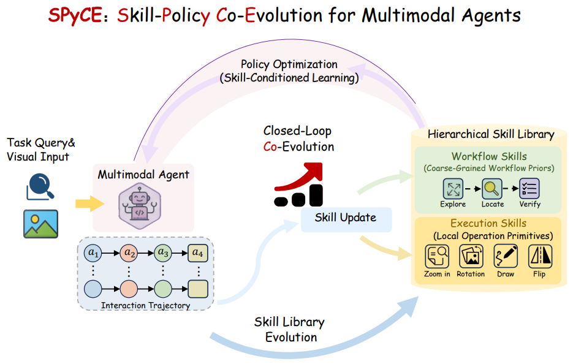

# SPyCE

> **分类**: Skill优化 | **成熟度**: 🟡 成长期 | **综合评分**: 0.49

---

## 一句话描述

**SPyCE** 是一个技能-策略协同进化框架，在 RL 训练多模态 Agent 的过程中，将成功交互轨迹蒸馏为**分层技能库**（工作流技能管宏观规划 + 执行技能管局部操作），技能指导策略产生更高质量轨迹，高质量轨迹反哺技能库进化，形成**闭环飞轮**。八个 Benchmark 全部跑赢 RL 和记忆基线。

**来源**:
- SPyCE: Skill-Policy Co-evolution for Multimodal Agents
- 发布年份：2026

**链接**:
- https://arxiv.org/abs/2607.13854

---

## 核心实现

**1. 两层技能库**

- **执行技能**（下层）：三元组（触发条件，工具动作，预期效果）。如"证据被旋转 → Image.rotate → 恢复正确朝向"。粒度细，针对局部视觉瓶颈，可精确匹配、即插即用
- **工作流技能**（上层）：二元组（瓶颈描述，工作流草图）。如瓶颈"跨区域一致性检查"，草图"定位证据→增强局部内容→核对一致性"。不编码具体动作，只告诉 Agent 大思路

**2. 技能蒸馏与治理**

用一个更强的 MLLM 作为蒸馏器，对每条成功轨迹做结构化摘要而非存原始片段。新候选进库前在嵌入空间与已有技能比对：触发条件相似的执行技能合并、瓶颈描述相似的工作流技能合并。够不着相似度阈值才新增。容量超限后按命中率淘汰最低频的条目。

**3. 协同进化闭环**

每个训练步上双向运作。
- **正向**：Agent 从输入提取瓶颈描述→工作流库搜 Top-K→分解为局部瓶颈→执行技能库匹配最佳操作→两级检索结果注入推理上下文。
- **反向**：每 $N$ 步开进化窗口，用 GRPO 相对优势值筛 $Top-\rho$ 高质量轨迹，重新蒸馏合并入库。训练早期执行技能数量和成功率同步攀升，中后期数量不再涨，进化转为条目质量改善。

---

## 主要能力

- 两级检索（粗粒度工作流+细粒度执行）为策略推理提供结构化先验
- 技能与策略在训练中相互增强的闭环飞轮，消融实验验证冻库掉 3.1pp
- 用更少工具调用完成更高任务成功率（4.83 vs 5.13）
- 跨三个骨架模型全部最优，Claude Opus 4.7 仍额外 +8.0pp
- 训练早期就拉开 GRPO 基线——技能库给了初始探索方向

---

## 局限性

- 技能蒸馏依赖更强的 MLLM 做裁判，增加了训练阶段的推理成本
- 工作流技能为抽象描述，跨域迁移时可能需要重新解释
- 当前仅评估多模态视觉工具调用任务，文本和非视觉 Agent 未覆盖
- 蒸馏过程丢失了轨迹中的细粒度失败信息（只取成功的）

---

## 成熟度评分

| 维度 | 评分 (0.0-1.0) | 说明 |
|------|---------------|------|
| 技术成熟度 | 0.50 | 两层技能库+技能蒸馏治理+协同进化闭环完整，八个Benchmark跑赢基线，属原型阶段 |
| 创新性 | 0.80 | 技能-策略协同进化飞轮，工作流+执行双层技能蒸馏思路开创性 |
| 落地程度 | 0.30 | 仅评估多模态视觉工具调用任务，无生产部署，非视觉Agent未覆盖 |
| 生态活跃度 | 0.30 | 论文发布，无开源代码，社区关注度有限 |

**综合评分**: **0.49**（0.50×0.30 + 0.80×0.25 + 0.30×0.25 + 0.30×0.20）

---

## 参考资料

- [论文](https://arxiv.org/abs/2607.13854)
