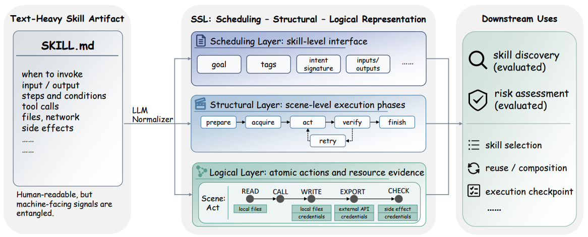

# SSL：把 SKILL.md "结构化"——解耦三层信号

**一句话描述**：北大团队提出 **SSL（Scheduling-Structural-Logical）三层表示法**，把 SKILL.md 中纠缠在一起的调度信号、结构信号和逻辑信号解耦成一张类型化 JSON 图——技能发现 MRR@50 从 0.649 提升到 **0.729**，风险识别 F1 从 0.409 提升到 **0.509**。

---

## 核心实现

SSL 将一份 SKILL.md 映射为三层独立表示，用 LLM 提取后用硬验证流水线保证质量，关键原则是只提取不发明——每个字段必须有源文档证据。

**Scheduling 层——技能名片**：提取技能名称、目标描述、标签、意图签名、控制流特征（长时运行？有副作用？需人工确认？）。这一层回答调度问题：技能干什么、何时调用、输入输出长什么样，不用展开全文就能快速比较。

**Structural 层——执行剧本**：将技能分解为有序场景序列（prepare → acquire → act → verify → finish），节点是场景，边是阶段转移类型。阶段类型使用受控词汇表，跨技能可比，执行引擎能据此知道"当前在哪、下一步去哪、异常回退到哪"。

**Logical 层——原子动作链**：最细粒度。每个节点是逻辑步（READ、WRITE、CALL、EXPORT、CHECK），边是步间转移。每步标注参数、效果和资源边界，风险评估器直接看到"这个技能会读本地文件、写本地文件、导出结果"，不用从自然语言里推断。

**硬验证流水线**：LLM 提取后过五道校验——结构完整性、标识符一致性、枚举值合法性、包含关系、转移目标指向——不通过就重试，直到输出合法。83% 的 SSL 输出经人工审计确认有源文档支撑。

**技能发现用浓缩信号，风险评估用双信号**：检索靠 Scheduling 层就够了，源文档里的旁白反而是噪音；风险评估必须 SSL + 源文档搭配使用——SSL 浮现线索（"有 WRITE 操作"），源文档提供上下文（"这个写操作严重吗"）。

---

## 主要能力

将 SKILL.md 中三种性质完全不同的信号——调度/结构/逻辑——从单一文本面解耦为三层结构化 JSON，每个下游系统只消费自己需要的层。

技能发现中，浓缩的结构信号反超完整 SKILL.md 全文的效果——信号纯度胜过信息量，检索不需要旁白。

风险评估中，Logic 层的原子动作标记（READ/WRITE/CALL/EXPORT/CHECK）让审查器直接看到资源边界，F1 从 0.409 拉到 0.509。

硬验证保证输出合法性，不通过就重试，避免 LLM 提取幻觉污染下游。

---

## 局限性

仅支持静态技能分析，不处理执行时的动态行为，复杂控制流（条件分支、循环）会被线性化。

标准化结果依赖 LLM 提取质量，原文写得模糊时可能丢失信息或过度正则化。

评估只覆盖技能发现和风险评估两个下游任务，执行、规划、监控等场景未测试。

风险标签来自三模型投票而非安全专家独立审计，标注精度有上限。

---

## 参考资料

1. [论文](https://arxiv.org/abs/2604.24026v4)
2. [代码](https://github.com/COOLPKU/SSL)
3. [详解](https://zhuanlan.zhihu.com/p/2035408399135928879)
