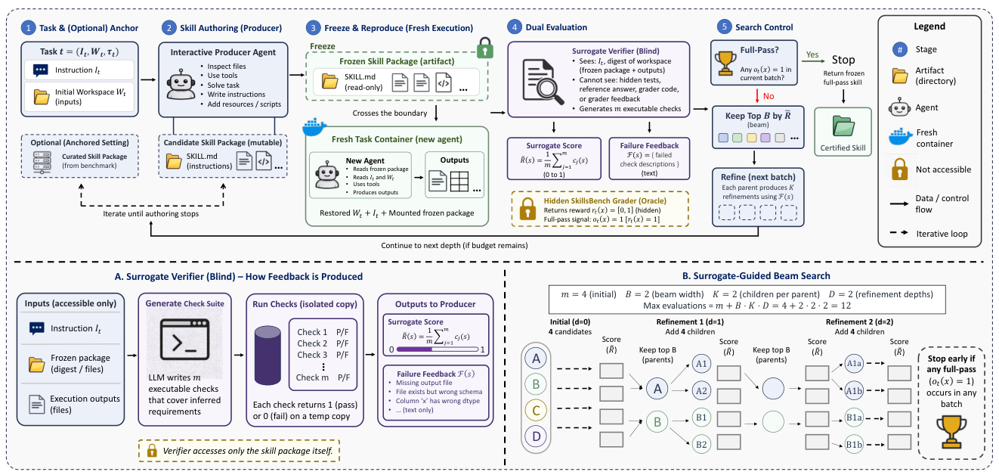

# SurrogateSkill

> **分类**: Skill优化 | **成熟度**: 🟡 成长期 | **综合评分**: 0.59

---

## 一句话描述

reSolve 是**按任务、oracle-in-the-loop** 的技能自演化框架，用 **solve-and-reproduce** 协议把生成 agent 和部署 agent 物理隔离，靠**盲测代理验证器**做稠密奖励，让弱模型自演化技能在 SkillsBench 上达 **74.9%** 超过官方最强策展。

**来源**:
- Self-Evolving Skills via Surrogate-Guided Solve-and-Reproduce（Jiale Liu, Pinze Ren, Yuqi Xia, Huan Wang, Zhenlin Zhao, Siming Dong，Cleer Science / The University of Edinburgh / Tsinghua University）
- 发布年份：2026

**链接**:
- https://arxiv.org/abs/2608.28638

---

## 核心实现

**1. 复现边界层：把生成和部署物理隔离，演化认证的是冻结包不是轨迹**

任务 $t=(I_t,W_t,r_t)$，隐藏 grader $r_t$ 给文件打分；全通过信号 $o_t(x)=\mathbb{1}[r_t(x)=1]$。producer $\pi_p$ 据指令 $I_t$、初始 workspace $W_t$ 和可选策展锚 $s^*$ 交互产出候选 $s\sim\pi_p(\cdot|I_t,W_t,s^*)$；**作者一结束就冻结目录**，丢弃 producer 对话、推理、工具历史和改过的 workspace；fresh container 恢复原始任务 workspace、挂冻结包，新 agent $\pi_d$ 独立执行产出文件 $x\sim\pi_d(\cdot|I_t,W_t,s)$；grader 只在新执行后调用。冻结包是两 agent 唯一通道，演化认证的是冻结包被独立复现的能力。

**2. 盲测代理验证器层：不碰答案，靠可执行检查做稠密信号**

验证器只看指令和可访问候选 workspace 摘要（冻结包 + 执行产出），看不到隐藏测试、参考答案、grader 代码。它写 **m 条可执行检查**覆盖推断需求（文件存在、格式、数值范围、必需列），每条返 0/1，汇总 $\bar{R}(s)=\frac{1}{m}\sum c_j(s)$ 做排序启发式，失败描述集合 $\mathcal{F}(s)$ 做修复指南。检查在候选 workspace 临时副本上跑、不影响后续 grader 输入；**每候选单独生成一套新检查**，覆盖广但牺牲跨候选严格可比性——$\bar{R}$ 是 beam 内排序启发式，不是 grader 奖励代理。

**3. 代理引导 beam search 层：宽深度显式化成 test-time-compute 旋钮**

搜索在解构造图上跑：节点是已评估技能包，边是按 $\mathcal{F}(s)$ 重写父节点的精修。流程为：(1) producer 按不同温度采 **m 个初始包**，独立冻结 fresh-execute 评分；(2) 任一全通过则停当前批次返回冻结包，否则按 $\bar{R}$ 留 **B 个**非通过候选作父；(3) 每父产 **K 个**独立精修（精修器收父冻结包、失败代理检查、原任务上下文）；(4) 重复 **D 层**，父保留可再进下轮，子低于父被剪枝；预算至多 $m+B\cdot K\cdot D$，配置 m=4 B=2 K=2 D=2 即 **至多 12 次评估**。策展包总进初始 beam，fallback 至少不差于策展——**keep-better rule**。

整个过程**复现压力筛选出可执行入口而非散文**：所有 77 个保留演化包都含可执行文件，agent-free 直调入 arm 拿 71.4% 距全系统只差 3.5 点。控制要点：全通过信号 gate 搜索是否继续，代理反馈是修复唯一来源，两者严格分工。

---

## 主要能力

- **跨容器复现认证**：solve-and-reproduce 把 producer 轨迹全丢弃，演化通过的条件是 fresh agent 在新容器独立复现，从结构上闭合 reproduction gap。
- **盲测稠密奖励**：代理验证器不碰隐藏测试和答案，靠自生成可执行检查给出 $\bar{R}$ 和文本失败描述，让 producer 能定位"缺文件/schema 错/dtype 错"具体修。
- **test-time-compute 可调**：beam 宽度和精修深度是显式参数，更大预算直接扩解构造图覆盖区域，不动底层模型。
- **弱模型超官方最强策展**：DeepSeek-V4-Pro 自演化到 74.9% mean-of-3，比同 harness 策展高 14.8 点、比 GPT-5.5/OpenHands 官方最强高 7.6 点。
- **失败定位到解释器**：trace 审计把剩余失败主要归到部署 agent 的语义偏离而非技能内容，77 个保留演化包全含可执行入口，agent-free 直调达 71.4%。

---

## 局限性

- **消不掉部署随机性**：85 个任务里 20 个（23.5%）同包同环境跨试验改奖励，可靠性载体是包-executor 对不是包，pass@3 测可恢复性而非下次成功率。
- **收益重尾非均匀**：86 任务里只 25 个改善，11 个涨 50 点以上贡献约三分之二总提升，自演化更像救援机制而非均匀打磨。
- **弱模型效益显著缩水**：Gemma 4 31B 只 +5.2 点（DeepSeek +14.8），只改善 10/86 任务，自演化放大已有能力而非补偿缺失，base 越弱效益越小。
- **代理排序噪声风险**：每候选一套新 LLM 写的检查套件是噪声值函数，对不完美代理做强优化最终可能降目标分而非提，宽 beam 时这个风险增长。

---

## 成熟度评分

| 维度 | 评分 (0.0-1.0) | 说明 |
|------|---------------|------|
| 技术成熟度 | 0.60 | solve-and-reproduce 隔离 + 盲测代理验证器 + beam search |
| 创新性 | 0.76 | 生成与部署物理隔离 + 盲测代理验证器不碰答案做稠密奖励 |
| 落地程度 | 0.52 | 弱模型 74.9% 超官方最强策展 14.8 点，77 包全含可执行入口 |
| 生态活跃度 | 0.45 | 单篇论文，未开源 |

**综合评分**: 0.59

---

## 参考资料

- [Self-Evolving Skills via Surrogate-Guided Solve-and-Reproduce](https://arxiv.org/abs/2608.28638)
