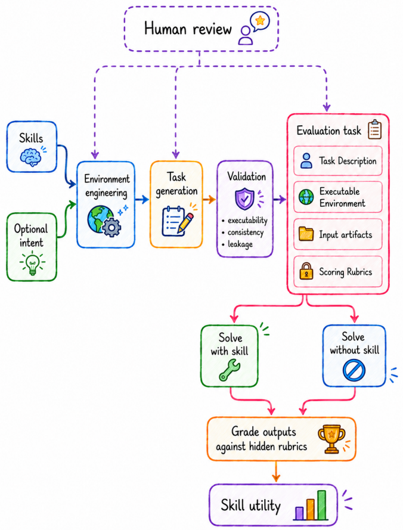

# Tessl技能评测框架

> **分类**: Agent技能评估 / 评测框架 | **成熟度**: 🟡 成长期 | **综合评分**: 0.62

---

## 一句话描述

以技能对Agent行为的因果影响为评测目标，从500个真实技能自动生成约1000个评测任务，在19个Agent-模型配置上通过**配对对比**量化技能边际贡献。发现**技能+便宜模型可逼近旗舰模型，成本压至1/3以下**。

**来源**:
- 论文：Shaposhnikov et al., "A Framework for Evaluating Agentic Skills at Scale"
- 发布年份：2026
- 机构：Tessl

**链接**:
- arXiv: 2606.17819v1
- 数据集：https://huggingface.co/datasets/tesslio/task-evals-for-skills

---

## 核心实现

**1. 环境工程与任务自动生成**

读入SKILL.md，分析16类环境依赖（工具/CLI、认证凭据、运行时等），由环境工程Agent逐一检查并自动满足。LLM从技能内容反推真实使用场景，每个技能最多生成三个任务。控制要点：任务描述不透露操作步骤和评分维度——防止Agent猜答案。质检Agent验证环境可达性、输入完整性和评分标准泄露。

**2. 配对对比与双维度评分**

每个任务跑两遍——有技能和无技能——共享相同指令、输入、环境和评分标准。评判Agent（固定Sonnet 4.6）对照两套隐藏评分标准打分：
- 目标完成度：产物对不对——衡量"能不能做"
- 指令遵循度：做法对不对——衡量"**是不是按你的方式做**"

控制要点：2026年前沿模型完成度已接近饱和，真正的差异全在遵循度。Opus 4.8遵循度88.0 vs Nemotron 3 Nano 30B仅25.2。

**3. 单技能诊断**

框架不仅产出聚合分数，还能针对每个评分维度做精确诊断。以HuggingFace hf-cli技能为例，每个子命令的遵循情况有单独分数，技能作者能精确知道哪些指令被吸收、哪些被忽略、哪些写太模糊理解错了。

**4. 成本-性能最优组合发现**

19个配置的对比揭示了技能加便宜模型可逼近旗舰模型。控制要点：**效用和基线强度强负相关（$r = -0.90$）**，强模型基线高则技能边际价值被压缩。GLM 5.1加技能91.1分成本$0.89 vs Opus 4.8的$3.26。

---

## 主要能力

- 边际贡献剥离：通过基线对比，把技能增量和backbone自身能力分开，PRG只反映净增益
- 双维度评估区分：完成度衡量能不能做，遵循度衡量做法对不对，饱和的完成度已不是有效指标
- 单技能诊断：精确到评分维度的前后差异，定位技能中有效/冗余/模糊的指令
- 成本-性能最优组合发现：GLM 5.1加技能91.1分成本$0.89 vs Opus 4.8的$3.26
- 工作流型vs建议型技能区分：程序化技能（媒体处理+38.1）远好于建议型技能（测试+16.7）

---

## 局限性

- 单评判模型（Sonnet 4.6），风格审美类指标上偏差难免
- 数据集偏软件工程，500个技能绝大多数是编程/DevOps/Web开发
- 有技能条件告知了Agent技能存在，但真实部署中技能选择是独立变量
- 约20%技能因环境依赖太复杂被过滤（数据库、MCP服务器等），覆盖受限

---

## 成熟度评分

| 维度 | 评分 | 说明 |
|------|------|------|
| 技术成熟度 | 0.65 | 配对对比+双维度评分框架完整，环境工程+任务自动生成成熟 |
| 创新性 | 0.70 | 边际贡献剥离、效用与基线负相关发现、工作流型vs建议型技能区分 |
| 落地程度 | 0.55 | 19个Agent-模型配置验证，HuggingFace数据集已发布，约20%技能因环境过滤 |
| 生态活跃度 | 0.55 | 数据集公开在HuggingFace，论文发布，工业公司背书 |

**综合评分**: 0.65×0.3 + 0.70×0.25 + 0.55×0.25 + 0.55×0.2 = **0.62**（🟡 成长期）

---

## 参考资料

- [论文](https://arxiv.org/abs/2606.17819)
- [数据集](https://huggingface.co/datasets/tesslio/task-evals-for-skills)
