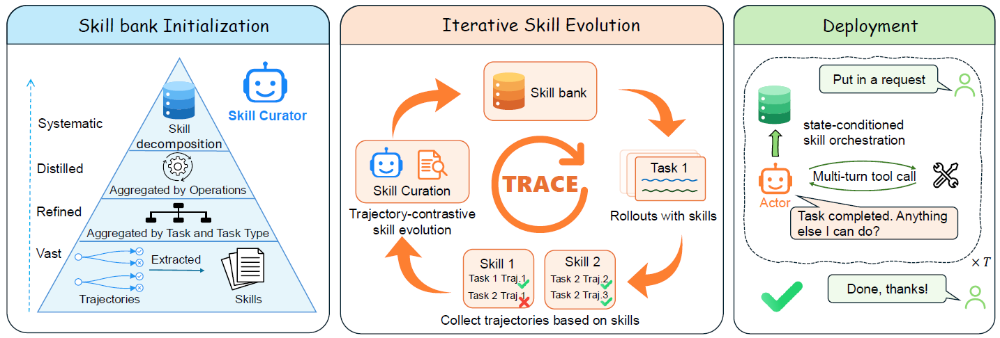

# TRACE

> **分类**: Skill优化 | **成熟度**: 🟡 成长期 | **综合评分**: 0.59

---

## 一句话描述

TRACE 是一个**不改模型权重**的自进化**技能库框架**，靠**轨迹对比**反推可迁移的操作级技能，把 LLM agent 在车载场景的一致性（Passˆ3）从 **59.9%** 拉到 **94.5%**，CAR-bench 隐藏集上登榜首。

**来源**:
- TRACE: A Self-Evolving Skill Bank for Consistent, Limit-Aware LLM Agents — A Technical Report on the CAR-bench Challenge（Wenhao Wu, Menghao Zhang, Xin Wang 等，小米 Inc. / 南京大学 / 北京邮电大学 / 清华大学）
- 发布年份：2026

**链接**:
- https://arxiv.org/abs/2608.22793

---

## 核心实现

立论：LLM agent 落地瓶颈不是单次能不能解，而是每次能不能稳定解、遇到做不到会不会诚实说做不到。TRACE 用一个自进化的 Skill Bank 把模型已有潜力压成可重复行为。

**1. 双体架构：在线执行 + 离线策展**

- **Actor** 在线做任务执行 + 状态条件化技能编排；**Curator** 离线读 Actor 评测轨迹、重写技能库 $B^{(r)}\to B^{(r+1)}$。
- 技能是一对 $s_i=(d_i,b_i)$：描述行 $d_i$ 当路由线索，体 $b_i$ 是 markdown 存的工具规则与行为指引包；两个 Agent 在评测轮内（Actor 做决策）和轮间（Curator 更新库）分工。

**2. 自底向上初始化：四步抽象链**

- 走 $\mathcal{B}_{\text{task}}\to\mathcal{B}_{\text{type}}\to\mathcal{B}_{\text{op}}\to\mathcal{B}^{(0)}$：任务级蒸馏抓成功和失败模式、类型级聚合去任务细节、操作级抽象跨类型按底层操作合并、最后分解过宽技能成细粒度。
- 控制要点：**操作级组织**是跨场景迁移的根——同一操作（如查状态、求确认）跨任务复用，分解则保证每技能聚焦单一能力便于精确激活。

**3. 轨迹对比进化：按技能分组 + 部署忠实重建**

- 每轮评测后按技能分组轨迹，**部署忠实重建**：部署可见信息与 Curator 特权信息分开标注，技能不被写成依赖 Actor 部署时没有的知识。
- **双模重写**：优化已有技能时读成对成败轨迹编辑（学为何失败），挖缺失技能时看未覆盖的 no-skill 轨迹；最后**去硬编码**剔除任务 ID、记忆答案、环境特定值，只留可迁移的决策原则。

**4. 状态条件化每轮重编排**

- 部署时按当前对话历史 $h_t$ 联合定技能相关性、激活数、组合顺序，编排式 $S_t=\sigma(h_t,\{d_i\})$，**每轮重算与上轮独立**。
- 让激活能力跟随对话演进（从清晰请求到发现 underspecified 或缺能力时换拉相应技能），而非锚在早先相关；上一轮注入的技能体不延续到下一轮，保持上下文精简。

---

## 主要能力

- **一致性提升**：GPT-5.5 上 Passˆ3 从 **59.9%** 拉到 **94.5%**（+34.6 个百分点），潜力到可靠的 $\Delta_3$ 压到 **4.0** 个百分点。
- **跨 backbone 迁移**：技能库只用 GPT-5.5 轨迹进化，原封不动套到 GLM-5.2 上 Passˆ3 照涨 **22.0** 个百分点。
- **安全关键行为强化**：Disambiguation 类基线最弱处涨得最多，GPT-5.5 上从 **39.3%** 涨到 **94.6%**（+55.3 个百分点），跨类型差距从 34.2 压到 1.1。
- **隐藏集泛化**：CAR-bench 官方隐藏集上 GPT-5.6-Sol Passˆ3 达 **70%**，比基线相对提升 **40%**，登榜首。
- **行为改变**：缺失能力时诚实拒绝而非谎称成功，歧义时先查状态、求确认再执行。

---

## 局限性

- **编排 scale 不动**：当前靠 LLM 每轮评估所有技能描述，技能库一大就线性变贵，得换学习型或分层编排。
- **无部署期反馈通道**：技能库是前向指引，没有从任务执行回灌技能的机制，对话内无法自适应纠偏。
- **token 与成本代价高**：隐藏集上每试次 token 涨 **72.4%**、成本涨 **58.8%**，技能编排每轮重算注入是明账。
- **域绑定**：技能库和评测都在 CAR-bench 车载场景，跨域泛化未验证。

---

## 成熟度评分

| 维度 | 评分 (0.0-1.0) | 说明 |
|------|---------------|------|
| 技术成熟度 | 0.62 | 双体架构 + 自底向上初始化 + 轨迹对比进化 + 状态条件化编排，小米 |
| 创新性 | 0.70 | 自进化 Skill Bank 不改权重 + 部署忠实重建 + 去硬编码 |
| 落地程度 | 0.55 | GPT-5.5 Pass3 59.9%→94.5%，CAR-bench 隐藏集登榜首 |
| 生态活跃度 | 0.48 | 竞赛验证，单篇论文，CAR-bench 排行榜 |

**综合评分**: 0.59

---

## 参考资料

- [TRACE: A Self-Evolving Skill Bank for Consistent, Limit-Aware LLM Agents](https://arxiv.org/abs/2608.22793)
- [CAR-bench 排行榜](https://car-bench.github.io/car-bench/leaderboard.html)
