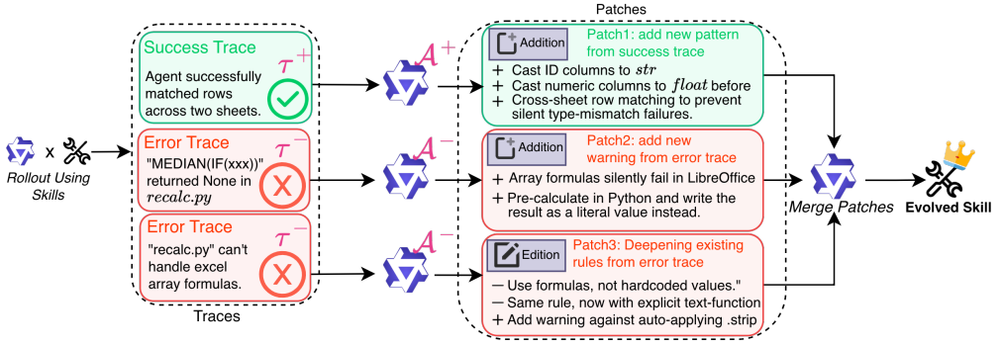

# Trace2Skill

> **分类**: Skill 生成 | **成熟度**: 🟡 成长期 | **综合评分**: 0.52

---

## 一句话描述

Trace2Skill 让 Agent 通过执行大量任务，从**成功和失败轨迹**中自动总结高质量、可跨模型跨场景迁移的技能。采用**全局并行分析 + 分层归纳整合**范式，模拟人类专家提炼知识的过程，仅需 **35B 开源模型**即可完成全流程技能进化。

**来源**:
- 学术论文：阿里巴巴通义千问团队联合苏黎世联邦理工学院、北京大学、浙江大学
- 发布年份：2026年

**链接**:
- 论文链接：https://arxiv.org/pdf/2603.25158

---

## 核心实现

Trace2Skill 采用全局并行分析 + 分层归纳整合的范式，通过三个阶段实现高质量技能的自动生成：

**阶段 1：轨迹批量生成（Trajectory Generation）**：使用初始技能（人工编写或 LLM 生成的草稿），让智能体在目标领域任务集上并行执行，生成带标注的成功轨迹（T⁺）和失败轨迹（T⁻，含推理、工具调用、结果），构成技能提炼的原始素材库。

**阶段 2：并行多智能体补丁提议（Parallel Multi-Agent Patch Proposal）**：调度一组专门的分析子智能体，并行处理每条轨迹，独立生成技能修改补丁：
- **成功分析器**：从成功轨迹中提炼可复用的有效行为模式，生成优化补丁
- **错误分析器**：以 ReAct 多轮交互方式定位失败根因、验证修复方案，生成避坑补丁

**阶段 3：无冲突补丁整合（Conflict-Free Consolidation）**：通过分层合并 + 归纳推理，把海量补丁整合成一套无冲突、通用的技能：
- **分层合并**：按批次逐层合成补丁，去重、解决冲突、保留核心洞察
- **归纳推理**：优先保留多次出现的通用规则，丢弃单轨迹的个性化特例，确保技能可迁移
- **格式校验**：通过三道确定性护栏保证技能格式合法、无冲突

**关键设计**

- 所有子智能体基于同一版初始技能工作，保留轨迹经验的多样性，避免顺序更新带来的"经验漂移"。
- 最终输出完整的 SKILL.md + 辅助资源，推理时直接加载，无需任何检索模块。支持两种工作模式：技能深化（优化现有技能）和从零创建（从 LLM 草稿开始迭代生成）。

---

## 主要能力

- 从成功轨迹中提炼可复用的有效行为模式
- 以 ReAct 多轮交互方式定位失败根因、验证修复方案
- 分层合并 + 归纳推理整合海量补丁为无冲突的通用技能

---

## 局限性

- 需要足够多的执行轨迹才能提炼出高质量技能
- 跨领域迁移效果与领域结构相关性高

---

## 成熟度评分

| 维度 | 评分 (0.0-1.0) | 说明 |
|------|---------------|------|
| 技术成熟度 | 0.55 | 有完整论文和实验验证 |
| 创新性 | 0.70 | 并行轨迹分析+归纳推理整合的创新范式 |
| 落地程度 | 0.40 | 仅论文验证，尚未大规模落地 |
| 生态活跃度 | 0.45 | 有代码即将开源 |

**综合评分**: 0.52

---

## 参考资料

- [论文](https://arxiv.org/pdf/2603.25158)
- [详解](https://zhuanlan.zhihu.com/p/2020916672396051215)
