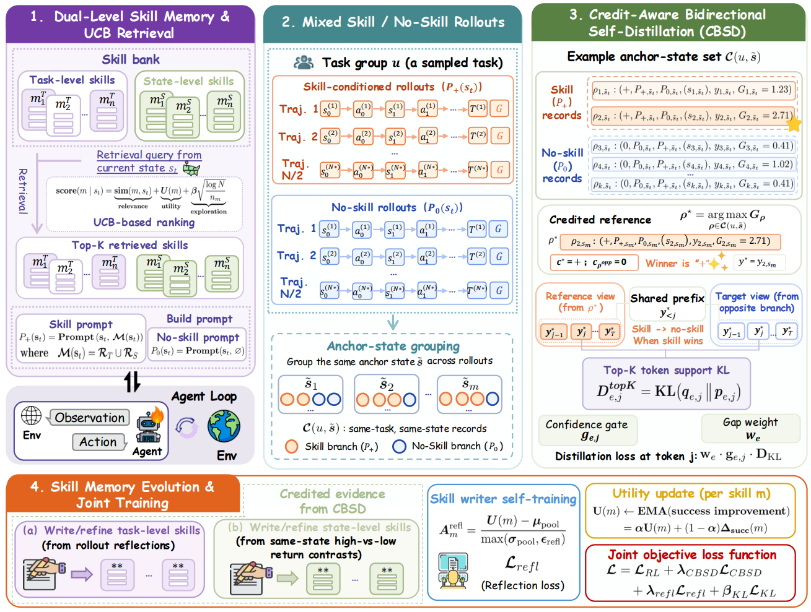

# UCOB：信用感知双向自蒸馏

> **分类**: Skill召回 | **成熟度**: 🟡 研究验证阶段 | **综合评分**: 0.63

---

## 一句话描述

**UCOB**（Credit-aware On-policy Bidirectional self-distillation）是一个让 AI Agent 学会 **"有选择地相信"技能记忆**的统一训练框架。它将技能条件化视图和无技能视图视为同一模型的两种 on-policy 上下文，通过比较**实际环境回报**来决定蒸馏方向，技能有帮助时正向蒸馏内化策略，技能产生误导时反向蒸馏纠正行为。在 Qwen3-1.7B 上，UCOB 在 **ALFWorld**（**89.1%**）和 **WebShop**（**79.7%**）上分别超出 SOTA **+23.5**和 **+18.0**个百分点。

**来源**:
- UCOB: Learning to Utilize and Evolve Agentic Skills via Credit-Aware On-Policy Bidirectional Self-Distillation
- 发布年份：2026 年 6 月

**链接**:
- https://arxiv.org/abs/2606.29502v1
- https://github.com/TU2021/UCOB

---

## 核心实现

UCOB 包含四个紧密耦合的模块：

**1. 双层技能记忆与混合 Rollout**
维护两级技能池：
- **任务级技能**：捕获跨回合可复用策略（如"先检查产品规格再比较价格"）
- **状态级技能**：捕获局部决策规则，基于同状态下回报对比生成

技能检索采用 **UCB-based** 评分机制，平衡语义相似度和历史效用。训练时每个任务组采样一半带技能、一半不带技能的 rollout，两台视图均与环境在线交互，为后续信用比较提供配对证据。

**2. 信用感知双向自蒸馏（CBSD，核心创新）**
对同一锚定状态下的所有 rollout 记录，选出 **return-to-go 最高**的记录作为信用参考，将其响应分布蒸馏到相反上下文的视图上：
- **技能更好时**：技能条件化行为 → 无技能视图（内化有用策略）
- **无技能更好时**：无技能行为 → 技能视图（纠正不可靠提示）

关键细节：
- **回合差距门控**：回报差距超过阈值才激活蒸馏，避免小差距引入噪声
- **Top-K 令牌支持匹配**：目标视图仅在参考视图的 Top-K 高概率令牌集合上学习
- **置信度门控**：令牌级别 sigmoid 门控，抑制参考视图不够自信的位置

理论分析证明，当分支排序正确且更新幅度较小时，CBSD 的蒸馏方向保证了对局部优势代理的正向贡献。

**3. 技能记忆演化**
利用 CBSD 中的信用证据持续更新技能：任务级技能通过反思整个 rollout 组生成；状态级技能通过对比同锚定状态下高/低回报记录生成。每个技能的效用分数通过 **EMA 在线更新**，高分技能在后续检索中优先选中。

**4. 技能写作器自训练**
训练负责写技能的反思写作器，利用技能效用计算归一化的反思优势，通过裁剪策略梯度损失调整生成技能文本的概率，高实用性记忆提高生成似然，低实用性记忆被抑制。

---

## 主要能力

- **信用感知双向蒸馏**：首次将技能增强训练中的师生方向由"实际环境回报"动态决定，而非预设固定的技能→无技能方向
- **显著性能提升**：在 Qwen3-1.7B 上 ALFWorld 达 **89.1%**（+23.5pp），WebShop 达 **79.7%**（+18.0pp），在 Qwen2.5-7B 上同样保持领先
- **技能记忆闭环演化**：在利用技能辅助决策的同时，持续用新交互经验更新技能质量和检索机制，技能库质量不衰减
- **两个视图协同进化**：双向蒸馏使技能视图和无技能视图的表现差距持续缩小，无论评估时是否提供技能，模型都保持有效

---

## 局限性

- **在线交互成本高**：混合 rollout 要求每个任务组同时运行带技能和不带技能的轨迹，训练时的环境交互成本翻倍
- **回报差距阈值需调参**：回合差距门控的阈值是敏感超参，不同环境可能需要不同的设定
- **双层技能记忆的维护复杂度**：任务级和状态级技能需要独立的生成、更新和检索流程，在技能数量增长时的扩展性未知
- 评估环境限于 ALFWorld、WebShop 和 SEARCH-QA 三个基准，在更多样化的 Agent 任务上的泛化性尚待验证

---

## 成熟度评分

| 维度 | 评分 (0.0-1.0) | 说明 |
|------|---------------|------|
| 技术成熟度 | 0.60 | 有完整论文和开源代码，在 ALFWorld/WebShop 上验证，但尚未大规模应用 |
| 创新性 | 0.80 | 首次将技能增强训练的师生方向交由实际环境回报动态决定，双向蒸馏理念新颖 |
| 落地程度 | 0.55 | 学术验证阶段，3个基准测试，未报告生产环境部署案例 |
| 生态活跃度 | 0.55 | GitHub 开源 + arXiv 论文，社区关注度中等 |

**综合评分**: 0.63

---

## 参考资料

- [UCOB论文](https://arxiv.org/abs/2606.29502v1)
- [UCOB代码](https://github.com/TU2021/UCOB)
