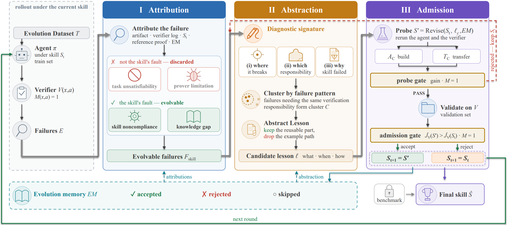

# VeriSkill

> **分类**: Skill优化 | **成熟度**: 🟡 成长期 | **综合评分**: 0.48

---

## 一句话描述

VeriSkill 是一个**专为程序验证构建的 skill 自进化框架**，通过**责任归因（区分 skill 缺陷 vs solver 边界 vs 任务不可满足）→ 诊断签名聚类与教训抽象 → 可执行验证准入**三阶段，将验证失败转化为**可信任、可迁移的 skill 改进**，在 Dafny、Frama-C、VeriFast 上全部超过通用进化基线。

**来源**:
- VeriSkill: A Self-Evolution Framework for Program Verification Skills
- 北京大学 / 中关村实验室 / 上海交大
- 发布年份：2026

**链接**:
- （开源信息见论文）

---

## 核心实现

VeriSkill 的核心链路围绕**归因→抽象→验证**三阶段展开，每一步都针对程序验证的特殊反馈信号设计。

**1. 四类失败归因**

每个验证失败被分入四种类型：
- **任务不可满足**：源码与注解关系本身不支持验证目标——与 skill 无关
- **验证器能力边界**：合理的 proof obligation 但 solver 无法完成推导——与 skill 无关
- **Skill 不合规**：skill 给了正确引导但 agent 没遵守——不归因给 skill 内容
- **Skill 知识缺口**：skill 确实缺少所需的可复用程序知识——**唯一触发进化的信号**

归因时同时检查失败任务、verifier 输出、当前 skill、生成 artifact、参考解答和历史进化记忆。归因结果写入记忆，防止同类失败被重复误判。

**2. 诊断签名与教训抽象**

每条失败提取三维诊断签名：证明义务定位（不变式初始/保持/内存安全/终止）、可复用验证责任抽象（缺失的入口事实/保持条件/中间引理）、skill 失败机制（缺失/不清晰/太抽象/难定位）。相同结构的失败聚类后，在集群层面抽象可复用教训——剥离实例特定的变量名、路径、常量，只保留**适用条件、具体步骤、不适用情况**。

**3. 三道关卡的可执行验证准入**

候选 skill 须通过三道递增的验证关卡：
- **归因集测试**：必须修好触发该教训的原始失败案例
- **转移集测试**：同一失败模式的 held-out 案例也必须通过，同时检查 pass-to-fail 回退和语义破坏
- **验证集测试**：完全分离的 frozen set 上严格提升 PASS 率且保持程序语义完整性

任何关失败 → 精修教训 → 重新修改 → 重新测试，直至通过或预算耗尽。所有结果写入进化记忆。

---

## 主要能力

- **精确责任归因**：区分 skill 缺陷与 solver 边界/任务不可满足，避免噪声污染 skill
- **跨验证器通用**：Dafny（+43.3pp）、Frama-C（+17.6pp）、VeriFast（+46.0pp）全部最优
- **跨模型迁移**：Codex 进化的 skill 原封不动部署到 5 个后端模型，提升 +15.3 到 +43.7pp
- **消融证实三阶段独立贡献**：可执行验证贡献最大（-21.3pp），责任归因其次（-13.0pp），教训抽象第三（-8.3pp）

---

## 局限性

- 归因依赖人类验证过的参考 artifact，扩展性受限于参考数据的获取成本
- 三阶段 + revise-test 循环 + 正式验证执行，评测耗费约 $15K API 费用，训练成本较高
- 实验限于三种形式验证器，在其他验证范式（如模型检验、类型系统）上的通用性未评估
- 进化记忆的规模随迭代增长，长期运行下的检索和管理开销未解决

---

## 成熟度评分

| 维度 | 评分 (0.0-1.0) | 说明 |
|------|---------------|------|
| 技术成熟度 | 0.50 | 归因→抽象→三道验证关卡闭环设计完整，消融证实三阶段独立贡献 |
| 创新性 | 0.70 | 精确责任归因区分 skill 缺陷/solver 边界/任务不可满足，思路原创 |
| 落地程度 | 0.35 | 学术原型，限于 Dafny/Frama-C/VeriFast 三种形式验证器 |
| 生态活跃度 | 0.35 | 开源信息见论文，无公开代码仓库，评测成本较高 |

**综合评分**: **0.48**

---

## 参考资料

- [VeriSkill论文](https://arxiv.org/abs/2607.27733)
