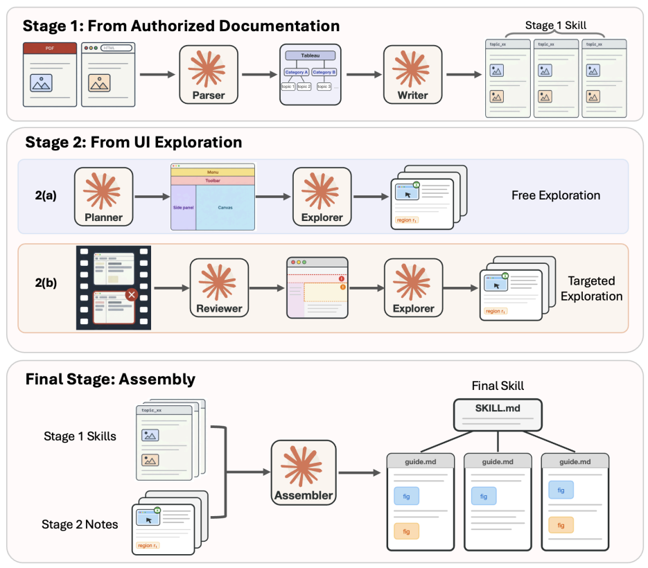

# VISUALSKILL：CUA的多模态技能框架

> **分类**: 多模态Skill生成 | **成熟度**: 🟡 成长期 | **综合评分**: 0.55

---

## 一句话描述

在CUA技能中**保留截图而非将其改写为文字**，通过文档挖掘+UI探索两阶段pipeline构建多模态技能，配合MCP on-demand加载。Stage 2多模态版比纯文字版高**8.3个百分点**（0.456 vs 0.373），MCP加载比直接Read多读约10倍图片。

**来源**:
- 论文：Jiang et al., "VISUALSKILL: Multimodal Skills for Computer-Use Agents"
- 发布年份：2026
- 机构：UCSB, MIT CSAIL, MIT-IBM Watson AI Lab

**链接**:
- arXiv: 2606.18448v1
- 代码: https://github.com/XMHZZ2018/VisualSkills

---

## 核心实现

**1. 两层技能结构与图文交错加载**

每个应用一套技能，顶层SKILL.md索引加底层话题文件夹（guide.md+PNG截图）。Agent推理时只持索引，按需调load_topic MCP工具拉取对应话题。关键设计：**文字和图片按引用顺序交错推送**——截图紧跟描述句子出现，Agent在同一上下文窗口同时看到描述和图像，不需自己匹配。纯文本对照版由同一LLM调用同源内容生成，唯一区别是视觉信息以图片还是文字呈现。

**2. 两阶段技能构建**

Stage 1挖文档：解析官方手册（PDF/HTML）目录结构复用为话题集合，提取文字和vendor配图原样保留。控制要点：继承维护者已有的结构比另起炉灶更省钱且更准确。

Stage 2跑真实应用，两种互补子模式：
- Free Explorer：Opus planner分8个区域，Sonnet worker逐控件操作、截图、记录状态转换行为
- **Trajectory-Targeted Explorer**：reviewer agent读失败rollout找出系统性UI知识缺口，针对性派worker补截图和操作说明

控制要点：两个子阶段覆盖互补的UI表面——free覆盖静态可见区域（工具栏、侧边栏），targeted覆盖只有在任务交互中才出现的动态表面（两层深的模态对话框、状态转换行为）。

**3. 配对对照与模态归因**

每个VISUALSKILL配一个从同源内容生成的纯文字对照版，共享话题结构和操作内容。任何性能差异只来自模态差异——不是内容差异。八个领域177个任务上验证。

**4. MCP工具 vs 直接Read**

消融实验揭示加载方式决定技能能否被真正使用：MCP方式每任务读7.9张图、最后一次查阅在10.4步（边做边查）；直接Read只读0.8张图、最后一次查阅在1.5步（开头翻一下就再也不回去）。MCP把图文打包一次返回，直接Read每张图要单独调一次。

---

## 主要能力

- 截图作为一等公民：保留UI截图而非改写为文字，消除"点击格式刷"这类文字描述的歧义
- MCP on-demand加载：Agent只持索引，边做边查，不是一次读完所有技能
- 两阶段互补覆盖：文档覆盖+真实UI探索，Free和Targeted各补不同的盲区
- 干净模态归因：配对纯文字版隔离模态贡献，差距可精确量化
- 视觉密集型应用受益最大：GIMP+16.6%，Tableau+15.0%，OpenToonz+8.9%

---

## 局限性

- 当前模型不擅长从多张截图中筛选相关的那几张，一口气全返回在小模型上造成上下文压力
- Qwen3.5-397B加多模态技能后反而退化，上下文被截图撑爆的问题没解决
- Stage 2 explorer依赖Opus/Sonnet级强模型，构建成本对普通用户偏高
- 技能构建是离线pipeline，不支持Agent在线运行时自主更新截图

---

## 成熟度评分

| 维度 | 评分 | 说明 |
|------|------|------|
| 技术成熟度 | 0.55 | 两阶段pipeline+MCP on-demand加载完整实现，配对对照实验严谨 |
| 创新性 | 0.80 | 截图保留而非改写为文字、图文交错推送、Trajectory-Targeted互补探索是原创范式 |
| 落地程度 | 0.40 | 八领域177任务验证，但构建依赖Opus/Sonnet级强模型，成本偏高 |
| 生态活跃度 | 0.45 | GitHub代码已开源，MIT CSAIL背书，但社区规模尚小 |

**综合评分**: 0.55×0.3 + 0.80×0.25 + 0.40×0.25 + 0.45×0.2 = **0.55**（🟡 成长期）

---

## 参考资料

- [论文](https://arxiv.org/abs/2606.18448)
- [GitHub仓库](https://github.com/XMHZZ2018/VisualSkills)
