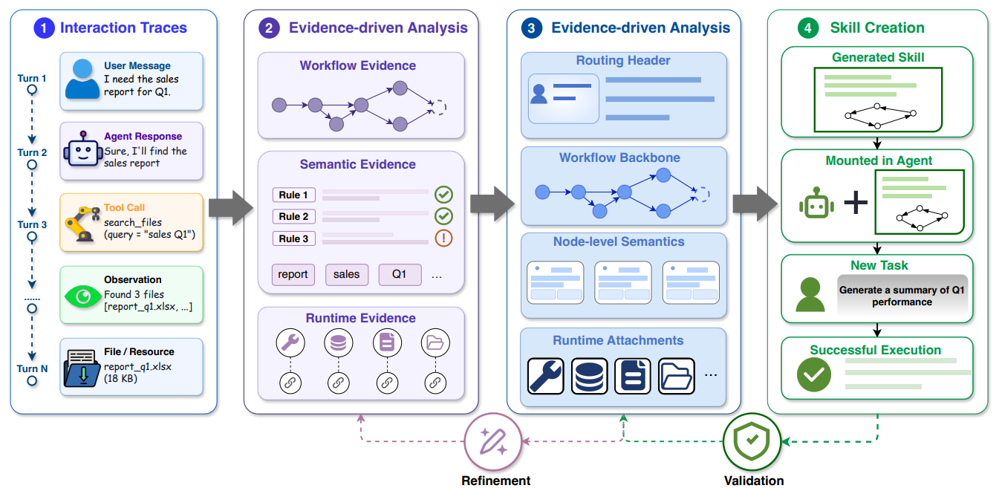

# W2S (Workflow-to-Skill)

> **分类**: Agent 技能自动生成 | **成熟度**: 🟡 实验阶段 | **综合评分**: 0.54

---

## 一句话描述

W2S 将技能自动生成从**文本摘要**重新定义为**工作流规范重构**：不是把多条轨迹压缩成一段文章，而是将对齐到一张有节点、有分支、有语义、有操作上下文的可执行图。W2S 定义了技​​能中间表示 **Skill-IR**（路由头+工作流骨架+节点级语义+运行时附件），行为重放一致性比 Anthropic Skill Creator 高出 **10.5%**。

**来源**:
- 武汉大学 & 南昌大学，论文 arXiv: 2606.06893
- 发布年份：2026

**链接**:
- 论文：https://arxiv.org/abs/2606.06893

---

## 核心实现

**1. Skill-IR 四层中间表示：从"发生了什么"到"应该怎么做"**

摘要追求语义显著性（挑重要内容、压掉细节），而技能需要的恰好是操作细节。W2S 定义 **Skill-IR** 将技能拆为四个正交组件：
- **路由头**：什么条件下调用
- **工作流骨架**：节点间的有向跳转关系与宏观流程分支
- **节点级语义**：局部目标、执行条件、成功/失败判定标准
- **运行时附件**：工具、脚本、参考文档、模板、配置约束和状态管理规范

四层拆分使技能生成从"把轨迹写成一段话"变为"从轨迹中为每一层填充该层需要的信息"。

**2. 五步重构管线：分段 → 起草 → 对齐与合并 → 分支协调 → 冗余压缩**

1. 分段将每条轨迹按操作类型切分成过程单元。
2. 起草对每条路径单独诱导本地 Skill-IR 草案。
3. 对齐与合并在多条草案间做骨架层面对齐，识别共章节点、合并同构步骤、将路径差异收敛到同一骨架的不同分支。
4. 分支协调根据轨迹一致性和出现频率判断分支是通用规则还是偶然偏差，保留的分支标注证据来源和置信度。
5. 冗余压缩在保留关键验证/审批/回滚行为的前提下合并表述重复。

---

## 主要能力

- 将技能生成从文本摘要**范式转换为工作流规范重构**，解决摘要目标函数与技能优化方向错位
- Skill-IR 四层正交表示让技能的不同组件（路由/骨架/语义/附件）各自独立可编辑
- 多轨迹对齐与合并：自动识别共章节点，将不同路径差异收敛到统一工作流骨架的不同分支上
- 分支协调按**轨迹一致性+频率**过滤偶然偏差，保留分支标注证据来源和置信度
- 行为重放一致性比 Anthropic Skill Creator 高 **10.5%**，在分支逻辑和恢复步骤方面漏项显著更少

---

## 局限性

- **场景覆盖的完整性是未观测变量**：技能质量受限于输入轨迹是否覆盖足够多执行场景，关键回退路径若从未出现则不会被补上
- Skill-IR 四层结构**预定义且固定**：极简单步技能中两层几乎为空，复杂多 Agent 协作场景中四层可能不够，抽象粒度不可参数化
- 轨迹分段的粒度选择是**启发式**的：不同任务的"一个自然步骤"跨度差异巨大，同一套分段启发式可能切出尺度极不相同的步骤

---

## 成熟度评分

---

## 参考资料

- [论文](https://arxiv.org/abs/2606.06893)
