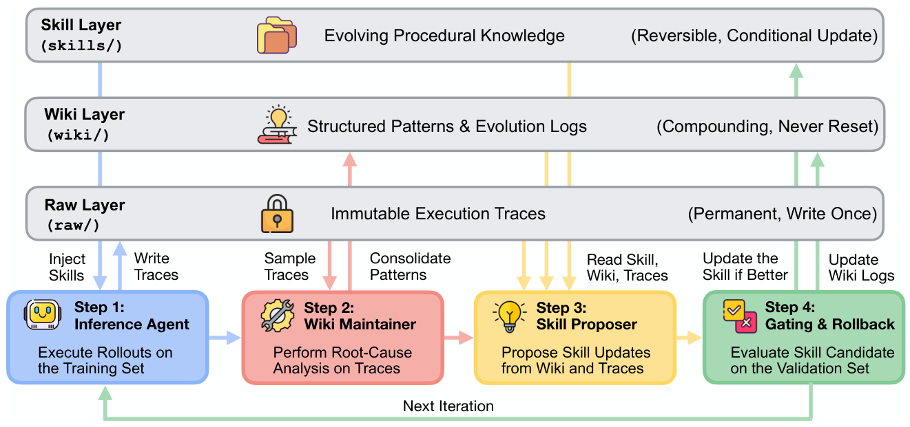

# WikiSkill

> **分类**: Skill优化 | **成熟度**: 🟡 成长期 | **综合评分**: 0.59

---

## 一句话描述

WikiSkill 是把 **agent 经验与可执行技能分离**的框架，在轨迹和技能间插入**持久 wiki 知识层**，技能可回滚但**知识永不重置**，每轮 proposer 据累积证据推进技能进化。

**来源**:
- WikiSkill: Compiling Agent Experience into Persistent Knowledge for Skill Evolution（Liyan Tang, Cyrus Rashtchian, Chun-Sung Ferng, Andrew Tomkins, Da-Cheng Juan, Tu Vu，Google Research / Virginia Tech）
- 发布年份：2026

**链接**:
- https://arxiv.org/abs/2608.27454

---

## 核心实现

**1. 三层架构：把经验和知识从技能制品里剥出来**

工作空间分三层，可回滚性不对称：
- **Raw Layer（raw/）**：存训练 rollout 完整轨迹（推理、工具调用、输出、答案），**write once 不可变**，供 maintainer 和 proposer 回看任意轮行为
- **Wiki Layer（wiki/）**：把轨迹归约成结构化知识——`patterns/` 目录每个 markdown 记一种失败或成功模式附 workaround，`logs.md` 按时序记每轮发现，`skill-impact.md` 记每个提案 diff、验证分数、收拒结果。**永不重置、跨轮累积**
- **Skills Layer（skills/）**：存可执行技能，每个目录两文件：`SKILL.md` 指令本体 + `PURPOSE.md` 回溯到催生它的 wiki 模式。**可被门控回滚**

**2. 四步循环：谁该读 wiki 是个访问控制问题**

每轮四组件协作：
1. **Inference Agent** 注入当前技能跑训练 rollout 产出轨迹，但**禁止读 wiki**——避免任务知识从 wiki 走捷径让轨迹变懒
2. **Wiki Maintainer** 拿采样轨迹（每轮最多 8 条、5 失 3 过分层）和当前 wiki 做根因分析，以增量 patch 编辑模式页、更新索引和日志
3. **Skill Proposer** 以多轮 ReAct 自主探查 wiki 索引、skill-impact、按需读特定模式页和原始轨迹（$T_{ReAct}\approx 10$-$20$ 轮），产出一个针对单一技能的原子提案（新建或增量编辑）
4. **Gating & Rollback** 在验证集上跑候选技能，分数超 $R_{best}$ 才接受并更新阈值，否则回滚技能；**wiki 不管门控结果都已落盘留存**

**3. 关键控制要点**

- **访问非对称**：给 proposer 持久 wiki 平均涨 **15.0 个点**，给 inference agent 读 wiki 反掉 **2.8 个点**——知识导向能结构化它的一方
- **被拒提案留 diff**：skill-impact.md 保留被拒方案，proposer 下轮据此不重复
- **full-batch 复杂度**：$B=N_{train}$ 时 optimizer 调用 $1+T_{ReAct}$，**O(1) 于训练集规模**
- 门控严判据要求每个接受提案都提升验证分，排除保平但开路的提案

---

## 主要能力

- **持久知识累积**：wiki 跨轮不重置，模式页、进化日志、提案 diff 持续累积，被拒提案的审计轨迹供下轮 proposer 引用
- **跨模型迁移**：他模型进化的技能常反超自进化（9B 用 27B 技能 ALFWorld **70.2 vs 自进化 63.4**），小模型技能也能迁移到强模型（4B 技能把 Gemma-31B LiveMath 拉到 **73.1**）
- **与模型 scaling 互补**：收益随规模递增（4B +12.3、9B +17.5、27B +23.9 个点），9B 带技能反超 27B 无技能（47.4 vs 39.4）
- **五基准五模型全面领先**：对每个模型平均最优，对最强竞争方法再涨 **3.3-12.0 个点**

---

## 局限性

- **不评测技能检索**：为隔离技能质量把活动技能全量注入 prompt，技能数变大后检索和触发成为未覆盖问题
- **门控严判据**：要求每个接受提案都提升验证分，排除保平但能为后续轮开路的提案，沿用前人严格判据为公平对比
- **wiki 无自动剪枝**：模式页、日志、diff 持续累积无裁剪机制，长进化轮次后可能需要
- **不覆盖超长时序**：基准含长上下文和多步工具但不跨数百动作或多小时任务，单次长 rollout 内在线精化仍是开放问题

---

## 成熟度评分

| 维度 | 评分 (0.0-1.0) | 说明 |
|------|---------------|------|
| 技术成熟度 | 0.60 | 三层架构 raw/wiki/skills + 四步循环 + 门控回滚，Google |
| 创新性 | 0.76 | 经验与可执行技能分离 + 持久 wiki 知识层永不重置 |
| 落地程度 | 0.52 | 五基准五模型全面领先，跨模型迁移 +9B 反超 27B |
| 生态活跃度 | 0.45 | 单篇论文，未开源 |

**综合评分**: 0.59

---

## 参考资料

- [WikiSkill: Compiling Agent Experience into Persistent Knowledge for Skill Evolution](https://arxiv.org/abs/2608.27454)
